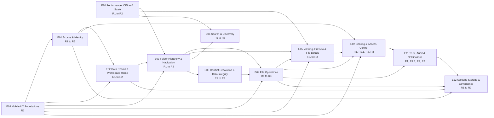

# Epics

## Purpose

This file is the bridge between the PRD and the executable backlog. It fixes the twelve epics
E01 to E12, states what each one owns and does not own, names the dependency edges between them,
and proves that every bullet of the original stakeholder brief lands somewhere. Read it before
planning a sprint, before arguing about which epic a story belongs to, and before adding a
thirteenth epic (do not add a thirteenth epic; extend an existing one).

Epic IDs and titles are stable. They are cited in commits, branches, ticket titles, test names
and design files, and they are never renumbered.

## Related documents

- [Documentation index](./README.md)
- [Prior art and UX benchmark](./01-prior-art-and-ux-benchmark.md)
- [Personas and jobs-to-be-done](./02-personas-and-jtbd.md)
- [Product overview, the core PRD](./03-product-overview.md)
- [Functional requirements](./05-functional-requirements.md)
- [Business rules and permissions](./06-business-rules-and-permissions.md)
- [Non-functional requirements](./07-non-functional-requirements.md)
- [Mobile UX specification](./08-mobile-ux-spec.md)
- [Domain model and glossary](./09-domain-model-and-glossary.md)
- [Success metrics and analytics](./10-success-metrics-and-analytics.md)
- [Master backlog](./11-master-backlog.md)
- [Risks and open questions](./12-risks-and-open-questions.md)

Story files, one per epic:

- [E01 Access & Identity](./backlog/epic-01-access-and-identity.md)
- [E02 Data Rooms & Workspace Home](./backlog/epic-02-data-rooms-and-workspace-home.md)
- [E03 Folder Hierarchy & Navigation](./backlog/epic-03-folder-hierarchy-and-navigation.md)
- [E04 File Operations](./backlog/epic-04-file-operations.md)
- [E05 Viewing, Preview & File Details](./backlog/epic-05-viewing-preview-and-file-details.md)
- [E06 Search & Discovery](./backlog/epic-06-search-and-discovery.md)
- [E07 Sharing & Access Control](./backlog/epic-07-sharing-and-access-control.md)
- [E08 Conflict Resolution & Data Integrity](./backlog/epic-08-conflict-resolution-and-data-integrity.md)
- [E09 Mobile UX Foundations](./backlog/epic-09-mobile-ux-foundations.md)
- [E10 Performance, Offline & Scale](./backlog/epic-10-performance-offline-and-scale.md)
- [E11 Trust, Audit & Notifications](./backlog/epic-11-trust-audit-and-notifications.md)
- [E12 Account, Storage & Governance](./backlog/epic-12-account-storage-and-governance.md)

## How to read an epic entry

Each entry below carries the same headings so they can be compared and diffed.

| Heading | What it commits to |
| --- | --- |
| Goal | One sentence, outcome-shaped, not feature-shaped |
| Why it matters | Tied to a named user role and to a named failure mode in the prior art, with evidence |
| Scope in | What this epic owns and will deliver |
| Scope out | What it deliberately does not own, and which epic does |
| Business rules owned | The `BR-` block this epic is the authority for |
| FR domains owned | The `FR-<DOMAIN>` prefix or prefixes it writes requirements under |
| NFR categories judged against | Which `NFR-<CAT>` families gate its release |
| Mobile-first notes | The specific touch decisions, and the desktop enhancement |
| Success metrics | The `M<nn>` metrics that prove it worked |
| Main risks | The `R<nn>` risks it carries |
| R1.1 contribution | Present only on the three epics that carry R1.1 work (E05, E07, E11): what this epic ships in the trust-hardening increment |
| Backlog | Link to its story file |

`BR-` numbers were allocated to epics in contiguous blocks so that two authors could write rules
without colliding. [06-business-rules-and-permissions.md](./06-business-rules-and-permissions.md)
is the authority for the wording, the numbering **and** the allocation of every rule; the blocks
named in each epic entry below describe the subject matter that epic owns, and where a block range
here disagrees with 06's actual numbering, **06 wins**. Individual rules cited by ID in the entries
below are cited against 06 as it stands. Any threshold, limit, retention window, timing guarantee or
permission rule quoted anywhere in this file carries its owning `BR-` in parentheses precisely so
that a reader never has to guess which copy is current.
`FR-` domains map one-to-one onto epics, with `MOB` owned by E09 even though mobile requirements
appear inside every other epic's stories. `M<nn>` metric definitions live in
[10-success-metrics-and-analytics.md](./10-success-metrics-and-analytics.md) and `R<nn>` risk
detail in [12-risks-and-open-questions.md](./12-risks-and-open-questions.md).

## Epic map

| ID | Title | Goal | Primary personas | Release span | Depends on | Business value | Risk |
| --- | --- | --- | --- | --- | --- | --- | --- |
| [E01](#e01--access--identity) | Access & Identity | Prove who someone is, cheaply on a phone, and let an external recipient in with no account at all | P1, P2, P5 | R1, R2, R3 | E09 | High | Med |
| [E02](#e02--data-rooms--workspace-home) | Data Rooms & Workspace Home | Make the room the unmistakable unit of work, and make it invisible to everyone it was not shared with | P1, P4, P6 | R1 to R2 | E01, E09 | High | Med |
| [E03](#e03--folder-hierarchy--navigation) | Folder Hierarchy & Navigation | Let a thumb build and traverse an arbitrarily deep structure without a tree | P1, P4, P3 | R1 to R2 | E02, E09 | High | High |
| [E04](#e04--file-operations) | File Operations | Turn the phone into a document source and a full file manager, with no silent failures | P1, P4, P6 | R1, R2, R3 | E03, E08, E09, E10 | High | High |
| [E05](#e05--viewing-preview--file-details) | Viewing, Preview & File Details | Make a large document readable on a phone in seconds, and show its facts without a hover pane | P2, P3, P5 | R1 to R2 | E03, E09, E10 | High | High |
| [E06](#e06--search--discovery) | Search & Discovery | Replace tree-walking with finding, on the first try, from a thumb | P3, P4, P1 | R1 to R3 | E03, E10 | Med | Med |
| [E07](#e07--sharing--access-control) | Sharing & Access Control | Let a room owner grant, scope and take back access from a phone, and always answer "who can see this" | P1, P6, P2, P3 | R1, **R1.1**, R2, R3 | E01, E02, E03, E04, E09 | High | High |
| [E08](#e08--conflict-resolution--data-integrity) | Conflict Resolution & Data Integrity | Never lose, overwrite or duplicate a document because a phone was interrupted | P4, P1 | R1 to R2 | E03, E04 | High | High |
| [E09](#e09--mobile-ux-foundations) | Mobile UX Foundations | Ship the named interaction system that every other epic is built from | All | R1 to R2 | none | High | Med |
| [E10](#e10--performance-offline--scale) | Performance, Offline & Scale | Make a 10,000-item room and a several-GB file behave on a mid-range Android over bad 4G | P2, P5, P6 | R1 to R2 | E09 | High | High |
| [E11](#e11--trust-audit--notifications) | Trust, Audit & Notifications | Turn the room into a habit by making the phone the triage surface, and prove what happened | P1, P6, P3 | R1, **R1.1**, R2, R3 | E04, E07 | High | Med |
| [E12](#e12--account-storage--governance) | Account, Storage & Governance | Never silently drop data at a quota limit, and give an administrator the joiner, leaver, quota and retention controls an internal tool actually needs | Administrator, P1, P6 | R1 to R2 | E01, E02, E04 | Med | Med |

**Release columns in this file are derived, not authored.**
[05-functional-requirements.md](./05-functional-requirements.md) owns the `Release` tag on every
requirement; the spans above, the release notes inside each epic's Scope-in list and the coverage
check at the end of this file are the epic-level roll-up of that column. Where this file and 05
disagree, 05 wins and this file is the defect. There are exactly four tags: R1, R1.1, R2, R3, as
defined in [03's release plan](./03-product-overview.md#release-plan).

Business value is judged against the thesis in
[03-product-overview.md](./03-product-overview.md): the thing every comparable tool fails at is
owner-side administration on a phone, so the epics that carry it (E03, E04, E07, E09) rank highest
even where a general file product would treat them as plumbing.

## Delivery sequence

### The critical path

The critical path for R1 is **E09 to E02 to E03 to E04 to E07**, with E08 fused into E03 and E04
rather than following them, and E10 running as a parallel track that E03, E05 and E06 consume.

**E09 comes first because it is not a feature, it is the vocabulary.** Every other epic's stories
are written in terms of a bottom action bar, a selection mode, a long-press action sheet, a
details sheet at the medium detent, a destination-picker sheet, a toast with undo, a sticky
breadcrumb, and a safe-area-aware layout. If those are invented per screen by whoever gets there
first, we ship the same failure mode as the prior art: a set of shrunken desktop screens that each
behave differently. The benchmark in
[01-prior-art-and-ux-benchmark.md](./01-prior-art-and-ux-benchmark.md) is blunt about what that
looks like in production. Intralinks' own App Store reviewers report "Documents cannot be viewed
within the app"; Datasite's Capterra reviewers describe a "dated user interface requiring multiple
clicks for simple tasks"; SmartRoom ships a maintained iOS app with four ratings. Those are all
products where mobile was assembled screen by screen rather than designed as a system. E09 is also where the accessibility floor
lives, and retrofitting WCAG 2.2 AA into forty screens costs several times what building it into
ten components does.

**E03 and E04 must land before the sharing epics, for three independent reasons.**

1. *There is nothing to share until there is something to share.* A share is a grant on a room, a
   folder or a file. Until the hierarchy exists and files can be put into it, E07's stories have
   no object. Building sharing first produces a permission model designed against an imagined
   tree, which is how inheritance bugs are born.
2. *Sharing inherits the hierarchy's semantics.* Inheritance and override rules, the "who can see
   this right now" indicator, the effect of moving a shared folder into an unshared parent, and
   the blast-radius statement on a cascade delete ("this deletes 3 folders and 47 files, and 2
   people lose access") are all statements about the tree. They cannot be specified, let alone
   tested, before E03 fixes depth limits, path semantics and move rules, and before E04 fixes
   trash, restore and bulk behaviour.
3. *The riskiest interaction in the product sits in E04, not E07.* Upload from a phone on a bad
   connection is where every comparable tool visibly fails: Firmex's Capterra reviewers report
   "uploading of documents often stalls requiring further intervention", Ansarada's report slow
   mobile access, Papermark's report large files loading badly. On the web platform, iOS has no
   Background Fetch and no Background Sync, pages are frozen and discarded aggressively, and
   `unload` does not fire when a tab is closed from the mobile tab switcher. Resumable upload has
   to be proven early, because if it cannot be made to work the product's third strategic pillar
   fails and scope must change. Discovering that in the last sprint is fatal; discovering it in
   sprint six is a re-plan.

**E08 is fused, not sequenced.** Duplicate-name resolution, forbidden characters, Unicode
normalisation and optimistic concurrency are not a phase that happens after file operations. They
are the acceptance criteria of create, upload, copy, move and rename. E08 therefore ships its
rules alongside E03 (folder create, rename, move) and E04 (upload, copy, paste), and keeps only
versioning and the offline mutation queue as separable R2 work. The specific trap E08 must close
early: because an interrupted upload is retried after a page freeze, the server has to be
idempotent per folder, name and content hash, or every resume manufactures a "file (2)" the user
never asked for.

**E10 runs in parallel from sprint one, then gates.** Dynamic directory loading, cursor
pagination and list virtualisation are prerequisites for E03's folder screen rather than an
optimisation of it, so the primitives land in S1 to S2. The budgets then act as a gate on every
later epic: CI fails a pull request that breaks a route budget, and release requires p75 field
Core Web Vitals in the good band.

**E07 is the epic the tool exists for, and therefore the last R1 epic, not the first.** Controlled
outward sharing with instant revocation is the whole reason to build this instead of using a shared
cloud folder, and it is the thing no comparable tool lets a room owner do from a phone. It ships
once the objects it grants access to are real, which in this plan is sprint eight.

**E11 and E12 both land substantially in R1, and E11 continues into R1.1.** R1 needs the activity
log that records who did what and when, the notification centre that makes the phone the triage
surface, the CSV export, the administrator-set quota that refuses uploads rather than dropping data
at the limit, and the provisioning and deprovisioning flows without which an internal tool cannot
be handed to IT. **R1.1 then adds the three trust capabilities in
[03's release plan](./03-product-overview.md#r11-trust-hardening-the-three-questions-after-a-leak):**
the dynamic per-viewer watermark, the per-viewer access log, and share-link expiry, with the
recipient tracking disclosure as a hard precondition of the access log rather than a follow-up.
What waits for R2 is page-level dwell, web push and email digests: valuable, but not what a
colleague asks for the first time a document leaks.

### Sequence summary, R1

| Sprint | Primary work | Gate at end of sprint |
| --- | --- | --- |
| S1 | E09 tokens, layout shell, bottom bars, sheets, toasts; E10 list and pagination primitives; persistence and object storage | A virtualised list of 10,000 stub rows scrolls at 60 fps on the reference device |
| S2 | E09 selection mode, action sheets, a11y baseline, theme; E10 budgets wired into CI | CI fails on a deliberate budget regression; automated WCAG suite green |
| S3 | E01 sign-up, sign-in, magic link, verification, sessions, rate limiting, guest access | A guest opens a stub shared item with no account, on both platforms |
| S4 | E02 rooms and workspace home; E03 navigation, breadcrumb, folder map | Room switcher and breadcrumb collapse verified at 360 px, one-handed |
| S5 | E03 create, rename, move, cascade delete; E08 naming and conflict core | A cascade-delete warning states correct counts on a depth-6 tree of 500 items |
| S6 | E04 upload (camera, library, picker), resumable chunking, progress, cancel, retry, trash | A 40 MB upload survives backgrounding, airplane mode and a forced discard |
| S7 | E04 copy, move, staging tray, selection bulk actions, partial-failure reporting; E05 views, details sheet, viewer | A PDF of 200 pages paints its first page inside the budget on the reference device |
| S8 | E06 filename search and filters; E07 shares, roles, links, revocation, read-only enforcement, share management | A Viewer token is rejected by every mutating API verb; revocation is measured inside BR-108 |
| S9 | E11 activity log, viewer analytics, notification centre, CSV export; E12 administrator-set quota, limit behaviour, retention settings, provisioning and deprovisioning; hardening, a11y pass, performance pass, live internal processes | All R1 exit criteria in [03-product-overview.md](./03-product-overview.md) met |

### Sequence summary, R1.1

| Sprint | Primary work | Gate at end of sprint |
| --- | --- | --- |
| S10 | E05 and E07: per-viewer watermark baked into the server-rendered tile, with the render cache keyed on watermark identity; E07 share-link expiry | A watermarked tile is never served to a viewer whose watermark differs; an expired link is byte-identical and timing-equivalent to a link that never existed |
| S11 | E11: per-viewer access log surfaced per file and per recipient; the recipient tracking disclosure as a precondition of the first view event | A query returns zero FR-AUDIT-004 view events for any recipient not previously shown the notice; the access log reconciles exactly with the activity log |

Sprint counts are **Estimates** for one team of five, as stated in the PRD release plan.

## E01 — Access & Identity

**Goal.** Establish who someone is with the least possible friction on a phone, keep them signed
in for as long as is safe, and let an external recipient read a shared item without ever creating
an account.

**Why it matters.** Two user types, opposite needs. P1, a colleague running several live processes,
works in 90-second bursts at 7am and 10pm and will abandon a tool that makes her sign in again in a
car park; her session must survive weeks of app switching. P2, an external recipient on a commuter
train, will not create an account to look at a document, and does not complain when he leaves, he
simply stops reading. Every comparable tool puts an account wall there and pays for it in silent
recipient loss, which is the failure mode this epic exists to avoid
([01-prior-art-and-ux-benchmark.md](./01-prior-art-and-ux-benchmark.md)). Staff identity is also
the root of every access decision in E07, so this epic is load-bearing for the whole permission
model.

**Identity assumption (A13).** The company identity provider (SSO / OIDC) is assumed to be the
primary sign-in path for staff. No SSO requirement set is written in this pass; the requirements
below are the fallback for staff and the only path for external recipients, who must be able to
open a link with no account at all. Which provider, and whether directory provisioning rides with
it, is an open question in [12-risks-and-open-questions.md](./12-risks-and-open-questions.md).

**Scope in.**

- Sign-up and sign-in with email and password (R1); magic-link sign-in (R1); social and OAuth
  providers (R2) where they reduce friction.
- Email verification, including the deferred-verification path so a first room can be created
  before the inbox is checked (R1).
- Session management across devices, with an explicit mobile session longevity policy and a
  session list (R1), and sign-out-everywhere as a single action (R1).
- Guest and invitee access: a recipient reaches the content with a link and, where the share is
  permissioned, a one-time email challenge, without a password and without an account (R1).
  Anonymous public-link sessions scoped to exactly the shared subtree (R1).
- Password reset, rate limiting, lockout UX that explains itself rather than saying "too many
  attempts" (R1).
- Passkey and WebAuthn sign-in (R1). Step-up re-authentication on resume, presented honestly as a
  re-authentication prompt rather than an OS lock (R2).
- Account deletion with the retention window in BR-190 (R1).
- Time-based one-time-password second factor with recovery codes, and an owner-set forced
  re-authentication interval per room (R3).

**Scope out.** The room visibility rule (E02). Role semantics and what a session may then do
(E07). Notification of a new-device sign-in (E11, this epic emits the event). Account provisioning,
deprovisioning and the administrator role (E12). The SSO requirement set itself, which is not
written in this pass (A13).

**Business rules owned.** `BR-001` to `BR-010`: credential policy, session lifetime and idle
policy on mobile versus desktop, verification requirement before first share, guest-session
scope and lifetime, lockout thresholds and decay, and the rule that a guest session is bound to
one share grant and never widened by discovery. The access-credential TTL of 5 minutes (BR-023) is
06's, cited here because it is what makes the revocation bound in BR-108 achievable.

**FR domain owned.** `AUTH`.

**NFR categories judged against.** SEC (credential handling, token scope, brute-force
resistance), PRIV (what a guest session records about a person), A11Y (WCAG 3.3.7 Redundant Entry
and 3.3.8 Accessible Authentication: paste into OTP fields, password-manager and autofill
support, no cognitive-function test), PERF (auth round trips on the reference network), OBS
(auth funnel telemetry), COMPL (GDPR lawful basis for guest data).

**Mobile-first notes.**

- Every auth screen is a single-column, keyboard-aware layout with the primary action inside the
  thumb zone and above the software keyboard. `keyboard-inset-*` or `visualViewport` is used so
  the submit button is never hidden, which is also WCAG 2.4.11.
- OTP and password fields accept paste and expose the correct `autocomplete` and `inputmode`, so
  a password manager works. This is not a nicety; SC 3.3.8 makes it a Level AA obligation.
- Magic link is the primary recipient path because it removes password creation entirely. The
  link must open in the same browser context that requested it, and the failure case (opened in a
  different browser) must be explained rather than silently failing.
- Passkeys are available cross-platform (`PublicKeyCredential` in Chrome 67, Chrome Android 70,
  Safari 13, Firefox 60), so biometric sign-in is achievable in R1. What is not achievable is an
  OS-level app lock: there is no web API that forces a biometric re-check on resume, so "require
  Face ID to reopen" is implemented as a short session TTL plus a step-up assertion on
  `visibilitychange`, and the copy says re-authenticate, not unlock.
- Rate-limit and lockout messages state what to do next and when, because a person standing in a
  car park cannot open a support ticket.
- Desktop enhancement: full keyboard flow, a visible session list with device and location, and
  sign-out-everywhere as a single action.

**Success metrics** (defined in [10-success-metrics-and-analytics.md](./10-success-metrics-and-analytics.md),
which owns every metric ID). M03 signup-to-first-room rate and M07 owner activation, both of which
this epic's friction directly moves; M09 recipient activation rate, since the no-account path is
the whole recipient funnel; M20 share of sessions on mobile, split by role — this epic is where the
instrumentation starts and it is how we come to own a number nobody in the category publishes; and
a contribution to M08 time to first share, since account creation sits inside that clock.

**Main risks.** R01 magic-link deliverability into an external recipient's corporate mail filter,
which would break the primary invite path (mitigation: OTP fallback, the public-link route with a
link password, and A12 in the PRD). R02 guest access without an account weakens attribution in the
activity log, which E11 and our own legal reviewer both care about (mitigation: bind the guest
session to the invited address, record the challenge, and label anonymous activity unverified per
FR-AUDIT-007).

**Backlog.** [backlog/epic-01-access-and-identity.md](./backlog/epic-01-access-and-identity.md)

## E02 — Data Rooms & Workspace Home

**Goal.** Make the Data Room the top-level container that a user cannot confuse with another one,
and make it structurally invisible to anyone it was not shared with.

**Why it matters.** P1 runs five to eight live processes at once and has already, twice, sent the
wrong link to the wrong recipient. That is the failure this epic exists to prevent, and on a 360 px
screen where only one room is visible at a time it is a design problem, not a warning-label
problem. It is also the job-to-be-done stated most bluntly in the research: "I want each room to be
visibly and unmistakably separate on a small screen, so I never send process A's confidential
financials to process B's recipient." The invisibility rule is the derivative requirement from the
brief ("Data Room not visible to others unless shared") and it is the cheapest trust signal the
tool can give a colleague deciding whether to put real material in it.

**Scope in.**

- Create, rename and delete a room, with room ownership (R1). Duplicate and archive or restore a
  room (R2).
- The mobile workspace home: My rooms, Shared with me, Recents, pinned rooms (all R1), empty states
  that teach the next action, and a room switcher reachable with a thumb (R1). Room-list filter and
  item counts (R2).
- Room-level settings (R1) and the room's identity treatment: name, colour or emoji marker, and a
  recipient-safe display name (R1).
- The invisibility rule as an enforced behaviour, not a UI state (R1), including the
  indistinguishable-not-found response of FR-ROOM-020.
- Room templates and user-defined templates (R2), which is the "reuse the folder skeleton from the
  last one" job.

**Scope out.** Folder structure inside the room (E03). Sharing the room (E07). The storage quota
and its enforcement (E12; the per-room figure is surfaced here). Activity log per room (E11,
surfaced here).

**Business rules owned.** `BR-011` to `BR-020`: room ownership and the single-owner invariant, the
invisibility rule and its non-enumeration corollary, room name uniqueness scope, archive
semantics (readable, not mutable, not counted against active limits), delete semantics and the
retention window, and the rule that deleting a room revokes every share on it immediately.

**FR domain owned.** `ROOM`.

**NFR categories judged against.** SEC (the invisibility rule is a security property), PRIV,
PERF (workspace home is the cold-start route and therefore the LCP that most users see first),
A11Y, SCALE (a user with 200 rooms), OBS.

**Mobile-first notes.**

- The workspace home is the app's cold-start route, so it owns the strictest performance budget in
  the product. It renders a useful skeleton before data arrives and never shifts layout when
  thumbnails or counts land.
- Room separation is enforced visually: a persistent room name in the sticky header on every
  screen inside the room, a distinct accent per room, and a room-scoped confirmation string in
  every share and delete dialog ("Share *Acme HVAC sale* with...").
- The room switcher is a bottom sheet, not a drawer behind a hamburger. NN/g's study of hidden
  navigation found a discoverability drop of more than 20% and users 15% slower on mobile with
  hidden navigation versus visible, and switching rooms is the single most consequential
  navigation act in this product.
- Empty states carry exactly one primary action, in the thumb zone.
- Invisibility is verified negatively: an unauthorised fetch for a room returns the same response
  as a non-existent room, and the room never appears in search, listings, notification copy or
  error messages for a non-participant.
- Desktop enhancement: a room list with columns and sort, multi-room side navigation, and
  keyboard switching.

**Success metrics.** M11 room setup completion rate (rooms reaching three files and one folder
within 24 hours); M13 rooms with an active share; M01 Weekly Active Shared Rooms, to which this
epic is the entry point; M26 concurrent rooms per active account, which is the honest test of the
five-to-eight-at-once claim; M50 unintended access incidents, because the invisibility rule failing
is exactly what M50 counts. Wrong-room incidents are tracked qualitatively with the internal teams
running live processes in R1.

**Main risks.** R03 the invisibility rule leaks existence through a side channel such as an error
code, an email bounce message, a share-link 403 that differs from a 404, a response-time
difference, or an analytics event (mitigation: a negative test suite that asserts byte-identical
and timing-equivalent responses, and the rule from D02 that a principal with no grant on the target
always gets 404 and never 403). R26 greenfield persistence
decisions churn the room and membership schema (mitigation: fix the entity model in
[09-domain-model-and-glossary.md](./09-domain-model-and-glossary.md) in S1).

**Backlog.** [backlog/epic-02-data-rooms-and-workspace-home.md](./backlog/epic-02-data-rooms-and-workspace-home.md)

## E03 — Folder Hierarchy & Navigation

**Goal.** Let a thumb create, traverse, restructure and safely destroy an arbitrarily deep folder
hierarchy, with no tree view on the primary surface and no loss of orientation.

**Why it matters.** This epic carries all four "Requested Requirements" from the brief, and it
carries the single most dangerous interaction in the product: cascade delete on a small screen.
It also carries the primitive the brief lists as base functionality and the constraint calls
explicitly hostile to touch, the files tree view. P4, the transaction coordinator, is the role that
lives here: she builds structure, and her stated highest-stakes interaction is a deletion warning
that does not tell her what it is about to destroy. P3, an external adviser, needs to know at a
glance which requested folders are still empty, which is why item counts are a requirement rather
than decoration.

The failure modes in the prior art are precise. iDeals' G2 reviewers report that folders cannot be
uploaded and permissions cannot be managed from mobile; Firmex's Capterra reviewers report folder
structures that cannot be navigated "without requesting support"; Intralinks' report that "you may
move folders unintentionally and you wouldn't notice since it doesn't ask for changes
confirmation". Every one of those is worse with a thumb.

**Scope in.**

- Create a folder; nest folders to a stated depth limit, with the limit surfaced before it is
  hit.
- View a folder's contents including nested folders and files, with item counts on folder rows.
- Rename a folder. Move a folder. Delete a folder and its descendants with an explicit cascade
  warning stating exact counts and any access that will be lost.
- Breadcrumb navigation and its collapse behaviour at 360 px; sticky breadcrumb; the "Jump to"
  ancestor sheet.
- The mobile tree equivalent: a flat "Folder map" sheet listing descendant folders with depth
  badges and item counts, plus search-first navigation.
- Hardware and gesture back on Android, an in-app back on iOS standalone (where there is no
  browser chrome), up-one-level affordance, deep links that resolve to a folder and restore the
  breadcrumb, and guaranteed scroll-position restoration on return.
- Depth limit, name length limit and total path length limit, with clear errors.
- The persistent desktop tree view in a navigation rail or drawer at `expanded` and above (R2, FR-FLDR-022), per the [size-class ladder](./03-product-overview.md#responsive-size-class-ladder).

**Scope out.** File-level operations inside the folder (E04). Duplicate-name resolution mechanics
(E08 owns the rules, this epic consumes them). Pagination and virtualisation of the folder
listing (E10). Permission inheritance down the tree (E07). Search itself (E06).

**Business rules owned.** `BR-021` to `BR-032`: maximum depth, maximum name length, maximum total
path length, the folder-into-own-descendant prohibition (shared with E08's move validation),
cascade-delete semantics and what the warning must enumerate, soft-delete and restore of a
subtree, the item-count definition (immediate children versus recursive), and the rule that a
folder move which would break a path limit is refused before it starts rather than half-applied.

**FR domain owned.** `FLDR`.

**NFR categories judged against.** PERF (folder open time, breadcrumb render, cascade-count
computation), SCALE (depth and breadth), A11Y (Reflow at 320 px, target sizes on breadcrumb chips
and disclosure rows, 200% text size with long folder names), MOB, SEC (a folder is a permission
boundary), OBS.

**Mobile-first notes.**

- The tree is replaced, not shrunk. Rationale is stated in the PRD's touch-equivalence mapping:
  indentation inside 320 CSS px violates SC 1.4.10 Reflow, and expand twisties fall under the
  24 x 24 CSS px floor of SC 2.5.8 while sitting immediately next to the row's own navigate
  target, which is the same "two competing trailing controls" failure Apple warns about for
  indexes beside disclosure indicators.
- Breadcrumb is a horizontally scrollable chip rail that collapses at 360 px to a leading path
  chip plus the current folder. The path chip opens a sheet listing the ancestor chain, and the
  chip rail scrolls inside its own container so the page body never scrolls horizontally.
- Cascade delete is specified in full because it is the highest-stakes touch interaction: the
  confirmation names the exact counts and total size, names any shares that will lose access,
  commits on the up-event (SC 2.5.2), soft-deletes to trash with a stated retention window, and
  offers a time-boxed undo toast. There is no swipe-only path to it, and the destructive item sits
  where the platform expects it (top of an iOS action sheet, end of a context menu), styled
  destructive.
- Every navigation layer is a popable history entry, because Android's predictive back is on by
  default from Android 13 and iOS standalone web apps have no browser chrome, so an in-app back
  affordance plus correct history depth is mandatory rather than optional.
- Rename is reached from the row's overflow button, not from long-press, which is bound to
  multi-select (D01). It opens a keyboard-aware sheet with only the basename preselected, since
  extensions are hidden by default per Apple's file-management guidance and a rename field must not
  let a user silently destroy one.
- Move uses the destination-picker sheet with in-sheet drill-down and its own internal breadcrumb.
  It is one sheet, never a stack, because stacked sheets lose the user's sense of place.
- Desktop enhancement: the real tree in a rail, drag and drop under `(pointer: fine)`, keyboard
  traversal with type-ahead, and inline rename.

**Success metrics.** M11 room setup completion rate, which is what folder creation followed by
filing actually produces; M49 accidental deletion rate (this epic is where most of it is earned or
lost); M45 list-children p95 latency, which must not degrade with scroll depth; M46 one-handed task
success, whose task list includes moving nine files into a nested folder. Zero incidents of a
cascade warning stating wrong counts is a release gate, not a metric.

**Main risks.** R04 cascade-count computation is slow or wrong on deep or wide trees, which turns
the product's central safety feature into a spinner (mitigation: maintain aggregates, and specify
a bounded-time contract with a "counting..." state that is never the confirmation itself). R05
breadcrumb collapse loses orientation at 360 px on a depth-8 path (mitigation: the ancestor sheet
plus the folder map, usability-tested with P4-shaped users). R16 gesture conflicts with the
Android system back on both edges.

**Backlog.** [backlog/epic-03-folder-hierarchy-and-navigation.md](./backlog/epic-03-folder-hierarchy-and-navigation.md)

## E04 — File Operations

**Goal.** Make the phone a first-class source of documents and a complete file manager, with
every operation resumable, reversible and honest about its state.

**Why it matters.** This is the claim in Pillar 3 made concrete. Only one product in the prior art
ships in-app scan-to-upload at all, and none of them make it work on a bad connection, which is
exactly the situation our field staff are in. P1's job is "photograph a statement on the spot and
get it into the right subfolder before I drive to the next appointment". P6's job is "a 40 MB
survey PDF uploads from one bar of signal, resumes after the connection drops, and lands in the
right folder". P4's job is "multi-select nine files with my thumb and move them into a nested
folder".

The evidence from the prior art is that this is where products visibly break. Firmex: "uploading of
documents often stalls requiring further intervention". Datasite's Capterra cons cite connectivity
and performance problems on large files and documents having to be opened one at a time.

**Scope in.**

- Upload from camera capture, photo library and device files picker (R1); the OS share sheet where
  the platform supports it (R2, Android only, feature-detected).
- Multi-file upload; chunked resumable upload with adaptive chunk size; progress, cancel, retry;
  queue reconstruction on next app open (all R1). Screen Wake Lock during a long foreground upload
  (R2). Multi-page capture assembled into one PDF with per-page retake and reorder (R2). Deskew and
  on-device OCR (R3).
- Download a single file and a folder or selection as a server-streamed zip, with an honest mobile
  destination story (both R1). Open-in and share-to another app through the Web Share API (R1). The
  recently-downloaded list of re-fetchable links (R2).
- Copy or duplicate, rename, cut and paste (move) via the staging tray, delete to trash, restore
  from trash (all R1). **"Create" in the brief's first bullet is create-folder (E03, FR-FLDR-001)
  plus upload (FR-FILE-001 onward);** creating an empty text or Markdown file in-app and editing it
  is a separate lesser capability at Could / R3 (FR-FILE-044), per D15.
- Selection mode on touch, entered by long-press on a row or by a visible Select button, and the
  bulk action bar; select-from-here-to as the range operation; partial-failure reporting item by
  item (all R1).
- The destination picker for move and copy (R1); desktop drag and drop under `(pointer: fine)` as
  an enhancement only (R2). Folder upload where directory selection exists, plus the zip-upload
  alternative (R2).

**Scope out.** Folder-level create, rename, move and cascade delete (E03). Naming and collision
rules (E08). Preview and thumbnails (E05). Versioning (E08, R2). Quota enforcement at the limit
(E12, this epic honours it). Malware scanning is a dependency, not scope.

**Business rules owned.** `BR-033` to `BR-045`: allowed types and size ceilings, the idempotency
key for an upload (folder plus name plus content hash) so a resume cannot manufacture duplicates,
trash retention and restore semantics, what happens to a shared file that is moved or trashed,
partial-failure atomicity (per item, never per batch), the copy-versus-move distinction for
permissions and audit, and the rule that a cancelled upload leaves no orphan parts beyond a
stated TTL.

**FR domain owned.** `FILE`.

**NFR categories judged against.** PERF and MOB (upload throughput and memory on the reference
device), AVAIL (resumability across freeze and discard), SCALE (a 500-file batch), SEC (scanning,
signed URLs, type sniffing on the server), A11Y (selection mode semantics, live-region progress),
COMPAT (platform capability matrix), OBS.

**Mobile-first notes.**

- Upload is engineered against the platform's actual guarantees. There is no Background Fetch on
  iOS or in any WebView; there is no Background Sync on iOS; frozen pages stop running timers and
  fetch callbacks; discarded pages run no code; and `unload` does not fire when a tab is closed
  from the mobile tab switcher. Therefore the resume offset is committed to IndexedDB or OPFS
  *before* each chunk is sent, every `visibilitychange` to hidden is treated as "we may never run
  again", the queue is rebuilt on next open, and the UI says "Paused, reopen the app to continue"
  rather than implying background progress.
- Memory is the second hard constraint. Never read a whole file into an ArrayBuffer, never build
  a data URL from a file, always stream through `File.slice()`, and never hold more than one chunk
  in memory. Mobile Safari was measured crashing at roughly 100 MB of allocated JavaScript data on
  an iPhone SE 3rd generation with no catchable exception.
- Chunk sizing is adaptive: small on cellular, 5 to 8 MiB on Wi-Fi. Effective mobile uplink is the
  binding number, and even on fast US networks median upload is roughly 12 Mbps, so chunking is
  sized against 1 to 3 Mbps effective, not against download headlines.
- Folder upload is not a baseline mobile capability. `webkitdirectory` only became functional in
  iOS Safari 18.4 and Chrome Android 132, and `webkitEntries` is absent in Android WebView
  entirely. The specification therefore offers multi-file selection with path reconstruction where
  `webkitRelativePath` exists, a zip upload the server expands, and an explicit message elsewhere.
- Photo pickers are permissionless and partial by design on both platforms, so no flow may assume
  library enumeration. "Sync my camera roll" is not expressible on the web and is not offered.
- Cut and paste becomes the staging tray, which is the touch analogue of a clipboard: a slim
  persistent bar showing "n items ready to move" that survives navigation, then "Paste here".
- Multi-select is an explicit selection mode entered by long-press on a row, which enters the mode
  and selects that row, or by a visible Select button, because iOS requires an edit mode before
  table selection and there is no touch analogue for rubber-band selection. **Long-press therefore
  never opens the action sheet** (D01); the sheet has its own always-visible per-row overflow
  button. The action bar is titled with the selection count so the user is reminded what the
  command will affect.
- Download is fire-and-forget. Safari routes downloads through its own manager into a Downloads
  folder that defaults to iCloud Drive and is user-configurable; the page is never told the path,
  gets no completion callback and cannot verify the bytes landed. The UI therefore keeps a list of
  re-fetchable links and names the Files app in its copy instead of pretending to track a local
  file.
- Bulk zip is generated server-side and streamed. Client-side zipping is capped and only used for
  a small explicit selection, because on iOS there is no `showSaveFilePicker` to pipe a stream
  into, which forces buffering and reintroduces the memory ceiling.
- Desktop enhancement: HTML5 drag and drop under `(pointer: fine)`, marquee select, Shift+click
  ranges, keyboard cut and paste bound to the same tray, and a real folder-upload input.

**Success metrics.** M40 upload first-attempt success, split by network class; M41 upload eventual
success, where anything below 100 percent is a lost document rather than a slow one; M18
capture-to-room uploads, which is the direct measure of whether the phone became a document source;
M17 owner mutations per active room, of which uploads and moves are the bulk; M49 accidental
deletion rate for delete and move; M47 mobile task completion for the upload funnel.

**Main risks.** R06 no background upload on iOS means long uploads from the field genuinely cannot
complete unattended, and no amount of engineering changes that; the mitigation is honest UI plus
wake lock, and the residual limitation is stated in the interface rather than hidden. R07 folder
upload is unavailable on older mobile browsers, which affects P4's bulk construction workflow
(mitigation: zip upload plus the desktop path, stated in copy). R14 retries after a page freeze create duplicates
(mitigation: E08 idempotency).

**Backlog.** [backlog/epic-04-file-operations.md](./backlog/epic-04-file-operations.md)

## E05 — Viewing, Preview & File Details

**Goal.** Make a large confidential document readable on a phone within seconds, and expose every
fact about a file without a hover-driven pane.

**Why it matters.** This is the highest-frequency moment in the whole product and the most
consistently reported failure in the prior art. P2 (external recipient, commuter train, 20 to 40
second bursts) and P5 (external decision-maker, taxi, 60 seconds to 4 minutes, frequently
interrupted) both do their first pass here and both stop reading silently. Adobe's survey of over 2,000 Americans found 65% find reading
documents on mobile frustrating and 45% stopped reading, or did not try, a document on mobile,
while 72% said they would work on mobile more if documents were easier to read (2020 data, the
oldest figure in the research pack, and the only hard measurement of mobile document abandonment
available). Papermark's G2 reviewers state it directly: "larger files take a while to load and the
mobile viewing experience could be improved... most participants open documents from their
phones". Ansarada's reviewers report "the preview process for some fairly large files is very
long". Intralinks' App Store reviewers report "Documents cannot be viewed within the app".

A measurable target nobody in the prior art currently meets is available to us: first page
readable in under two and a half seconds on a poor 4G link (M10).

**Scope in.**

- List view and tiles or grid view, with the preference persisted per user.
- Thumbnails with fixed aspect boxes so the grid never shifts.
- File details: size, type, created, modified, owner, path, version (R2) and effective
  permissions.
- The desktop preview pane's two mobile replacements: a details bottom sheet at the medium detent,
  and a full-screen viewer that is its own history entry.
- Preview support matrix: PDF, image, text or code, **and video and audio streamed by range
  request** in R1 (FR-VIEW-019); office formats through server-side conversion in R2. Pinch-zoom
  with single-pointer zoom and fit-to-width controls, page jump, and an unsupported-type fallback
  that still offers download and open-in (R1). Rotation (R2).
- Resume at the last page and scroll position after an interruption, retained 90 days (R1).
- Sort controls with a persisted sort in R1; grouping and the folders-before-files setting in R2.
- The mobile equivalent of split view (the staging tray, owned by E04) and the true two-pane split
  view at `expanded` and above with a 480 CSS px height floor (R2, FR-VIEW-029), per the
  [size-class ladder](./03-product-overview.md#responsive-size-class-ladder).

**Scope out.** Whether a share is watermarked at all (E07). Page-level dwell analytics (E11, R2).
Search inside a document (E06, R2 and R3). The upload that produced the file (E04).

**R1.1 contribution.** The dynamic per-viewer watermark is rendered by this epic's pipeline: the
identifier and timestamp are baked into the server-rendered page image, never overlaid in the
client where a viewer can remove them, and the render cache key includes the watermark identity so
that one viewer's tile can never be served to another (FR-VIEW-035).

**Business rules owned.** `BR-046` to `BR-052`: which types are previewable at which size
thresholds, the server-render threshold above which the client never parses a document, what a
Viewer without the download flag may do in the viewer, the details a Viewer may see versus what an
owner sees, and the rule that an unsupported type never dead-ends.

**FR domain owned.** `VIEW`.

**NFR categories judged against.** PERF (first-page paint, page-turn latency), MOB (memory,
canvas), A11Y (pinch-zoom must not be the only zoom, per SC 2.5.1; text at 200%; reduced motion),
SCALE (a 2,000-page PDF), COMPAT, PRIV (preview must not leak a document to a third-party
renderer without a stated processor).

**Mobile-first notes.**

- The hover preview pane is replaced by two surfaces, not shrunk into one. Tapping a row opens a
  full-screen viewer as its own history entry, so Android's system back and the iOS in-app back
  both close it, with swipe-down-to-dismiss and horizontal swipe to move between files in the
  folder. Tapping the info affordance opens the details sheet at the medium detent so the list
  stays partly visible, which is the platform's own progressive-disclosure pattern.
- Rendering is delegated, not decoded in-tab, above a stated size threshold. iOS caps a single
  canvas at 16,777,216 pixels and enforces an additional total canvas memory budget, and a
  client-side WASM engine that parses a whole document into the tab is a mobile crash generator.
  The plan of record is server-rendered page images streamed progressively, one page at a time, a
  single reused canvas capped to viewport times `min(devicePixelRatio, 2)`, and explicit canvas
  release (resize to 1 x 1) when done.
- Video and audio are always delivered through range requests or HLS to a media element, never
  fetched into a Blob.
- Resume position is persisted on `visibilitychange` to hidden and on `pagehide`, because those
  are the last points at which code is guaranteed to run.
- Pinch-zoom is supported but is never the only zoom: a tap-target zoom control and a
  fit-to-width toggle exist, per SC 2.5.1, and text-heavy documents offer a reflow-to-width
  reading mode, which is the direct answer to the abandonment evidence.
- The details sheet carries the metadata that a desktop table would put in columns, because a
  fixed-width table with name, size, type, modified, owner and permissions cannot satisfy Reflow
  at 320 px.
- Desktop enhancement: the same details component docked as a right-hand inspector at `expanded`
  and above, a true two-pane split view gated on `expanded` or above *and* height >= 480 CSS px (a
  landscape phone is frequently `medium` or `expanded` in width while being far under the height
  floor, which is exactly the case a naive width-only rule breaks), and keyboard page navigation.
  Both boundaries come from the single
  [size-class ladder](./03-product-overview.md#responsive-size-class-ladder).

**Success metrics.** M10 time to first rendered page at p75 for recipient sessions; M42 time to
first page for documents of 100 MB or more on cellular, which is the benchmarkable claim nobody in
the category makes; M15 read completion rate; M16 documents per recipient session; M44 mobile
unrecoverable session rate, which is where a memory-ceiling crash in the viewer would show up.

**Main risks.** R08 the mobile memory ceiling makes large-document preview unreliable if any part
of the pipeline is client-side (mitigation: server render above the threshold, and a hard rule
against whole-file reads). R09 server-side rendering cost per room is higher than modelled
(mitigation: cache rendered pages, tier by size, and measure cost per active room from R1).

**Backlog.** [backlog/epic-05-viewing-preview-and-file-details.md](./backlog/epic-05-viewing-preview-and-file-details.md)

## E06 — Search & Discovery

**Goal.** Make finding a named file faster than walking a tree, from a thumb, on a slow
connection, on the first attempt.

**Why it matters.** On a phone, search is not a secondary aid, it is the primary navigation
mechanism, because the alternative is walking four levels of hierarchy with one thumb. P3, an
external adviser, states the job exactly: "search finds a file by partial name on the first try
from a phone", and his fifteen-second question is "is the receivables ageing in here yet, or do I
email and ask?" P1 needs one file out of sixty without navigating. The evidence from the prior art
is that search is broken even on desktop: Intralinks' Capterra reviewers report search that
"doesn't always work".

**Scope in.**

- The built-in search box with an explicit scope selector: this folder, this room, **all rooms —
  all three in R1** (FR-SRCH-003).
- Debounced type-ahead, cancellable in-flight requests, and results-as-you-type behaviour tuned
  for a slow link (R1).
- **Filters in R1** (FR-SRCH-011, FR-SRCH-012): type, modified-date range, size range, owner and
  shared status, presented in a single sheet with an explicit Apply and a summary of what is in
  force.
- Result rows that show the containing path and jump to it, preserving the ability to return to
  the results (R1); result count and paging (R1).
- **Recent searches in R1** (FR-SRCH-015); saved searches in R2 (FR-SRCH-016).
- Zero-result, error, offline and cancellation states, each with a next action (R1).
- Filename search in R1; document content search in R2 (FR-SRCH-023); OCR of image-only PDFs and
  photographs in R3 (FR-SRCH-024).
- Mobile specifics: a reachable search affordance in the thumb zone, on-screen keyboard handling,
  and a result list that does not reflow under the keyboard (R1).

**Scope out.** The index and query implementation are an engineering concern under
[09-domain-model-and-glossary.md](./09-domain-model-and-glossary.md). Permission filtering rules
are E07's (search consumes them). Viewer analytics on what was found (E11).

**Business rules owned.** `BR-053` to `BR-058`: results are filtered by effective permission
before they leave the server so search can never reveal the existence of an item the caller may
not see (the search-side corollary of E02's invisibility rule), scope defaults, match semantics
(partial, case-insensitive, Unicode-normalised, matching E08's normalisation), and the maximum
result set with its pagination.

**FR domain owned.** `SRCH`.

**NFR categories judged against.** PERF (type-ahead latency budget under the reference network),
SEC and PRIV (permission filtering, and no leakage through result counts or timing), A11Y (live
region announcing result counts per SC 4.1.3, focus not obscured by the keyboard per SC 2.4.11),
SCALE, I18N (normalisation and non-Latin scripts), OBS.

**Mobile-first notes.**

- Search is reachable from the bottom bar in every room, not hidden behind an overflow. Hidden
  navigation measurably costs discoverability, and search is the mobile substitute for
  type-to-jump in a desktop list, so it cannot be a tertiary command.
- Type-ahead is debounced and every superseded request is aborted, because on a 100 ms RTT link a
  naive per-keystroke fetch produces out-of-order results and burns the radio.
- The results list is virtualised and its row height is fixed before content arrives, so the list
  does not shift as paths load.
- Result rows show the containing path, truncated from the middle so both the room and the leaf
  folder stay visible, with the full path available in the details sheet.
- Jump-to navigates and pushes a history entry, so back returns to the results with scroll
  position intact.
- Zero-result is a designed state with three actions: broaden the scope, clear filters, or create
  or upload here.
- Keyboard handling uses `keyboard-inset-*` or `visualViewport` so the field and the first results
  are both visible, and the search field is never obscured by a sticky bar.
- Desktop enhancement: keyboard-first invocation, arrow-key result traversal, and filter chips
  expanded into a persistent rail.

**Success metrics.** M19 search success rate, which is `search_result_opened` within 30 seconds of
`search_submitted`; a persistently low M19 with a high share of `had_results = false` is the
trigger to promote content search from R2 into R1.1, per assumption A06. Also M45 for query latency
under the reference network, and the share of navigation events that begin with search rather than
a folder tap, which is a cut of the same event stream.

**Main risks.** R10 filename-only search is insufficient for the real corpus, because a document
called `Scan_2026-08-21_001.pdf` is unfindable by name (mitigation: measure M19 from R1, and make
capture-time naming cheap in E04). Timing side channels in permission filtering are tracked under
R03, and the D02 rule applies to search too: a result set must never let a caller distinguish "no
match" from "exists but not yours".

**Backlog.** [backlog/epic-06-search-and-discovery.md](./backlog/epic-06-search-and-discovery.md)

## E07 — Sharing & Access Control

**Goal.** Let a room owner grant, scope, downgrade and revoke access to a room, a folder or
a single file from a phone, inside a stated time bound, and make the answer to "who can see this
right now" always visible.

**Why it matters.** This is the epic the tool exists for, and it is the exact thing no comparable
product lets a room owner do from a phone. The evidence is primary. Google: "You cannot turn the
limited access setting on or off for folders from your mobile device; you must do this from the
web", and since 22 September 2025 parent-folder permissions always cascade, so the limited-access
subfolder is the only workaround and it is web-only. Box: "enabling and disabling watermarking on
a folder is supported only on the Box Web app". iDeals' G2 reviewers: permissions cannot be
managed from the app. Digify's Android product is explicitly a viewer that sends you to a browser
for the full feature set. DocSend has no app at all.

P1's jobs are stated as time limits: send a read-only link within three minutes of the call, and
"revoke their access from my phone without deleting anything or breaking the other twelve
recipients' links". P2 and P5 need the other side of it: a link that opens into a document with no
signup and no gate.

**Scope in.**

- Share a room, a folder or a single file.
- Public link versus permissioned invite-by-email, as distinct objects with distinct controls.
- The role model: Owner, Manager, Contributor, Viewer, plus separate download-allowed and
  can-reshare flags, because a person who may read is not automatically a person who may download
  or pass it on. **An anonymous public-link visitor is always a Viewer** (D06): the
  download-allowed flag is the only variable on that path, and no configuration lets an anonymous
  visitor write. Role selection exists only on the invite path.
- Link controls: password, the download on/off toggle and link rotation in R1; **share-link expiry
  in R1.1**; email-capture gate in R2; click-through acknowledgement gate in R3.
- Revoke any share at any time, inside the bound in BR-108. **Revocation authority is exactly
  three principals** (D07): the room Owner, a Manager on the scope, and the principal that created
  the grant. FR-SHARE-014 is narrowed to that set, and 06's permission matrix carries the matching
  conditional row.
- Read-only enforcement in both the UI and the API, with the API as the enforcement point.
- Pending invites, resend and cancel (R1).
- The recipient experience on a phone, including opening a link without an account, and the single
  generic dead-link state that discloses nothing about whether the item ever existed (D02).
- Ownership transfer, bulk permission editing and inbound access requests (R2).
- A share-management screen that answers "who can see what" for a whole room in one view (R1).
- Inheritance and override rules for nested items, the pre-commit summary of exactly what will
  change, and the visible effective-permission indicator on every item (R1).

**Scope out.** Authentication itself (E01). The activity log and viewer analytics that report on
sharing (E11). The storage quota (E12). Structured question-and-answer workflow with recipients
(R3, E11). Rendering the watermark, which is E05's pipeline; this epic owns only whether a share is
watermarked.

**R1.1 contribution.** Watermark configuration on a share and share-link expiry both land in R1.1,
alongside E11's per-viewer access log. Together they are the three questions a colleague asks the
first time a shared document turns up somewhere it should not.

**Business rules owned.** `BR-059` to `BR-078`, the largest block in the product: the role
capability matrix, the download flag's independence from read, inheritance from ancestor to
descendant and the precedence of an explicit override, what happens when a shared folder is moved
under a differently-shared parent, what happens to a share when its target is trashed or restored,
link password semantics, the immediacy contract for revocation (defined as an observable latency,
not a promise), the rule that revoking one grant never affects another, the rule that a mutating
call from a principal whose grant does not permit it fails with a permission error rather than a
validation error, and the non-enumeration corollary that a revoked recipient cannot distinguish
revocation from non-existence. The numbers themselves live in 06 and are cited, never restated:
revocation propagation p95 5 seconds and 60 seconds absolute (BR-108), signed content URL lifetime
60 seconds bound to the grant epoch (BR-110), in-progress download cut at the next range boundary
(BR-111), loaded-page re-check interval 30 seconds (BR-112), share-token entropy 160 bits
(BR-055).

**FR domain owned.** `SHARE`.

**NFR categories judged against.** SEC (this is the epic's primary axis: token scope, revocation
propagation, no client-side authorisation), PRIV (what a public link records about a viewer, and
what the owner is told), COMPL (GDPR basis for capturing recipient identity), AVAIL (revocation
must work when a cache is warm), PERF (share creation and revocation round trips), A11Y (permission
sheets are the highest-risk place for accordion scope ambiguity), OBS.

**Mobile-first notes.**

- The three-tap rule: from the room home, creating a share and revoking a share are each reachable
  in at most three taps, with both actions inside the thumb zone. This is the specific claim the
  category cannot match.
- Every permission sheet is one scope with one explicit Apply and a plain-language summary of
  exactly what will change ("this recipient will be able to view and download 12 files in
  Financials"). Inline accordions are forbidden here: Baymard's research found users could not tell
  which fields were in scope for submission in accordion forms, and in an access-control sheet that
  ambiguity is a security defect, not a cosmetic one.
- Effective permission is always visible on the item, not hidden behind a menu, so the answer to
  "can this recipient see this folder?" never requires navigation.
- Revocation is designed as an emergency action: reachable from the share-management screen, from
  the recipient row, and from a notification. It confirms with the recipient's name and the scope,
  commits on the up-event, reports completion rather than optimistically claiming it, and states
  plainly what revocation cannot do — bytes already downloaded, printed or forwarded are outside the
  system's control (BR-117), and the activity log is the actual remedy.
- Read-only is enforced server-side and verified by a QA test that calls every mutating verb with
  a Viewer token. In the UI, unavailable commands are hidden rather than dimmed, per Apple's
  context-menu rule.
- The recipient path is the strictest performance and friction budget in the product: tap the
  link, land on a readable document, two taps maximum, no signup, no app install, no interstitial,
  on both platforms. The public-link route is server-rendered where that buys first paint.
- The share sheet uses system autofill and never asks a user to retype an address they have
  already entered, per SC 3.3.7 Redundant Entry.
- The dead-link state is one state, not four. An expired link, a revoked link, a rotated link and a
  link that never existed all render the same words — "This link is no longer active." — with no
  expiry date, no room name, no owner and no hint that the identifier was ever valid (D02).
- Desktop enhancement: bulk permission editing across many items, a permission matrix table, and
  keyboard-driven invite entry.

**Success metrics.** M08 time to first share; M13 rooms with an active share; M14 share open rate,
which is the recipient-side proof that the link worked; M21 revocations per 100 active shares, where
a flat zero means owners either do not trust revocation or cannot find it; M50 unintended access
incidents, the only zero-threshold metric in the set. **Revocation latency is judged against 06's
BR-108 and reported through 10's revocation-latency metric**, not against a locally invented metric
ID (D12).

**Main risks.** R11 holding watermarking, the per-viewer access log and link expiry until R1.1
means teams keep the most sensitive material out of the tool in the meantime, which is the sharpest
assumption in the PRD (A10) and is reviewed weekly with the teams running live processes; the
mitigation is that R1.1 is two sprints and named, not an item in a twelve-week queue. R12 the
inheritance and override model is misunderstood by an owner, who then over-shares; this is the
failure mode that loses control of a document, so the mitigation is the always-visible effective
permission plus a mandatory pre-commit summary. R13 revocation is not actually immediate because a
CDN, a signed URL or a client cache still serves content (mitigation: 60-second signed URLs bound
to the grant epoch per BR-110, cache keys that include the grant version, the 30-second re-check
interval of BR-112, and continuous measurement against BR-108 as a production service-level
objective).

**Backlog.** [backlog/epic-07-sharing-and-access-control.md](./backlog/epic-07-sharing-and-access-control.md)

## E08 — Conflict Resolution & Data Integrity

**Goal.** Guarantee that no document is lost, silently overwritten or spuriously duplicated,
including when the phone that was uploading it was frozen, discarded or offline.

**Why it matters.** The brief lists duplicate-name conflict resolution as a derivative
requirement, and P4 states the stakes: "duplicate filenames that overwrite or silently rename",
and "I never silently overwrite a version of a lease that a recipient is already relying on". The
platform makes this harder than it looks on desktop, because an interrupted upload is retried, and
a retry that is not idempotent manufactures a `file (2)` nobody asked for. Intralinks' Capterra
reviewers report versions uploading as "copy" and getting messy, which is the same class of defect
in a shipped product.

**Scope in.**

- Duplicate-name handling on create, upload, copy, move and rename, with **exactly three** explicit
  outcomes and never a fourth (D14, FR-CONF-006): keep both with a deterministic suffix, replace as
  a new version, or cancel this item. There is no merge-folders option anywhere in the product.
- Case-insensitive collision policy, forbidden characters, Unicode normalisation, name length and
  total path length limits, trailing-space and reserved-name handling.
- Optimistic concurrency with an ETag or version token, and a specified 409 experience that tells
  the user what changed and offers a resolution.
- Prevention of moving a folder into its own descendant.
- Concurrent rename and delete of an item another user is currently viewing.
- File versioning and version restore (R2), including replace-as-new-version.
- The offline mutation queue and its reconciliation on reconnect (R2).
- Trash retention and permanent deletion.

**Scope out.** The UI of the operation that triggered the conflict (E03, E04). Audit records of a
conflict resolution (E11). Real-time collaborative merge, which is explicitly out of scope for the
product.

**Business rules owned.** `BR-079` to `BR-095`: the deterministic suffix algorithm, the
case-folding and normalisation rules (NFC, and the comparison form used for collision detection),
the forbidden-character set and reserved names, name and total path length limits, the upload
idempotency key, the meaning of Replace in R1 (content replaced, prior copy recoverable from trash
for the retention window) versus R2 (new version in a version chain), the concurrency token
contract, the descendant-move prohibition, trash retention duration and permanent-deletion
semantics, and the rule that a mutation which cannot be applied is refused whole rather than
applied partly.

**FR domain owned.** `CONF`.

**NFR categories judged against.** SEC and PRIV (a permanently deleted item must be
irrecoverable), AVAIL (queue durability), MAINT (the rules must be expressible in one place and
enforced in one place, the API), I18N (Unicode normalisation, non-Latin names, right-to-left
names), SCALE, OBS (every conflict resolution is a telemetry event, because the rate tells us
whether the rules are wrong).

**Mobile-first notes.**

- Conflict resolution is presented in the same sheet as the action that caused it, with three
  clearly labelled choices and no silent auto-rename. It is never a toast, never a background
  decision, and never a dialog stacked on top of another sheet.
- Because iOS action sheets cap at four buttons including Cancel and must not scroll, the
  three-choice conflict prompt fits the platform exactly; a fourth option would break it, which is
  the second reason D14 fixes the count at three. Any proposal to add a fourth resolution is
  rejected at review rather than designed around.
- Batch conflicts are resolved once with an "apply to all remaining" affordance plus a per-item
  review, because resolving forty prompts with a thumb is not a product.
- Upload idempotency is the mobile-specific requirement: the offset is committed before each
  chunk, and the server deduplicates on folder, name and content hash, because page freeze and
  discard are normal on mobile rather than exceptional.
- The 409 experience is written for a small screen: what you changed, what someone else changed,
  and two buttons (keep mine as a copy, or discard mine and reload). Never a raw error code.
- Delete is soft by default with a stated retention window, an undo toast, and a trash screen
  reachable from the room, because mis-taps are the norm on touch rather than the exception.
- Rename protects the extension: only the basename is preselected, and extensions are hidden by
  default per the platform file-management convention, so a user cannot silently destroy one.
- Desktop enhancement: a conflict list view for large batches, and keyboard resolution.

**Success metrics.** M41 upload eventual success, which is the metric a spurious duplicate or a
lost retry damages; M49 accidental deletion rate, whose definition already includes restores from
trash within ten minutes of a delete; M54 offline mutation loss rate, where any non-zero value is a
defect rather than a number to optimise; M51 support contacts, since a conflict prompt nobody
understands arrives as a support conversation. Conflict-resolution abandonment is read from the
`conflict_prompt_shown` and `conflict_resolved` events: a high share of `resolution = cancel` means
the prompt is unclear, not that the user changed their mind.

**Main risks.** R14 upload retry after a page freeze manufactures duplicates (mitigation:
idempotency key, tested by forcing a discard mid-upload). R15 case-insensitive collision detection
across Unicode forms produces surprising rejections or, worse, surprising overwrites (mitigation:
normalise to NFC on write, compare on a case-folded normalised form, and test with real
non-Latin and combining-character names).

**Backlog.** [backlog/epic-08-conflict-resolution-and-data-integrity.md](./backlog/epic-08-conflict-resolution-and-data-integrity.md)

## E09 — Mobile UX Foundations

**Goal.** Ship, name and document the interaction system that every other epic is written in
terms of, so that touch behaviour is a platform decision made once rather than a screen decision
made forty times.

**Why it matters.** This epic is the product's identity. The benchmark in
[01-prior-art-and-ux-benchmark.md](./01-prior-art-and-ux-benchmark.md) is explicit that none of the
comparable tools has a credible touch-first equivalent set for the desktop file-manager primitives,
and that the difference between a usable phone product and a shrunken desktop one is whether that
set exists as a named, documented interaction system rather than as forty independent decisions. It
serves every user role, but it is P4 and P6 who will find its defects: P4 because she does a third
of her touches on the phone and expects bulk operations to work there, and P6 because he is on one
bar of LTE with a cracked screen and gloves half off, and more than 80% of field workers have
damaged their devices.

**Scope in.**

- Layout: thumb-zone rules, bottom navigation, bottom action bar, contextual action bar for
  selection mode, safe-area and notch handling with `viewport-fit=cover` and `env()` insets,
  keyboard avoidance, sticky breadcrumb.
- Interaction: **the always-visible per-row overflow button ("...", at least 48 x 48 CSS px, on the
  row's trailing edge) as the mobile context menu, opening the action sheet; long-press bound to
  entering multi-select and selecting the pressed row, never to opening the sheet** (D01); row swipe
  actions as shortcuts only (R2); pull-to-refresh with a visible Refresh in the overflow; selection
  mode; destination-picker and details sheets with detents and a grabber.
- Feedback: skeleton loaders, toast with undo, offline and poor-network banners, haptics (R2),
  live regions for every status message.
- Theming: system-following light and dark with a user override, token architecture, and
  customisation of accent, density and text size (R2).
- Responsive system: implementing the four-class
  [size-class ladder](./03-product-overview.md#responsive-size-class-ladder) that 03 owns —
  `compact`, `medium`, `expanded`, `large`, plus the 480 CSS px height floor that split view
  additionally requires — and the progressive-enhancement ladder built on it. This epic implements
  the ladder; it does not define it, and it introduces no breakpoint of its own.
- Accessibility to WCAG 2.2 AA: 48 CSS px minimum targets with 8 px gaps, screen-reader semantics
  for list and grid, dynamic type, reduced motion, focus management in sheets, and full keyboard
  operability with the R1 shortcut set of FR-MOB-039 — navigate, select, select-range, rename,
  move, delete, search, new folder, upload and toggle view — listed in a discoverable shortcut
  sheet (D18).
- The install-teaching flow for the PWA (R2), since there is no `beforeinstallprompt` on iOS.

**Scope out.** Any domain behaviour. This epic owns components and rules, never business logic.
Performance budgets and their instrumentation (E10, though this epic must fit inside them).

**Business rules owned.** `BR-096` to `BR-102`, the interaction rules that behave like business
rules because they protect data: **long-press has exactly one meaning across the entire product and
that meaning is "enter multi-select and select this row"** (D01), so it never opens a menu; every
gesture-reachable action is also reachable by a visible tap target; destructive actions commit on
the up-event with an abort path; every destructive action has a time-boxed undo of 10 seconds
(BR-176); no sheet is ever stacked on another sheet; every sheet, selection mode and preview is a
popable history entry; and no capability is claimed in copy that the platform does not grant.

**FR domain owned.** `MOB`.

**NFR categories judged against.** A11Y (primary), MOB, COMPAT (both platforms, both orientations,
browser tab versus installed), PERF (component cost, no long tasks on selection toggle or scroll),
MAINT (one component, one behaviour), I18N (text expansion, right-to-left).

**Mobile-first notes.** The whole epic is the mobile-first note, so this section records the
non-obvious decisions.

- **Long-press enters multi-select. That is the one meaning, everywhere** (D01, resolving OQ89).
  It is not a per-surface choice, because inconsistent long-press behaviour makes people believe the
  product is broken. The action sheet is reached from the row's always-visible overflow button, and
  selection mode additionally has a visible Select button, so both affordances have a discoverable
  entry point and neither depends on a gesture. The rationale is that this is what iOS Files, Google
  Drive and Dropbox already taught our users, and a visible button satisfies WCAG 2.2 SC 2.5.1 on
  its own without a separate fallback mechanism to specify and test.
- Row swipe is a shortcut, never a mechanism, and it ships in R2 rather than R1. It has at most
  one action per direction, keeps the acted-on item visible, is duplicated in the overflow, and
  never starts near a screen edge, because the Android system back gesture owns both edges and an
  app may only exclude 200 dp per edge.
- Action sheets respect the stricter platform: at most four buttons including Cancel, never
  scrolling, destructive styled and positioned per platform convention. A file row attracts a
  dozen commands, so grouped secondary commands go in a sectioned modal bottom sheet instead.
- Infinite scroll is never the only model. The virtualised list carries a persistent "n of N
  items" count, sort and filter, search-in-folder, a sticky breadcrumb header, guaranteed
  scroll-position restoration, and an explicit Load more affordance, because infinite scroll
  removes the landmarks a person needs when hunting one specific file.
- Nothing is gated behind hover. Hover affordances exist only inside
  `@media (hover: hover) and (pointer: fine)` and never carry unique information. This is also a
  responsiveness argument: hovering is explicitly excluded from INP measurement, so a hover-driven
  UI is one whose slowness is never measured and always felt.
- Icon-only controls are labelled, and every accessible name contains the visible label, so voice
  control ("tap Move") works. Move versus copy, share versus export, link versus permissions and
  archive versus delete are all ambiguous as glyphs.
- Keyboard navigation is built as roving-tabindex grid semantics, which is simultaneously the
  desktop enhancement and the screen-reader model, so it is built once.
- Field-condition rules: high contrast in sunlight, targets that survive a gloved or cracked-screen
  tap, and no interaction that requires precision in a corner of the screen.

**Success metrics.** M39 mobile Core Web Vitals pass rate; M48 accessibility conformance (100
percent of automated WCAG 2.2 AA checks passing, zero blocking manual findings); M37 mobile p75 INP,
which is where a long task during list scroll or a selection-mode toggle shows up; M46 one-handed
task success from moderated sessions; M43 mobile client error rate. Component reuse ratio is tracked
in the design system, not as an analytics metric, as a proxy for whether screens are inventing their
own patterns.

**Main risks.** R16 gesture conflicts with the Android system back and with browser edge gestures
(mitigation: no edge-started gestures, everything popable). R17 the design system slips and blocks
every other epic, because everything depends on it (mitigation: E09 is sprints one and two, and
its first deliverable is tokens plus the five components E03 needs, not a complete library).

**Backlog.** [backlog/epic-09-mobile-ux-foundations.md](./backlog/epic-09-mobile-ux-foundations.md)

## E10 — Performance, Offline & Scale

**Goal.** Make a room with 10,000-plus items and files of several gigabytes behave correctly and
feel fast on a mid-range Android over a poor 4G link, and be honest whenever it cannot.

**Why it matters.** The brief asks for optimisation for large datasets with dynamic directory
loading, and the prior art shows what happens without it: Ansarada's reviewers report very long
previews of large files, Datasite's cite connectivity and performance problems with large files,
Papermark's cite slow large-file loading as the top mobile complaint. The field baseline is
unforgiving: only 48% of mobile websites passed all three Core Web Vitals in CrUX for July 2025,
mobile p90 Total Blocking Time reached 7,555 ms, and the median mobile page was already 2.56 MB
with 697 KB of JavaScript, which exceeds the three-second interactive budget for our reference
device. Shipping something average means shipping something that fails. P6 is the persona who
proves it, working from a basement with one bar of signal.

**Scope in.**

- Dynamic directory loading, cursor pagination, **list virtualisation above 100 rows**
  (FR-PERF-004), lazy thumbnails, prefetch and caching, optimistic UI with correct rollback (R1).
- Behaviour in a folder with 10,000-plus items and with files of several GB (R1 for the primitives,
  R2 for the full-scale verification).
- Mobile performance budgets on the reference device over the reference network: bundle size, LCP,
  INP, CLS, cold and warm start, memory ceiling (R1).
- **The offline read cache in R1** (FR-PERF-009), with the honest labelling that evictable storage
  requires (FR-PERF-011); explicit per-file pinning and its space accounting in R2 (FR-PERF-010).
- Used-storage measurement and the per-room figure, kept fresh within 60 seconds (FR-PERF-025);
  surfaced by E12.
- Client and server performance telemetry with real-user monitoring, segmented by device class
  (R1).

**Scope out.** The offline mutation queue for writes (E08). The rendering pipeline for previews
(E05). Quota policy and what happens at the limit (E12).

**Business rules owned.** `BR-103` to `BR-108`: the page size and cursor contract, the cache
freshness and invalidation policy (including that a cache key incorporates the grant version so a
revocation cannot be served from cache), what may be cached offline and for how long, the rule
that a cached copy is always labelled as such, and the rule that the server is the sole source of
truth for anything a permission decision depends on.

**FR domain owned.** `PERF`.

**NFR categories judged against.** PERF (primary), SCALE, MOB, AVAIL, OBS, COMPAT, PRIV (what a
cache leaves on a shared device).

**Mobile-first notes.**

- Budgets are stated against the reference device and network, and there are two distinct gates:
  the CI gate uses the Lighthouse mobile preset (150 ms RTT, 1,638.4 Kbps down, 750 Kbps up, 4x
  CPU) as a regression guard, and the release gate uses p75 field data. Every performance story
  states which of the two it is measured against.
- No single task may exceed 50 ms on the reference device during list scroll, selection-mode
  toggle or breadcrumb navigation. Directory-load work yields with `scheduler.yield` or an
  `isInputPending` loop, because main-thread work rather than bytes is what breaks INP on phones.
- The initial-route budget is set below the web-wide median rather than at it, because the median
  already fails.
- Virtualisation is mandatory for any list that can exceed one screen of data, and row height is
  fixed before content arrives so late thumbnails cannot shift layout (CLS is scored as the worst
  five-second burst, and a virtualised list that measures lazily is a burst generator).
- Offline is treated as a read cache and nothing more, and the copy says so. Client storage is
  evictable, eviction is all-or-nothing per origin across IndexedDB, Cache API and OPFS together,
  and WebKit deletes script-created storage for an origin with no user interaction in the last
  seven days. `navigator.storage.persist()` is requested but never assumed, and
  `navigator.storage.estimate()` is treated as deliberately imprecise.
- Optimistic UI is permitted only where a rollback is visible and safe. A permission change is
  never optimistic.
- Prefetch is bounded and cellular-aware, because prefetching a folder of thumbnails on a metered
  connection is a cost the user pays.
- Desktop enhancement: larger page sizes, more aggressive prefetch, and multi-column virtualised
  grids.

**Success metrics.** M36, M37 and M38 mobile p75 LCP, INP and CLS from field data, and M39 the
combined pass rate on the six key routes; M45 list-children p95 latency, which must not degrade with
scroll depth; M44 mobile unrecoverable session rate, which is where the memory ceiling shows up;
M43 mobile client error rate. Cold-start time, JavaScript bytes on the initial route and offline
cache hit rate are tracked per release as engineering budgets rather than as product metrics.

**Main risks.** R18 budget regressions accumulate silently as features land, which is the normal
outcome without a CI gate (mitigation: the gate is built in sprint two, before most features
exist). R19 storage eviction makes any offline claim false and could lose a user's only copy of
something (mitigation: BR rules that forbid the cache being the sole copy, plus honest labelling).

**Backlog.** [backlog/epic-10-performance-offline-and-scale.md](./backlog/epic-10-performance-offline-and-scale.md)

## E11 — Trust, Audit & Notifications

**Goal.** Prove what happened in a room, and make the phone the place where an owner triages what
just happened rather than a dashboard they visit at a desk.

**Why it matters.** Two distinct jobs sit here. The first is proof: our own legal reviewer needs
to show who accessed what and when, and read-only plus revocable links is not an audit trail. The
second is awareness, which is what per-viewer analytics buys: knowing that a recipient opened the
document, how far they got, and whether to follow up. DocSend is built entirely around page-level
viewer analytics, and Dropbox's own help page confirms DocSend has no mobile app, so the most
useful report in the category is only readable at a desk. Intralinks' App Store reviewers complain
the app does not let you filter for new documents or set alerts.

The prior-art benchmark names the replacement pattern explicitly: notification-and-triage as the
primary mobile surface, replacing the desktop dashboard, where each notification is directly
actionable in one tap. P1 wants to know a recipient opened the document and to revoke a different
one from the same screen. P5 as a recipient is the mirror image: she is the person whose open event
creates the notification, and she is also the person the tracking disclosure is owed to.

**Scope in.**

- The activity log per room, folder and file: who did what, when, and from where, including
  document-open events and failed access attempts, so the log is useful on day one (R1).
- Per-file viewer analytics: which principal opened which file, when, and for how long (R1).
  Page-level dwell for paginated documents (R2).
- Download tracking, recorded separately from preview and never conflated with it (R1).
- Security events such as a sign-in from a new device (R1, emitted by E01).
- In-app notification centre with directly actionable items, and per-room notification preferences
  and mute (R1). Web push where the platform allows it, and email digests (R2).
- Activity-log export to CSV (R1); the export rate limit (R2). Retention per BR-195, which is 24
  months, **administrator-configurable and never derived from a plan** (R1).
- Structured question-and-answer workflow with recipients, and the live "who is in this room now"
  list (R3).

**R1.1 contribution.** The **per-viewer access log** — the owner-facing view of who opened which
file, when, through which share and for how long, surfaced per file and per recipient rather than
only as a room-wide feed — plus the **recipient tracking disclosure**, which is a hard precondition
rather than a companion task: the first FR-AUDIT-004 view event for a recipient must not be recorded
until that recipient has been shown the notice (D08, NFR-PRIV-010, US-E11-11). Tracking and its
notice ship together or neither ships.

**Scope out.** The events themselves are emitted by the epics that own the actions. Analytics for
our own product decisions (that is
[10-success-metrics-and-analytics.md](./10-success-metrics-and-analytics.md), a different concern).
Quota and retention configuration (E12; this epic delivers the notifications about them).

**Business rules owned.** `BR-109` to `BR-118`: what is recorded and what is deliberately not
(privacy boundary), attribution for guest sessions, immutability of log entries, who may read the
log for which scope, the rule that a recipient is told what is tracked about them **before the
first view event exists**, the rule that a notification never reveals content a recipient may not
see, and the digest and mute semantics. Retention is 24 months (BR-195), set by an administrator,
and notification delivery is p95 30 seconds (FR-AUDIT-022).

**FR domain owned.** `AUDIT`.

**NFR categories judged against.** SEC (log integrity), PRIV and COMPL (viewer tracking is
personal data, so lawful basis, disclosure and retention all apply), AVAIL (log writes must not
block the user action that produced them), SCALE (log volume), PERF, A11Y, OBS.

**Mobile-first notes.**

- The notification is the surface, not the dashboard. Each item states the actor, the object and
  the consequence in one line, and carries a single primary action: approve access, answer,
  revoke, open. Triage is designed for a 20-second session on a train.
- Push capability is stated honestly per surface. Web push on iOS arrived in 16.4 and works only
  for Home Screen web apps, not for pages in a Safari tab; from Safari 26 every site added to the
  Home Screen opens as a web app, but it still has to be on the Home Screen. There is no
  `beforeinstallprompt` on iOS, so installation is taught in-product, and email is the guaranteed
  channel for anything an owner must not miss.
- The activity log renders as a reverse-chronological virtualised list with a filter chip rail,
  never a table, because a fixed-width table of actor, action, object, time and location cannot
  satisfy Reflow at 320 px.
- Per-page analytics on a phone is a compact chart plus a ranked page list, with the chart
  described in text for screen readers rather than being an unlabelled image.
- CSV export is a server-generated download, honest about where it lands on iOS.
- Desktop enhancement: the full analytics dashboard, cross-room reporting, and multi-column log
  tables with sort.

**Success metrics.** M53 notification opt-out rate, which is the honest counter-metric for a
notification surface; M51 support contacts per 100 shares; M14 share open rate and M22 return
recipient rate, both of which this epic makes visible to the owner. Notification tap-through to a
completed action is read from the `notification_opened` event, and the share of revocations
initiated from a notification is the direct evidence that triage-first works. Export usage is read
from the export events rather than carrying its own metric ID.

**Main risks.** R20 push is unavailable to users who never install the PWA, which on iOS is
everyone in a Safari tab (mitigation: email as the guaranteed channel, and an install-teaching
flow in E09). R21 activity-log volume and retention cost grow faster than modelled (mitigation: the
24-month window in BR-195 is an administrator-configurable setting, and entries beyond the hot
window move to cold storage rather than being deleted). R24 the tracking disclosure is treated as a
follow-up task and analytics ships without it, which would make the first recipient view event
unlawful (mitigation: D08 makes the disclosure a precondition in the code path, not a checklist
item).

**Backlog.** [backlog/epic-11-trust-audit-and-notifications.md](./backlog/epic-11-trust-audit-and-notifications.md)

## E12 — Account, Storage & Governance

**Goal.** Give an administrator the controls an internal tool cannot run without — provisioning,
deprovisioning, storage quota, retention — show every user exactly where they stand on storage, and
never silently drop data at a limit.

**Why it matters.** Two reasons: data integrity, and the lifecycle an internal tool has to serve.

The first is data integrity. The brief lists used-storage info as base functionality, and the
behaviour at the limit is a data-integrity question: a tool that accepts an upload it cannot store
loses a document whose only other copy may be on a phone at a site visit. Every rule in this epic
is written so that the answer to "we are out of space" is a refusal the user understands, never a
silent truncation and never a deletion (BR-201 to BR-205).

The second is that an internal tool has a lifecycle the product must serve. Colleagues join and
leave. When someone leaves, their account is deprovisioned, their rooms need an owner, and their
grants need to end — and none of that can be a manual database operation. Somebody has to be able
to say how much storage a room gets and how long the activity log is kept. That person is the
internal administrator, and this epic is the whole of their surface. **Every limit in the product is
a value this role sets, with an explicit default stated in
[06-business-rules-and-permissions.md](./06-business-rules-and-permissions.md); no limit is ever
derived from a purchased plan, because there is nothing to purchase** (I03).

**Scope in.**

- Profile and preferences: display name, profile image, email address change with verification of
  the new address, password change behind a re-authentication (R1).
- **Administrator-set storage quota**, per data room and optionally per team, with an explicit
  stated default. The figure is a configuration value, and the screen that shows it names the figure
  and where it came from (R1).
- Used-storage information: the account-level figure against its quota, and the **per-room breakdown
  ordered by size** (FR-ACCT-005, R1). What counts toward it and what does not is BR-197 and
  BR-198, cited rather than restated.
- Quota warning thresholds at 75, 90 and 100 percent (BR-196), and the exact behaviour at the
  limit: refuse the upload at initiation before any byte is accepted, state the shortfall, offer the
  path that fixes it, never silently drop data, never leave a partial item in a folder (R1).
- **Retention settings**: the trash window (BR-177), the version window and always-keep-3 rule
  (BR-186) and the activity-log window (BR-195), each administrator-configurable with the stated
  default (R1).
- **Account provisioning and deprovisioning** — the joiner and leaver flows an internal tool
  actually needs: create a colleague's account, place them in the right teams, and on departure sign
  them out everywhere, end their grants, and reassign or explicitly retain the rooms they owned
  without destroying content (R1).
- Account deletion with the retention window in BR-190, including cancellation inside that window
  (R1, mechanics shared with E01).
- **The administrator role itself**: who holds it, what it can and cannot do, and the rule that it
  can never read a room's contents it holds no grant on — administration is not a read-everything
  back door (R1).
- Data export and portability as an asynchronous job with a completion notification and a
  time-limited download link (R2).

**Scope out.** Authentication mechanics and session handling (E01). Storage measurement itself
(E10; this epic surfaces the figure and enforces the limit). Delivery of the warning notifications
(E11's channels). Room ownership transfer as a user-initiated action (E07); this epic owns only the
administrator-initiated reassignment that a leaver forces.

**Business rules owned.** `BR-119` to `BR-130`: how used storage is computed, including whether
trash and versions count, which is the decision users will argue with; the warning thresholds; the
at-limit policy; what happens when an administrator *lowers* a quota below current usage (never
delete, make read-only, explain, and state the grace period); the joiner and leaver rules; who may
hold the administrator role and what it may not see; and the rule that every operation which reduces
authority — deprovisioning, quota reduction, retention shortening — is logged and notified.

**FR domain owned.** `ACCT`.

**NFR categories judged against.** SEC (the administrator role is a privilege-escalation surface and
is tested as one), PRIV and COMPL (retention settings are the GDPR lever, and deprovisioning is what
makes a leaver's access actually end), AVAIL (a quota condition must never take away revocation or
export — BR-204), A11Y, PERF, OBS.

**Mobile-first notes.**

- The at-limit experience is designed for a phone in a car park: the message states how much space
  is needed, names the administrator-set quota it is measured against, offers the one action that
  fixes it, and preserves the queued upload so it completes after the fix rather than being
  discarded.
- The storage indicator is a compact bar with a text value in the account sheet and on the workspace
  home, announced as a status message per SC 4.1.3 rather than being a colour-only signal. It states
  when the figure was last computed (BR-200), because a stale number that moves on its own reads as
  a bug.
- Warning thresholds are delivered through E11's channels, with email guaranteed.
- Lowering a quota never destroys: over-limit content becomes read-only with an explicit list of
  what is affected, the grace period, and how to resolve it (BR-206).
- Deprovisioning a colleague is a destructive, high-blast-radius action, so it obeys the same rules
  as a cascade delete: it states in numbers what will happen (how many rooms change owner, how many
  grants end, how many recipients lose access), commits on the up-event, and is logged.
- Administration screens are specified at `compact` first like everything else. The realistic case
  is not "an administrator on a phone by choice" but "the only person who can revoke or reassign is
  on a train", and that case must work.
- Desktop enhancement: an itemised storage breakdown table, bulk provisioning, and a filterable
  administration log.

**Success metrics.** M50 unintended access incidents, because a leaver whose grants did not end is
exactly what M50 counts; M51 support contacts per 100 shares, on storage and access topics; M41
upload eventual success, which a badly implemented quota check damages directly. Zero incidents of
data lost at a quota boundary is a release gate rather than a metric.

**Main risks.** R22 the at-limit path drops data under a race between a quota check and a
multi-chunk upload (mitigation: reserve quota at upload initiation per BR-202, release on cancel or
failure, and test the race explicitly). R23 deprovisioning leaves orphaned rooms or live grants,
which is the internal-tool version of a data leak (mitigation: the leaver flow enumerates and
commits every consequence in one transaction, and a negative test asserts that no grant survives a
deprovisioned principal). R28 the administrator role accretes read-everything powers because it is
convenient (mitigation: BR-119 to BR-130 state what it may not see, and the permission matrix is
tested against it like any other principal).

**Backlog.** [backlog/epic-12-account-storage-and-governance.md](./backlog/epic-12-account-storage-and-governance.md)

## Coverage check

Every bullet of the stakeholder brief, with the epic or epics that carry it and the release in
which it first ships. The finer mapping to individual `FR-` identifiers, and the statement of the
touch-first treatment for the primitives that are hostile to touch, are in
[03-product-overview.md](./03-product-overview.md#requirements-traceability-overview) and
[05-functional-requirements.md](./05-functional-requirements.md). Nothing in the brief is
unassigned.

### Base file-manager requirements

| # | Brief bullet | Primary epic | Supporting epics | First release |
| --- | --- | --- | --- | --- |
| 1 | Basic file operations: create, delete, copy, rename, cut, paste | E04 | E03 (folders), E08 (naming, conflict), E09 (selection mode, action bar) | R1. "Create" is create-folder plus upload; the in-app empty-file editor is FR-FILE-044 at Could / R3 (D15) |
| 2 | Download and upload files | E04 | E10 (throughput, budgets), E08 (idempotency), E12 (quota at limit) | R1, including server-streamed bulk zip download; OS share-sheet target and folder upload R2 |
| 3 | Files tree view | E03 | E09 (navigation patterns), E06 (search-first navigation) | R1 mobile equivalent; R2 persistent tree rail at `expanded` and above |
| 4 | List and tiles views | E05 | E09 (components), E10 (virtualisation, lazy thumbnails) | R1 |
| 5 | File preview pane with file information | E05 | E09 (sheets, detents), E10 (streaming), E07 (permission facts) | R1 sheet and viewer; R2 docked inspector at `expanded` and above |
| 6 | Split view to manage files between different locations | E04 (staging tray) | E05 (true split at `expanded` and above with a 480 CSS px height floor), E09 (sheets) | R1 tray and destination picker; R2 split |
| 7 | Built-in search box | E06 | E10 (pagination), E07 (permission filtering) | R1 filename, filters, all-rooms scope and recent searches; R2 content search and saved searches; R3 OCR |
| 8 | Context menu and toolbar for quick actions | E09 | every epic that contributes commands | R1. Overflow button opens the sheet; long-press enters multi-select (D01) |
| 9 | Keyboard navigation | E09 | E03, E04, E05, E06 (per-surface shortcuts) | R1, including the full FR-MOB-039 shortcut set with move and toggle view (D18) |
| 10 | Used storage info | E12 | E10 (measurement) | R1, including the per-room breakdown (FR-ACCT-005). Quota is administrator-set with a stated default, never plan-derived |
| 11 | Light and dark themes, with easy customization | E09 | none | R1 system themes; R2 customisation |
| 12 | Optimized for large datasets with dynamic directory loading | E10 | E03 (folder listing), E05 (thumbnails), E06 (results) | R1, including virtualisation above 100 rows and the offline read cache; 10,000-item verification and explicit pinning R2 |

### Requested requirements

| # | Brief bullet | Primary epic | Supporting epics | First release |
| --- | --- | --- | --- | --- |
| 13 | Create a folder and nest folders in another folder | E03 | E08 (naming, collision), E09 (Add affordance) | R1 |
| 14 | View folders and contents including nested items, with breadcrumb navigation | E03 | E05 (item rendering), E10 (dynamic loading), E09 (sticky breadcrumb) | R1 |
| 15 | Update the folder name | E03 | E08 (collision, normalisation), E09 (keyboard-aware sheet) | R1 |
| 16 | Delete a folder and its nested folders and files, warning the user what will be deleted | E03 | E08 (soft delete, retention), E07 (access lost), E09 (undo toast) | R1 |

### Derivative requirements

| # | Brief bullet | Primary epic | Supporting epics | First release |
| --- | --- | --- | --- | --- |
| 17 | Authorization | E07 | E01 (identity), E11 (logging of decisions) | R1 |
| 18 | Authorization / Authentication, owner-based access, room not visible unless shared | E01 and E02 | E07 (grants), E06 (search filtering) | R1. No grant on the target means 404, never 403 (D02) |
| 19 | Access control, roles and permissions, public link versus permissioned share | E07 | E01, E02, E03 (inheritance surface) | R1. An anonymous public-link visitor is always a Viewer (D06) |
| 20 | Access revocation at any time | E07 | E11 (audit and notification), E10 (cache invalidation) | R1, bounded by BR-108, available to the Owner, a Manager and the grant's creator (D07) |
| 21 | Read-only enforcement for shared content | E07 | E04 (mutating operations), E05 (viewer), E10 (signed URLs) | R1 |
| 22 | Conflict resolution for duplicate file and folder names | E08 | E03 (folder paths), E04 (upload, copy, move) | R1, with exactly three resolutions and no fourth (D14) |

### The hard product constraint

| Constraint | Carried by | First release |
| --- | --- | --- |
| Mobile-first specification order for every requirement, rule and story | E09 owns the system; every epic's Definition of Ready and Done enforces it | R1 |
| Explicit mobile-native equivalent for tree view, split view, right-click context menu, toolbar, keyboard navigation and hover preview pane | E03 (tree), E04 and E05 (split), E09 (overflow button in place of the context menu, toolbar, keyboard), E05 (preview pane) | R1 |
| Say so where a base requirement is hostile to touch, and specify the replacement plus the desktop enhancement | [03-product-overview.md](./03-product-overview.md#normative-touch-equivalence-mapping) is the normative record; each epic's mobile-first notes restate its own case | R1 |
| PWA as the delivery vehicle with its limits named rather than hidden | E04 (upload, download), E10 (storage, offline), E11 (push), E01 (biometrics) | R1 |
