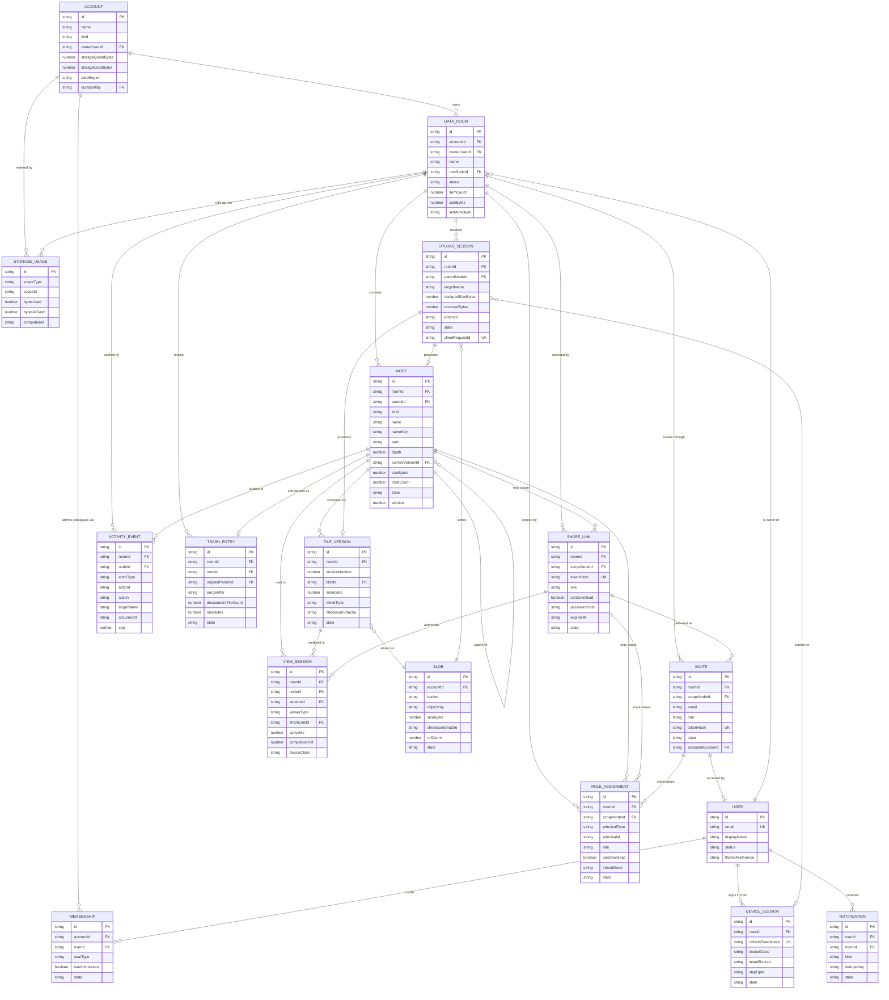
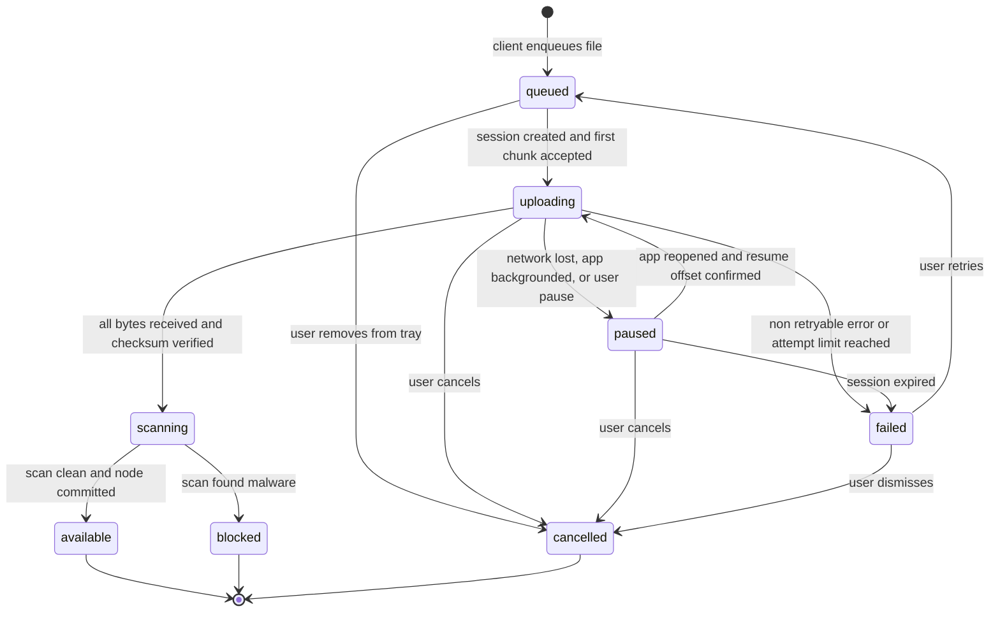
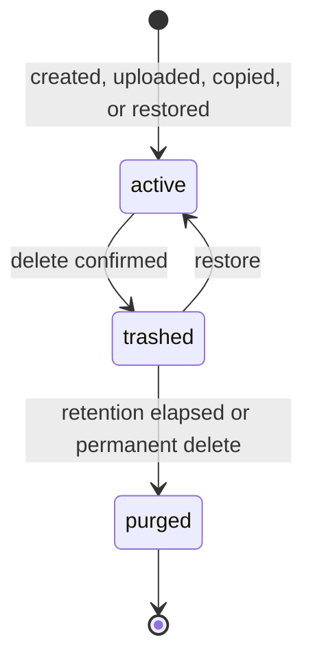
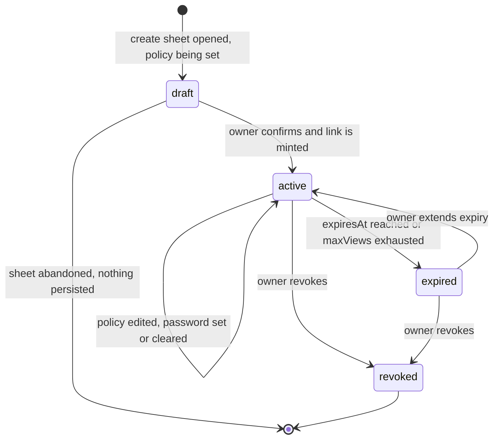
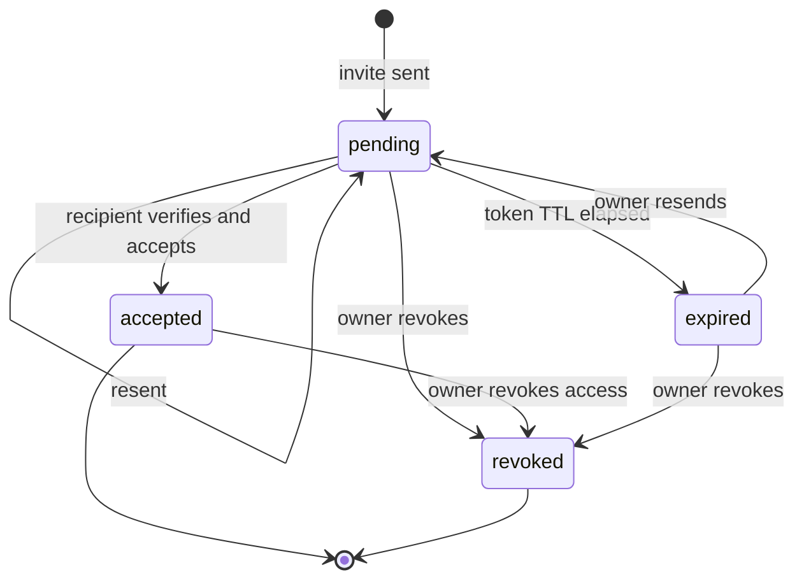

# Domain Model, Data Contracts & Glossary

## Purpose

This document is the single authoritative description of *what the Data Room is made of*. It
defines the entities, their fields and constraints, the state machines that govern their
lifecycles, the TypeScript contract that `packages/shared` publishes to both the API and the web
client, the REST surface each epic needs, and the machine-readable error codes the mobile UI
branches on. It exists so that an engineer can build a repository layer, a QA engineer can write
a negative test, and a designer can name a thing correctly, all from one file. Persistence is
genuinely greenfield in this repository (the current `documents.service.ts` holds an in-memory
seed), so nothing here is a retrofit onto an existing schema. Everything here is constrained by
the mobile-first mandate: the tree model, the pagination model and the error catalogue are all
shaped by what a phone on a bad cellular link can actually do.

This is an internal tool. The accounts in this model belong to our own colleagues; external
parties — clients, buyers, advisers — appear only as recipients reached through a share link or an
emailed invite, and hold no account of any kind unless they choose to accept one. There is no
commerce anywhere in the model: no plan, no subscription, no seat and no payment entity exists.
Storage quota survives, and it is a value an administrator sets (BR-199); it is never derived from
a purchase.

**Ownership.** Under the single-source-of-truth rule, this document owns **entity field names and
error codes**. It does not own thresholds, retention windows, timing guarantees or permission
rules — those belong to [06](./06-business-rules-and-permissions.md) and are cited here by BR ID.
It does not own release tags or priorities — those belong to
[05](./05-functional-requirements.md) and the Release column of the API table below is derived
from it. It does not own metric IDs or event names — those belong to
[10](./10-success-metrics-and-analytics.md).

## Related documents

- [Documentation index](./README.md)
- [Prior art & UX benchmark](./01-prior-art-and-ux-benchmark.md)
- [Personas & JTBD](./02-personas-and-jtbd.md)
- [Product overview](./03-product-overview.md)
- [Epics](./04-epics.md)
- [Functional requirements](./05-functional-requirements.md)
- [Business rules & permissions](./06-business-rules-and-permissions.md)
- [Non-functional requirements](./07-non-functional-requirements.md)
- [Mobile UX spec](./08-mobile-ux-spec.md)
- [Success metrics & analytics](./10-success-metrics-and-analytics.md)
- [Master backlog](./11-master-backlog.md)
- [Risks & open questions](./12-risks-and-open-questions.md)
- Backlog by epic: [Access & Identity](./backlog/epic-01-access-and-identity.md) ·
  [Data Rooms & Workspace Home](./backlog/epic-02-data-rooms-and-workspace-home.md) ·
  [Folder Hierarchy & Navigation](./backlog/epic-03-folder-hierarchy-and-navigation.md) ·
  [File Operations](./backlog/epic-04-file-operations.md) ·
  [Viewing, Preview & File Details](./backlog/epic-05-viewing-preview-and-file-details.md) ·
  [Search & Discovery](./backlog/epic-06-search-and-discovery.md) ·
  [Sharing & Access Control](./backlog/epic-07-sharing-and-access-control.md) ·
  [Conflict Resolution & Data Integrity](./backlog/epic-08-conflict-resolution-and-data-integrity.md) ·
  [Mobile UX Foundations](./backlog/epic-09-mobile-ux-foundations.md) ·
  [Performance, Offline & Scale](./backlog/epic-10-performance-offline-and-scale.md) ·
  [Trust, Audit & Notifications](./backlog/epic-11-trust-audit-and-notifications.md) ·
  [Account, Storage & Governance](./backlog/epic-12-account-storage-and-governance.md)

---

## Entity-relationship overview



**Withdrawn in the internal-tool rework.** Two entities are deleted outright from this model, not
deferred: `PLAN` and `SUBSCRIPTION`. Nothing replaces them; nothing references them. `STORAGE_USAGE`
survives unchanged, because measuring stored bytes is a governance need rather than a commercial
one, and every quota it is compared against is an administrator-set value under BR-199. The seat
modelling that hung off `PLAN` — `seatLimit`, `seats`, `priceMonthlyCents` — is deleted with them:
there is no seat to meter when the whole population is our own colleagues, and every external party
is a recipient who holds no `MEMBERSHIP` row at all. `Account.subscriptionId` and
`Account.seatLimit` are deleted from the entity dictionary for the same reason.

### The modelling decisions that matter

**D1. One `NODE` table with a `kind` discriminator, not separate `folder` and `file` tables.**
Every operation in the brief that a user performs is polymorphic over folders and files: rename,
move, copy, delete with cascade warning, share, revoke, trash, restore, search, breadcrumb. With
two tables, each of those becomes two code paths, two permission checks and two chances for an
access-control bug, and the ordering rule "folders first, then files, both alphabetical" becomes a
`UNION ALL` that no index can serve in one keyset scan. With one table it is one row-level
permission check, one composite index, one cursor. The cost is nullable columns that only apply to
one kind (`currentVersionId`, `mimeType` for files; `childCount`, `descendantFileCount` for
folders). We accept that cost and enforce the kind-specific invariants with check constraints
rather than with a second table. The discriminator is also what makes the mobile list cheap: a
single page of 50 rows already carries everything the row needs to render, with no join fan-out.

**D2. Adjacency list plus a materialised ancestor path, not a closure table.**
`NODE` carries both `parentId` (the authoritative edge) and `path` (a materialised `/`-delimited
string of ancestor ids, for example `/nd_root/nd_fin/nd_2025`). This combination is chosen
specifically because of two mobile requirements. First, the breadcrumb must resolve in one
request: `path` gives us every ancestor id without a recursive query, so a single
`WHERE id = ANY(:ancestorIds)` returns the whole trail (see
[Tree addressing and pagination model](#tree-addressing-and-pagination-model)). Second, the
cascade-delete warning must state exactly what will be destroyed before the user taps Delete, and
`WHERE room_id = :r AND path LIKE :prefix || '%'` answers "how many folders and files are under
this one" with one index range scan. A closure table answers both questions too, but it costs one
row per ancestor-descendant pair, which for a 32-deep 10,000-node room is roughly an order of
magnitude more rows to write on every move, and a subtree move becomes a bulk delete plus bulk
insert instead of a prefix rewrite. The known weakness of the materialised path is that a move
rewrites `path` and `depth` for the whole subtree; we bound that by capping `depth` at 32 and
performing the rewrite inside the same transaction as the `parentId` change, with the subtree size
already known from `descendantFileCount` + `descendantFolderCount` so the API can reject an
oversized move with `MOVE_SUBTREE_TOO_LARGE` rather than time out on a phone. The path stores
**ids, not names**, so a rename is O(1) and never touches descendants.

**D3. Version as a child row, and the node is the stable identity.**
`NODE` is the addressable, shareable, permissionable thing. `FILE_VERSION` is immutable content.
A node points at its `currentVersionId`; uploading over an existing name with the "replace" conflict
resolution appends a new `FILE_VERSION` and repoints the pointer, so every share link, every
`ROLE_ASSIGNMENT` and every deep link stays valid across a version bump. This is a direct answer to
a documented prior-art failure: Intralinks reviewers report that "versions upload as 'copy' and get
messy" (Capterra, 4.1/5, 18 reviews), which is what happens when a new version creates a new
identity. `FILE_VERSION` in turn points at a `BLOB`, and `BLOB` is deduplicated per account by
`checksumSha256` with a `refCount`, which is why the same 40 MB survey PDF re-uploaded after a
failed session consumes the quota once rather than twice. Version retention is 90 days from
supersession with the 3 most recent versions always kept, per BR-186; this document states no
version-retention figure of its own.

**D4. One polymorphic `ROLE_ASSIGNMENT` edge for every kind of principal.**
A user, a pending invite and a public share link all grant access, and all three must be revocable
with immediate effect. Rather than three permission tables, there is one edge with
`principalType` in `{user, invite, share_link}`. The authorisation function is therefore a single
query, and "revoke" is a single state transition on a single row type, which is what makes
`FR-SHARE-*` revocation testable and what makes read-only enforcement one code path in the API
guard instead of one per surface. Effective permission for a node is resolved by walking the
node's own `path` from most specific to least specific and taking the first assignment whose
`inheritMode` is `override`, otherwise the union of inherited grants. The full resolution
algorithm and its precedence table live in
[Business rules & permissions](./06-business-rules-and-permissions.md).

---

## Entity dictionary

Types are written as TypeScript because `packages/shared` is the single typed contract both sides
import. `string` for a timestamp always means an ISO 8601 UTC string with milliseconds, matching
the existing `DocumentSummary.updatedAt` convention. Ids are ULIDs with a human-readable prefix
(`usr_`, `room_`, `nd_`), chosen over UUIDv4 because ULIDs sort lexicographically by creation time,
which makes them usable as the cursor tie-breaker and as the `ActivityEvent` ordering key without a
second column. Fields marked **server-only** must never appear in the shared contract.

### User

| Field | Type | Required | Constraints | Notes |
| --- | --- | --- | --- | --- |
| `id` | `string` | yes | PK, `usr_` + ULID | |
| `email` | `string` | yes | unique on lowercased value, ≤ 254 chars, RFC 5322 | The login identity, and the value the company identity provider asserts for a colleague. Lowercased and NFKC-normalised on write. |
| `emailVerifiedAt` | `string \| null` | yes | ISO 8601 | Null blocks share creation but not reading a link. |
| `displayName` | `string \| null` | yes | 1..120 chars after trim | Shown in the activity log and share screens. |
| `avatarUrl` | `string \| null` | yes | https URL, ≤ 2048 | Optional; initials fallback in the UI. |
| `passwordHash` | `string \| null` | yes | argon2id, **server-only** | Null for OAuth-only, magic-link-only and guest identities. |
| `authMethods` | `AuthMethod[]` | yes | subset of `sso_oidc`, `password`, `magic_link`, `passkey` | Drives the sign-in screen. **Assumption (A-IDP):** `sso_oidc` against the company identity provider is the primary path for colleagues; password, magic link and passkey are the fallback and the path for a recipient who chooses to hold an identity. Which identity provider is an open question in [12](./12-risks-and-open-questions.md). A recipient still needs no identity at all to open a link. |
| `webauthnCredentialIds` | `string[]` | yes | 0..10 entries, **server-only** | Passkeys. Enables biometric-backed step-up (see NFR-SEC). |
| `isGuest` | `boolean` | yes | | True when the identity was created by a recipient accepting an invite without setting a password. Guests can read what was shared with them; they cannot own an account and they hold no `Membership`. |
| `locale` | `string` | yes | BCP 47, default `en-US` | |
| `timezone` | `string` | yes | IANA tz, default `UTC` | Used for digest scheduling and activity-log display. |
| `themePreference` | `'system' \| 'light' \| 'dark'` | yes | default `system` | E09. Server-stored so it survives a reinstall. |
| `densityPreference` | `'comfortable' \| 'compact'` | yes | default `comfortable` | Comfortable keeps 48 CSS px rows. |
| `textScalePreference` | `number` | yes | 1.0..2.0, step 0.125, default 1.0 | Must not conflict with OS dynamic type; multiplies it. |
| `reducedMotion` | `boolean \| null` | yes | null means follow OS | |
| `status` | `UserStatus` | yes | `active`, `suspended`, `retired`, `pending_deletion`, `deleted` | `retired` is the terminal state of the leaver flow in BR-237: the identity can no longer authenticate, and its content is untouched. |
| `deletionRequestedAt` | `string \| null` | yes | | Starts the account-deletion retention window in BR-190 (E12). |
| `lastSeenAt` | `string \| null` | yes | | Updated at most once per 5 minutes to avoid write amplification. |
| `createdAt` / `updatedAt` | `string` | yes | | |

### Account

The tenancy and governance boundary. In an internal tool there is normally one account for the
company, optionally subdivided into teams; an account is the scope an administrator governs under
BR-044, and the scope a storage quota attaches to under BR-199.

| Field | Type | Required | Constraints | Notes |
| --- | --- | --- | --- | --- |
| `id` | `string` | yes | PK, `acc_` + ULID | |
| `name` | `string` | yes | 1..120 chars | The company or team name. |
| `kind` | `'company' \| 'team'` | yes | | A `team` account is a subdivision of the company account, used when an administrator wants a shared ceiling narrower than the company one. |
| `ownerUserId` | `string` | yes | FK → User | The account holder. Exactly one at a time. Transfer is an explicit, audited action. |
| `storageQuotaBytes` | `number` | yes | ≥ 0, **administrator-set** (BR-199), default 1 TiB | Never derived from a purchase, a head count or a room count. Where no administrator has set a value, the BR-199 default is in force; there is no unset state. |
| `storageUsedBytes` | `number` | yes | ≥ 0, denormalised counter | Maintained transactionally; reconciled nightly against `StorageUsage`. |
| `quotaSetBy` / `quotaSetAt` | `string \| null` | yes | FK → User | Who set the quota and when, so the interface can name the administrator to ask (BR-201) and the activity log can show the previous and new values (BR-044). Null means the BR-199 default is in force. |
| `roomLimit` / `guestLimit` | `number` | yes | ≥ 0, `-1` means unlimited, **administrator-set** (BR-236) | Defaults are 200 rooms per account and 500 concurrently active invited recipients per room. Reaching either returns a typed refusal naming the ceiling, the current count and the administrator to ask. |
| `dataRegion` | `'us' \| 'eu'` | yes | immutable after creation | Blob bucket and DB partition selection (NFR-COMPL). |
| `retentionTrashDays` | `number` | yes | fixed at 30 (BR-177) | Trash retention is 30 days, owned by BR-177. The column exists so the value is queryable with the account rather than compiled into the purge job; an administrator changing it is a BR-044 action recorded in the activity log. A room never lengthens it. |
| `activityLogRetentionMonths` | `number` | yes | 6..84, default 24, **administrator-set** (BR-195) | Applies forward only; a change never retroactively deletes entries already retained. |
| `status` | `'active' \| 'suspended' \| 'pending_deletion' \| 'deleted'` | yes | | `suspended` is an administrator action; it blocks new uploads and never deletes data. |
| `createdAt` / `updatedAt` | `string` | yes | | |

### DataRoom

| Field | Type | Required | Constraints | Notes |
| --- | --- | --- | --- | --- |
| `id` | `string` | yes | PK, `room_` + ULID | |
| `accountId` | `string` | yes | FK → Account | |
| `ownerUserId` | `string` | yes | FK → User | Root of all access control for this room. |
| `name` | `string` | yes | 1..120 chars after NFC + trim, no control chars | Not unique. Duplicate names are allowed but the create sheet warns, because "eight rooms called Deal" is the wrong-room mix-up risk a colleague running several mandates at once actually runs. |
| `rootNodeId` | `string` | yes | FK → Node, `kind: 'folder'`, `parentId: null` | Created in the same transaction as the room. |
| `templateId` | `string \| null` | yes | FK → RoomTemplate | Records which starting skeleton was used (E02). |
| `colorToken` | `string \| null` | yes | one of 8 named accents | Purely to make rooms visually unmistakable on a phone home screen (JTBD: never send Deal A's documents to Deal B's recipient). |
| `status` | `RoomStatus` | yes | `active`, `archived`, `trashed`, `purged` | Archived is read-only for everyone including the owner. |
| `itemCount` | `number` | yes | ≥ 0, denormalised | Total non-trashed nodes. Powers "about 10,240 items" without a count query. |
| `fileCount` / `folderCount` | `number` | yes | ≥ 0, denormalised | |
| `sizeBytes` | `number` | yes | ≥ 0, denormalised | Sum of current versions, excluding trash. |
| `trashSizeBytes` | `number` | yes | ≥ 0 | Shown separately so a user understands why usage did not drop after a delete. |
| `maxDepth` | `number` | yes | ≤ 32 (BR-160) | Hard limit; see `FOLDER_DEPTH_EXCEEDED`. |
| `defaultWatermarkMode` | `WatermarkMode` | yes | default `none` | The watermark itself is R1.1 (FR-VIEW-035); the column lands in R1 so the migration is not breaking. |
| `retentionTrashDays` | `number` | yes | 30 (BR-177) | Denormalised from the account so the purge job needs one read. A room never lengthens or shortens it. |
| `lastActivityAt` | `string` | yes | | Drives the home-screen "Recents" ordering. Updated by any mutation or view. |
| `createdBy` / `createdAt` / `updatedAt` / `archivedAt` | `string` / `string \| null` | yes | | |

There is deliberately **no `visibility` or `isPublic` column on DataRoom.** The invisibility rule
(BR-046 to BR-060, and normatively BR-233 in
[Business rules](./06-business-rules-and-permissions.md)) is enforced by the absence of a
`ROLE_ASSIGNMENT`, not by a flag. A room with no assignment for you does not exist for you, and the
API returns `404 NOT_FOUND` rather than any `403` so that room ids are not enumerable. Adding a
boolean here would create a second, weaker source of truth.

### Node

| Field | Type | Required | Constraints | Notes |
| --- | --- | --- | --- | --- |
| `id` | `string` | yes | PK, `nd_` + ULID | |
| `roomId` | `string` | yes | FK → DataRoom, immutable | A node never moves between rooms. Cross-room transfer is copy + delete. |
| `parentId` | `string \| null` | yes | FK → Node, null only for the room root | Must reference a node with `kind: 'folder'` in the same room. |
| `kind` | `NodeKind` | yes | `'folder' \| 'file'`, immutable | |
| `name` | `string` | yes | 1..**255 UTF-8 bytes** (BR-158), NFC, no `/ \ : * ? " < > \|`, no control chars, no leading/trailing space or dot, not a Windows reserved name (`CON`, `PRN`, `AUX`, `NUL`, `COM1..9`, `LPT1..9`) | Rejected with `INVALID_NODE_NAME`. The limit is measured in **bytes** because that is what storage enforces; the interface warns in graphemes before the byte limit is reached (BR-161), so a name of emoji or CJK characters is never silently truncated at a boundary the user cannot see. |
| `nameKey` | `string` | yes | generated: NFC + Unicode case-fold + trim | Unique on `(parentId, nameKey)` where `state = 'active'`. This is the case-insensitive collision policy, in the database, not in the service. |
| `path` | `string` | yes | `/`-delimited ancestor ids, ≤ 1024 chars | Materialised. Excludes the node's own id by convention; the root's path is `''`. |
| `depth` | `number` | yes | 0..32 (BR-160) | Root is 0. |
| `namePathBytes` | `number` | yes | ≤ **4,096 UTF-8 bytes** (BR-159) | Sum of ancestor name byte lengths plus separators. Measured in bytes for the same reason as `name`, and guards the zip-download and OS-restore case. Exceeding it is `PATH_LENGTH_EXCEEDED`. |
| `currentVersionId` | `string \| null` | yes | FK → FileVersion, non-null iff `kind = 'file'` and `state = 'active'` | |
| `mimeType` | `string \| null` | yes | non-null iff `kind = 'file'` | Server-sniffed, never taken from the client (HEIC hazard, see NFR-COMPAT). |
| `sizeBytes` | `number` | yes | ≥ 0 | Files: current version size. Folders: rolled-up subtree size, eventually consistent within the 60-second freshness window carried by FR-PERF-025. |
| `childCount` | `number \| null` | yes | non-null iff folder | Direct children only. Rendered as "12 items" on the row. |
| `descendantFileCount` / `descendantFolderCount` | `number \| null` | yes | non-null iff folder | The blast-radius numbers the delete sheet must state. |
| `thumbnailState` | `ThumbnailState` | yes | `none`, `pending`, `ready`, `unsupported`, `failed` | Never blocks the row from rendering. |
| `previewState` | `PreviewState` | yes | `none`, `pending`, `ready`, `unsupported`, `failed` | Server-rendered page images for large PDFs. |
| `pageCount` | `number \| null` | yes | ≥ 1 when known | Enables page-level viewer analytics (E11). |
| `scanState` | `ScanState` | yes | `pending`, `clean`, `blocked`, `skipped` | A file with `pending` or `blocked` is listable but not downloadable. |
| `state` | `NodeState` | yes | `active`, `trashed`, `purged` | See [Node state machine](#node-lifecycle). |
| `trashEntryId` | `string \| null` | yes | FK → TrashEntry, non-null iff `state = 'trashed'` | |
| `version` | `number` | yes | starts at 1, incremented on every mutation | The optimistic-concurrency token. Serialised as the `ETag`. |
| `createdBy` / `updatedBy` | `string` | yes | FK → User or `'system'` | |
| `createdAt` / `updatedAt` | `string` | yes | | |

Check constraints worth writing explicitly, because each one prevents a real defect:
`kind = 'folder' → currentVersionId IS NULL AND mimeType IS NULL`;
`kind = 'file' → childCount IS NULL`;
`parentId IS NULL → depth = 0 AND path = ''`;
`id <> parentId`; and `position(id in path) = 0` which is the cheap in-database guard against a
folder becoming its own ancestor.

### FileVersion

| Field | Type | Required | Constraints | Notes |
| --- | --- | --- | --- | --- |
| `id` | `string` | yes | PK, `ver_` + ULID | |
| `nodeId` | `string` | yes | FK → Node with `kind = 'file'` | |
| `versionNumber` | `number` | yes | ≥ 1, unique per `nodeId`, monotonic | Allocated inside the commit transaction, never client-supplied. |
| `blobId` | `string` | yes | FK → Blob | |
| `sizeBytes` | `number` | yes | ≥ 0, ≤ the administrator-set per-file ceiling (BR-231) | The ceiling is a configuration value with the default stated in its own rule, never a purchased allowance. |
| `mimeType` | `string` | yes | sniffed server-side | |
| `checksumSha256` | `string` | yes | 64 hex chars | Also the upload idempotency key component. |
| `originalFilename` | `string \| null` | yes | ≤ 255 | What the device called it, kept for forensics; `Node.name` is what the user sees. |
| `uploadSessionId` | `string \| null` | yes | FK → UploadSession | Null for server-side copies. |
| `restoredFromVersionId` | `string \| null` | yes | FK → FileVersion | A restore creates a new version rather than mutating history. |
| `label` | `string \| null` | yes | ≤ 60 chars | Optional human label, for example "signed". |
| `state` | `'scanning' \| 'available' \| 'blocked' \| 'purged'` | yes | | |
| `supersededAt` | `string \| null` | yes | | Set when a newer version becomes current. The retention clock in BR-186 runs from this timestamp, which is why it is a column and not a derivation. |
| `createdBy` / `createdAt` | `string` | yes | | Immutable after creation; there is no `updatedAt` by design. |

Version retention is **90 days from supersession, with the 3 most recent versions always retained
regardless of age (BR-186)**. That rule is stated once, in 06; the pruning job reads
`supersededAt` and `versionNumber` and applies it. This document sets no version-retention figure of
its own, and the "keep 20 versions or 180 days" figure this file previously carried is withdrawn as
a contradiction of BR-186.

### Blob (StorageObject)

| Field | Type | Required | Constraints | Notes |
| --- | --- | --- | --- | --- |
| `id` | `string` | yes | PK, `blob_` + ULID | |
| `accountId` | `string` | yes | FK → Account | Quota attribution and residency. Deduplication never crosses accounts. |
| `bucket` | `string` | yes | | Region-specific, derived from `Account.dataRegion`. |
| `objectKey` | `string` | yes | unique per bucket | `{accountId}/{sha256[0:2]}/{sha256}`. Content-addressed. |
| `sizeBytes` | `number` | yes | ≥ 0 | |
| `checksumSha256` | `string` | yes | unique on `(accountId, checksumSha256)` | The dedup key. |
| `contentType` | `string` | yes | | |
| `storageClass` | `'standard' \| 'infrequent'` | yes | default `standard` | Lifecycle-transitioned after 90 days without access. |
| `encryptionKeyId` | `string` | yes | | SSE-KMS key reference. **server-only**. |
| `refCount` | `number` | yes | ≥ 0 | Number of live `FileVersion` rows pointing here. |
| `state` | `'pending' \| 'committed' \| 'orphaned' \| 'deleted'` | yes | | `pending` objects with no activity for 24 h are swept, which is how abandoned multipart parts are reclaimed. |
| `createdAt` / `lastAccessedAt` | `string` | yes | | |

### Membership

A `Membership` row is a colleague's standing in an account. External recipients hold no
`Membership` at all: their access is a `RoleAssignment` materialised from an `Invite` or a
`ShareLink`, and removing it removes everything.

| Field | Type | Required | Constraints | Notes |
| --- | --- | --- | --- | --- |
| `id` | `string` | yes | PK, `mem_` + ULID | |
| `accountId` / `userId` | `string` | yes | FK, unique together | |
| `seatType` | `ShareRole` | yes | `'owner' \| 'manager' \| 'contributor' \| 'viewer'` | **The role vocabulary and nothing else.** It is the same closed set as `RoleAssignment.role` and `SHARE_ROLES`, so one word means one thing across the model, and it records the account-wide default a colleague is given on rooms they are added to. It is not a licence, it is not metered, and it counts against nothing. |
| `isAdministrator` | `boolean` | yes | default `false` | The administrator capability of BR-044: setting the storage quota (BR-199), setting retention (BR-195), setting the configurable limits (BR-231), and provisioning or deprovisioning colleagues (BR-237). It is a **separate named capability, not a seat type**, which is why it is a boolean here rather than a value of `seatType`. A room role never confers it and it never confers a room role. |
| `invitedBy` | `string \| null` | yes | FK → User | The administrator who provisioned the account, for the joiner flow in BR-237. |
| `invitedAt` / `acceptedAt` | `string` / `string \| null` | yes | | |
| `state` | `'invited' \| 'active' \| 'suspended' \| 'retired' \| 'removed'` | yes | | `retired` is the leaver flow of BR-237: the identity can no longer authenticate but its content, and the grants it issued to recipients, are untouched. `removed` is kept, not deleted, so the activity log still resolves the name. |
| `notificationPrefs` | `NotificationPrefs` | yes | JSON | Per-account defaults; per-room overrides live on `RoomPin`. |

**Withdrawn in the internal-tool rework and by D12.** `seatType` values `admin`, `member` and
`guest` are withdrawn. `admin` is withdrawn because the administrator capability is orthogonal to
any role and is now `isAdministrator`; `member` is withdrawn because it was a licence word standing
in for a role and duplicated `contributor`/`viewer`; `guest` is withdrawn because a recipient holds
no `Membership` row to type. Nothing counts seats, so `Account.seatLimit` and every "consumes a
seat" clause are withdrawn with them.

### RoleAssignment

| Field | Type | Required | Constraints | Notes |
| --- | --- | --- | --- | --- |
| `id` | `string` | yes | PK, `ra_` + ULID | |
| `roomId` | `string` | yes | FK → DataRoom | |
| `scopeNodeId` | `string \| null` | yes | FK → Node, null means the whole room | Must belong to `roomId`. |
| `principalType` | `'user' \| 'invite' \| 'share_link'` | yes | | See D4. |
| `principalId` | `string` | yes | FK by type | |
| `role` | `ShareRole` | yes | `owner`, `manager`, `contributor`, `viewer` | |
| `canDownload` | `boolean` | yes | default `false` for `viewer` | Orthogonal to role, per the brief's download-allowed flag. |
| `inheritMode` | `'inherit' \| 'override'` | yes | default `inherit` | `override` stops resolution at this node, which is how you scope one subfolder to one bidder. |
| `grantedBy` | `string` | yes | FK → User | |
| `grantedAt` | `string` | yes | | |
| `expiresAt` | `string \| null` | yes | | Evaluated at request time, not by a job. |
| `revokedAt` / `revokedBy` | `string \| null` | yes | | |
| `state` | `'active' \| 'expired' \| 'revoked'` | yes | | Unique on `(roomId, scopeNodeId, principalType, principalId)` where `state = 'active'`. |

### ShareLink

| Field | Type | Required | Constraints | Notes |
| --- | --- | --- | --- | --- |
| `id` | `string` | yes | PK, `shl_` + ULID | |
| `roomId` | `string` | yes | FK → DataRoom | |
| `scopeNodeId` | `string \| null` | yes | FK → Node, null means the whole room | A link can target a room, a folder or a single file. |
| `tokenHash` | `string` | yes | SHA-256 of a token carrying at least 160 bits of entropy (BR-055), unique, **server-only** | The plaintext token is returned exactly once, at creation. |
| `tokenPrefix` | `string` | yes | first 6 chars of the token | Lets the share-management screen show "…/s/A7f3Qz" without storing the secret. |
| `kind` | `'public' \| 'permissioned'` | yes | | `permissioned` links only authorise after an `Invite` on the same link resolves to the caller's verified email. |
| `role` | `ShareRole` | yes | `viewer` for `kind: 'public'`; `viewer` or `contributor` for `kind: 'permissioned'` | **An anonymous public-link visitor is always Viewer (D06).** No configuration lets an anonymous visitor write, so a public link carries no role picker at all; the only variable on a public link is the orthogonal `canDownload` flag. Role control belongs to the invite path, where a verified email is bound to the grant. Owner and manager are never grantable by link. |
| `canDownload` | `boolean` | yes | default `false` | Orthogonal to role. With `false`, every byte-delivery path for the scope refuses (BR-090) and preview remains available. |
| `passwordHash` | `string \| null` | yes | argon2id, **server-only** | Presence of this field is what makes the link "password protected". Attempts are limited to 10 failed per link per source address per 15 minutes, then a 15-minute lock on that pair (BR-089, BR-214). |
| `requireEmailCapture` | `boolean` | yes | default `false` | Gate that records a recipient email before first render. |
| `watermarkMode` | `WatermarkMode` | yes | `none`, `viewer_email`, `custom` | The watermark is R1.1 (FR-VIEW-035, FR-SHARE-012). |
| `expiresAt` | `string \| null` | yes | **server-only on every unauthenticated path** | Share-link expiry is R1.1 (FR-SHARE-009). This value is **never disclosed to an unauthenticated visitor under any circumstances** (BR-234): not in a page, not in a banner, not in an email, and not as a field in any response body served to a token holder. It is readable only by a principal holding Owner or Manager on the scope, or by the principal that created the link (BR-060, BR-235). A response that merely carries `expiresAt` to a visitor is a defect against BR-234, so the `/s/:token` responses omit the field entirely rather than nulling it. |
| `maxViews` | `number \| null` | yes | ≥ 1 | Optional hard cap. Like expiry, its existence and its value are never disclosed to a visitor; exhausting it produces the same generic dead-link state as every other reason (BR-234). |
| `viewCount` | `number` | yes | ≥ 0 | Incremented on session start, not on every page. |
| `state` | `ShareLinkState` | yes | `draft`, `active`, `expired`, `revoked` | See [ShareLink state machine](#sharelink-lifecycle). |
| `createdBy` / `createdAt` | `string` | yes | | |
| `revokedBy` / `revokedAt` | `string \| null` | yes | | Revocation is available to the room Owner, to a Manager on the scope, and to the principal that created the grant, and to nobody else (FR-SHARE-014). |
| `lastAccessedAt` | `string \| null` | yes | | |

### Invite (ShareRecipient)

| Field | Type | Required | Constraints | Notes |
| --- | --- | --- | --- | --- |
| `id` | `string` | yes | PK, `inv_` + ULID | |
| `roomId` | `string` | yes | FK → DataRoom | |
| `scopeNodeId` | `string \| null` | yes | FK → Node | |
| `shareLinkId` | `string \| null` | yes | FK → ShareLink | Set when the invite is the delivery mechanism for a permissioned link. |
| `email` | `string` | yes | lowercased, ≤ 254, unique on `(roomId, scopeNodeId, email)` where `state = 'pending'` | Re-inviting the same address updates the existing row rather than creating a second. |
| `role` / `canDownload` | `ShareRole` / `boolean` | yes | | Materialised into a `RoleAssignment` on acceptance. |
| `tokenHash` | `string` | yes | unique, **server-only** | Single-use. |
| `tokenExpiresAt` | `string` | yes | default 14 days | |
| `message` | `string \| null` | yes | ≤ 500 chars, plain text only | Rendered as text, never HTML. |
| `state` | `InviteState` | yes | `pending`, `accepted`, `expired`, `revoked` | See [Invite state machine](#invite-lifecycle). |
| `acceptedByUserId` | `string \| null` | yes | FK → User | |
| `acceptedAt` | `string \| null` | yes | | |
| `resendCount` | `number` | yes | ≤ 5 | Beyond that, `INVITE_RESEND_LIMIT`. |
| `lastResentAt` | `string \| null` | yes | | Minimum 60 s between resends. |
| `invitedBy` / `invitedAt` | `string` | yes | | |

### ActivityEvent

Append-only. There is no `UPDATE` or `DELETE` grant on this table for the application role.

| Field | Type | Required | Constraints | Notes |
| --- | --- | --- | --- | --- |
| `id` | `string` | yes | PK, `evt_` + ULID | ULID gives creation ordering for free. |
| `accountId` | `string` | yes | FK → Account | Partition key. |
| `roomId` | `string \| null` | yes | FK → DataRoom | Null for account-level events such as a sign-in from a new device. |
| `nodeId` | `string \| null` | yes | FK → Node, no cascade | Deliberately no FK cascade: the log outlives the node. |
| `seq` | `number` | yes | monotonic per `roomId` | Lets the client fetch "everything after seq N" for the activity feed. |
| `actorType` | `'user' \| 'invite' \| 'link' \| 'system'` | yes | | |
| `actorId` | `string \| null` | yes | | |
| `actorLabel` | `string` | yes | ≤ 254 | Snapshot of the display name or email at event time. Survives rename and account deletion. |
| `action` | `ActivityAction` | yes | closed enum, see the contract block | Never free text. |
| `targetName` | `string \| null` | yes | ≤ 255 | Snapshot of the node name at event time. |
| `targetPathLabel` | `string \| null` | yes | ≤ 1024 | Human-readable path snapshot, for the CSV export. |
| `metadata` | `Record<string, string \| number \| boolean>` | yes | ≤ 4 KB serialised | Shape is fixed per `action` and validated. |
| `ipHash` | `string \| null` | yes | HMAC-SHA256 of IP with a rotating salt | We record "from where" without storing an IP (NFR-PRIV). |
| `countryCode` | `string \| null` | yes | ISO 3166-1 alpha-2 | |
| `deviceClass` | `'phone' \| 'tablet' \| 'desktop' \| 'unknown'` | yes | | This column is how we obtain a number no comparable product publishes: the real share of data-room work done on a phone, for colleagues and recipients separately. |
| `userAgentFamily` | `string \| null` | yes | ≤ 60 | Parsed family only, never the raw UA string. |
| `occurredAt` / `recordedAt` | `string` | yes | | Two timestamps because an offline mutation is recorded later than it occurred. |

### ViewSession

| Field | Type | Required | Constraints | Notes |
| --- | --- | --- | --- | --- |
| `id` | `string` | yes | PK, `vs_` + ULID | |
| `roomId` / `nodeId` / `versionId` | `string` | yes | FK | Version-pinned, so analytics survive a version bump. |
| `viewerType` | `'member' \| 'invite' \| 'anonymous_link'` | yes | | |
| `viewerUserId` | `string \| null` | yes | FK → User | |
| `viewerEmail` | `string \| null` | yes | | Present for `invite` and for `anonymous_link` with email capture. |
| `shareLinkId` | `string \| null` | yes | FK → ShareLink | |
| `startedAt` | `string` | yes | | |
| `lastHeartbeatAt` | `string` | yes | | Heartbeat every 15 s while the document is foregrounded. |
| `endedAt` | `string \| null` | yes | | |
| `endReason` | `'closed' \| 'navigated' \| 'heartbeat_timeout' \| 'backgrounded'` | yes | | `heartbeat_timeout` marks the session truncated; dwell is a lower bound, and the UI says so. |
| `activeMs` | `number` | yes | ≥ 0 | Foreground time only. Paused on `visibilitychange` to hidden. |
| `pageDwell` | `Record<string, number>` | yes | page number to ms, ≤ 2000 keys | The page-level record that answers "which pages did they actually read". It is part of the per-viewer access log, which is R1.1 (FR-AUDIT-004) and must not record its first view event for a recipient until that recipient has been shown the tracking notice (NFR-PRIV-010, D08). |
| `maxPageReached` | `number \| null` | yes | | |
| `completionPct` | `number` | yes | 0..100 | `pagesWithDwell >= 2s / pageCount`. |
| `downloadCount` | `number` | yes | ≥ 0 | |
| `deviceClass` / `os` / `browser` | `string` | yes | | |
| `networkClass` | `'wifi' \| 'cellular' \| 'unknown'` | yes | | From the Network Information API where available, otherwise `unknown`. |
| `isTruncated` | `boolean` | yes | | Derived from `endReason`. |

### Notification

| Field | Type | Required | Constraints | Notes |
| --- | --- | --- | --- | --- |
| `id` | `string` | yes | PK, `ntf_` + ULID | |
| `userId` | `string` | yes | FK → User | |
| `accountId` / `roomId` | `string` / `string \| null` | yes | FK | |
| `kind` | `NotificationKind` | yes | closed enum: `access_requested`, `share_link_opened_first_time`, `document_viewed`, `download_taken`, `upload_by_other`, `invite_accepted`, `permission_denied_repeated`, `new_device_signin`, `quota_warning` | The closed set E11 delivers. These are notification kinds, not analytics event names; the analytics stream carries them as the `kind` property of `notification_opened` and `notification_muted` in [10](./10-success-metrics-and-analytics.md). |
| `title` / `body` | `string` | yes | ≤ 120 / ≤ 300 chars | Rendered server-side so push, email and in-app read identically. |
| `deepLinkPath` | `string` | yes | app-relative path | Must resolve to a real screen even if the target was deleted (falls back to the room). |
| `dedupeKey` | `string` | yes | unique on `(userId, dedupeKey)` within a 15-minute window | Collapses "14 documents viewed" into one notification. |
| `collapseCount` | `number` | yes | ≥ 1 | |
| `channels` | `NotificationChannelResult[]` | yes | | Per-channel attempt and outcome, including "push unavailable on iOS Safari tab". |
| `state` | `'unread' \| 'read' \| 'archived'` | yes | | |
| `createdAt` / `readAt` | `string` / `string \| null` | yes | | |
| `digestBucket` | `string \| null` | yes | for example `2026-08-21T09` | Set when the user chose a digest rather than immediate delivery. |

### StorageUsage

The measurement half of storage governance. It survived the internal-tool rework unchanged in
substance: what changed is only what the number is compared against. The ceiling is an
administrator-set quota (BR-199), and the three warning thresholds — 75, 90 and 100 percent
(BR-196) — the hard stop at the ceiling (BR-201) and the promise that a quota condition never
silently drops or degrades data (FR-ACCT-009) all still hold.

| Field | Type | Required | Constraints | Notes |
| --- | --- | --- | --- | --- |
| `id` | `string` | yes | PK | |
| `scopeType` | `'account' \| 'team' \| 'room'` | yes | | The three scopes a quota can attach to under BR-199. Where more than one applies, the lowest governs. |
| `scopeId` | `string` | yes | unique on `(scopeType, scopeId)` | |
| `bytesUsed` | `number` | yes | ≥ 0 | Current versions only. |
| `bytesInVersions` | `number` | yes | ≥ 0 | Historical versions, shown separately so the 90-day-plus-3 retention of BR-186 is explainable to whoever is asked to free space. |
| `bytesInTrash` | `number` | yes | ≥ 0 | Shown separately so a colleague understands why usage did not drop after a delete, and what the 30-day trash retention of BR-177 is holding. |
| `quotaBytes` | `number \| null` | yes | ≥ 0 | The administrator-set ceiling in force for this scope (BR-199), snapshotted so a usage figure and the ceiling it was compared against always agree. Null at room and team scope means no explicit ceiling is set and the account ceiling governs. |
| `quotaSource` | `'room' \| 'team' \| 'account' \| 'default'` | yes | | Which of the three sources the ceiling came from, or the BR-199 default. FR-ACCT-027 requires this to be stated in the interface, so it is a stored value and not a UI inference. |
| `fileCount` / `folderCount` | `number` | yes | ≥ 0 | |
| `computedAt` | `string` | yes | | Read by FR-PERF-025, whose freshness window is 60 seconds. |
| `method` | `'incremental' \| 'reconciled'` | yes | | Incremental on every commit; a nightly job reconciles and records drift. |
| `driftBytes` | `number` | yes | | Non-zero drift is an alert, because a wrong usage figure either blocks a colleague who has room to spare or lets a room quietly exceed the ceiling an administrator set. |

### TrashEntry

| Field | Type | Required | Constraints | Notes |
| --- | --- | --- | --- | --- |
| `id` | `string` | yes | PK, `trh_` + ULID | |
| `roomId` / `nodeId` | `string` | yes | FK | `nodeId` is the **root of the trashed subtree**, not every descendant. Descendants are marked `trashed` but share this entry. |
| `originalParentId` | `string` | yes | FK → Node | |
| `originalPath` / `originalName` | `string` | yes | | Needed because the parent may itself be renamed or trashed before restore. |
| `descendantFileCount` / `descendantFolderCount` / `sizeBytes` | `number` | yes | | The blast-radius snapshot taken at delete time. Displayed on the undo toast and in Trash. |
| `deletedBy` / `deletedAt` | `string` | yes | | |
| `purgeAfter` | `string` | yes | `deletedAt` + **30 days** (BR-177) | Trash retention is 30 days, owned by BR-177. The exact purge date is visible in Trash from the moment of deletion. This document states no other trash-retention figure, and the "7 to 90 days" range it previously carried is withdrawn as a contradiction of BR-177. |
| `state` | `'restorable' \| 'restored' \| 'purged'` | yes | | |
| `restoredAt` / `restoredBy` | `string \| null` | yes | | |
| `restoreConflictPolicy` | `ConflictResolution \| null` | yes | | Recorded when a restore had to resolve a name collision. |

### UploadSession

| Field | Type | Required | Constraints | Notes |
| --- | --- | --- | --- | --- |
| `id` | `string` | yes | PK, `ups_` + ULID | |
| `accountId` / `roomId` / `parentNodeId` | `string` | yes | FK | |
| `clientRequestId` | `string` | yes | UUID from the client, unique on `(accountId, clientRequestId)` | The idempotency key. A retry after a page freeze returns the existing session instead of creating "file (2)". |
| `targetName` | `string` | yes | same rules as `Node.name` | |
| `declaredSizeBytes` / `declaredMimeType` | `number` / `string` | yes | | Declared by the client, verified on commit. A mismatch fails the commit. |
| `receivedBytes` | `number` | yes | ≥ 0, ≤ `declaredSizeBytes` | The resume offset. Persisted before each chunk is acknowledged. |
| `chunkSizeBytes` | `number` | yes | 256 KiB..8 MiB | Adaptive: small on cellular, larger on Wi-Fi. |
| `protocol` | `'tus' \| 's3_multipart'` | yes | | tus semantics at the edge, S3 multipart behind it. |
| `uploadUrl` | `string` | yes | | Short-lived. |
| `storageUploadId` | `string \| null` | yes | **server-only** | The S3 multipart upload id. |
| `blobId` | `string \| null` | yes | FK → Blob | Set on commit, or immediately when a checksum pre-check hits an existing blob (instant upload). |
| `expectedChecksumSha256` | `string \| null` | yes | | Enables the dedup fast path. |
| `state` | `UploadState` | yes | see [Upload state machine](#upload-lifecycle) | |
| `conflictResolution` | `ConflictResolution \| null` | yes | | Exactly three values, per BR-151: `keep_both`, `replace`, `cancel`. Null means "ask me". There is no fourth. |
| `attemptCount` | `number` | yes | ≤ 50 | |
| `lastError` | `ApiErrorCode \| null` | yes | | Surfaced verbatim in the upload tray so a retry is informed. |
| `resultNodeId` / `resultVersionId` | `string \| null` | yes | FK | |
| `deviceSessionId` | `string \| null` | yes | FK → DeviceSession | Lets the tray say "queued on your iPhone". |
| `networkClassAtStart` | `string \| null` | yes | | |
| `createdAt` / `lastActivityAt` / `expiresAt` | `string` | yes | | `expiresAt` defaults to 7 days; expiry sweeps the pending blob. |

### DeviceSession

| Field | Type | Required | Constraints | Notes |
| --- | --- | --- | --- | --- |
| `id` | `string` | yes | PK, `ds_` + ULID | |
| `userId` | `string` | yes | FK → User | |
| `refreshTokenHash` | `string` | yes | unique, **server-only** | Rotated on every refresh; reuse of a rotated token revokes the family. |
| `deviceLabel` | `string` | yes | ≤ 60 | "iPhone, Safari". User-editable. |
| `deviceClass` / `os` / `browser` | `string` | yes | | |
| `installSource` | `'browser_tab' \| 'installed_pwa'` | yes | | Materially different capability sets, so the server must know which it is talking to. |
| `pushSubscriptionId` | `string \| null` | yes | | Null on iOS unless the site is on the Home Screen. |
| `createdAt` / `lastSeenAt` / `expiresAt` | `string` | yes | | A refresh credential lives at most 90 days and is rotated on every use; a replayed refresh credential invalidates the whole chain (BR-023). The access credential it mints lives at most 5 minutes (BR-023), which is one of the three mechanisms that make the revocation bound in BR-108 achievable. |
| `stepUpAt` | `string \| null` | yes | | Last successful WebAuthn assertion or password re-entry. Consequential actions require one within the preceding **5 minutes** (BR-045, check C11). The "15 minutes" this file previously carried is withdrawn as a contradiction of BR-045. |
| `isTrusted` | `boolean` | yes | | Set after a successful step-up on this device. |
| `ipHashFirst` / `ipHashLast` / `countryCode` | `string \| null` | yes | | |
| `state` | `'active' \| 'revoked' \| 'expired'` | yes | | "Sign out everywhere" flips every row for the user, and so does deprovisioning under BR-237. Either way the refusal reaches every path within 5 s at p95 and 60 s absolutely (BR-108). |

### Satellite tables

Small tables that carry no independent lifecycle but that the API needs.

| Entity | Key fields | Purpose |
| --- | --- | --- |
| `RoomPin` | `userId`, `roomId`, `pinnedAt`, `sortIndex`, `notificationOverride` | Home-screen favourites and per-room mute. One row per user-room pair. |
| `IdempotencyKey` | `key` (client UUID), `accountId`, `endpoint`, `requestHash`, `responseStatus`, `responseBody`, `expiresAt` (24 h) | Backs every `POST` marked idempotent in the API table. A replay with the same key and a different body returns `IDEMPOTENCY_KEY_REUSED`. |
| `SavedSearch` | `id`, `userId`, `roomId \| null`, `query`, `filters`, `createdAt`, `lastUsedAt` | E06 saved and recent searches. |
| `RoomTemplate` | `id`, `accountId \| null`, `name`, `folderTree` (JSON), `isSystem` | The folder skeleton that turns a 30-minute room setup into 5 minutes, which is the setup job in [Personas & JTBD](./02-personas-and-jtbd.md). |
| `PreviewAsset` | `id`, `versionId`, `page`, `width`, `blobId`, `state` | Server-rendered page images. Keeps large-PDF preview off the phone's JS heap. |

---

## Tree addressing and pagination model

### The sort key and its tie-breaker

The canonical child ordering, and the default in every list on every breakpoint, is
**folders first, then files, each alphabetical, case-insensitive**:

```
ORDER BY kind_rank ASC, name_key ASC, id ASC
```

- `kind_rank` is a generated column: `0` for `folder`, `1` for `file`.
- `name_key` is a generated column: NFC-normalised, Unicode case-folded, trimmed name. Generating
  it in the database rather than the service is what makes the case-insensitive uniqueness
  constraint and the ordering agree. Without it, `Lease.pdf` and `lease.pdf` sort unpredictably
  and collide unpredictably, which is precisely the duplicate-name defect the brief calls out.
- `id` is the **tie-breaker and it is mandatory**. Two siblings can share a `name_key` transiently
  during a restore-with-conflict, and a keyset cursor is only correct over a *total* order. Because
  ids are ULIDs, the tie-break is also stable and creation-ordered.

Supported alternative sorts, each with the same `id` tie-breaker appended:
`modified_desc` (`updated_at DESC, id DESC`), `size_desc` (`size_bytes DESC, id DESC`),
`kind_then_name` (the default), and `name_asc` (ignores `kind_rank`, used by search results).
The covering index is
`(room_id, parent_id, state, kind_rank, name_key, id)` with secondary indexes for the alternative
sorts. Every sort must be backed by an index; an unindexed sort is rejected with
`UNSUPPORTED_SORT` rather than silently doing a heap scan on a 10,000-row folder.

### Why offset pagination is the wrong tool here

| Problem | What it looks like on a phone |
| --- | --- |
| **Window drift** | P4 uploads eleven files into `Financials` while P3 is scrolling it on a train. Every insert before the reader's window shifts the offset, so page 3 repeats rows from page 2 or skips rows entirely. On a desktop that is an annoyance; in a diligence room where the reader is checking "is the AR ageing here yet", a silently skipped row is a wrong answer to a business question. Concurrent mutation is the *normal* case in this product, not the edge case. |
| **Cost grows with scroll depth** | `OFFSET 9950 LIMIT 50` still walks 9,950 index entries. Latency therefore degrades linearly exactly as the user gets more invested in the scroll, and it blows the p75 budget at the worst moment. Keyset pagination is a constant-cost index seek at any depth. |
| **Resume after a freeze is impossible** | The mobile page can be frozen and then discarded by the OS. "I was at offset 4300" is meaningless after any mutation. "I was after key `(1, 'lease.pdf', nd_01J…)`" is exact, and it is the only thing that lets a 40-second interrupted session resume where it stopped. |
| **`total` costs a second scan** | The existing `ListResponse<T>` carries `total`. For a 10,000-item folder that is a `COUNT(*)` on every page. We replace it with `approximateTotal` read from the denormalised `Node.childCount`, and we label it as approximate in the UI ("about 10,240 items"). |

### The cursor

The cursor is an opaque, HMAC-signed, base64url string. Clients must treat it as opaque, and the
API rejects anything it did not mint:

```
payload = { s: sortId, k: kindRank, n: nameKey, i: nodeId, p: parentNodeId, v: schemaVersion }
cursor  = base64url(payload) + "." + base64url(hmacSha256(serverKey, payload))
```

Signing matters for more than tamper-proofing: it stops a client from hand-crafting a cursor that
pages across a `parentId` it has no `RoleAssignment` for. Rules:

- The `sortId` inside the cursor must match the `sort` query parameter, otherwise `400
  CURSOR_SORT_MISMATCH`. Changing sort restarts the listing from the top, which is honest and is
  what the UI does anyway.
- The `parentNodeId` inside the cursor must match the path parameter, otherwise `400 CURSOR_SCOPE_MISMATCH`.
- A cursor older than 24 hours is still accepted; it is a position, not a snapshot. We deliberately
  do **not** implement snapshot isolation across pages. Rows created after the cursor position
  appear; rows deleted disappear. Pull-to-refresh is the documented way to get a fresh view, and
  the list header shows a "3 new items" pill rather than silently reordering under the thumb.
- Page size defaults to 50 and is capped at 100. The cap is a server constraint, not a client
  convention, because a 500-row page is 160 KB of JSON on a 3 Mbps uplink and it breaks the LCP
  budget.

Keyset predicate for the default sort, using a row-value comparison so the composite index is used
in a single seek:

```sql
WHERE room_id = :roomId
  AND parent_id = :parentId
  AND state = 'active'
  AND (kind_rank, name_key, id) > (:k, :n, :i)
ORDER BY kind_rank, name_key, id
LIMIT :limit + 1        -- the +1 row is how hasMore is computed without a count
```

### Resolving a deep breadcrumb in one request

`GET /api/rooms/:roomId/nodes/:nodeId/children?include=breadcrumb,ancestorsPermissions` returns the
page **and** the trail. The trail costs one extra query, never one per level:

```sql
SELECT id, name, kind, depth
FROM node
WHERE room_id = :roomId AND id = ANY(:ancestorIdsFromPath)
```

`:ancestorIdsFromPath` is parsed from the node's own materialised `path`, so there is no recursive
CTE and no N+1. For a node at depth 12 the whole breadcrumb arrives in the same response as the
first 50 children, which is what makes the sticky breadcrumb render in the first paint instead of
popping in later and costing CLS.

Human-readable deep links (`/api/rooms/:roomId/resolve?path=/Financials/2025/Q4`) are supported as a
convenience for shared URLs and for the OS share sheet. They resolve level by level against
`(parent_id, name_key)` with a hard depth limit of 32, and they return the canonical id path so the
client can switch to id addressing immediately. Id-addressed URLs are canonical because a rename
must not break a link that someone pasted into an email.

### How a 10,000-item folder renders on a phone

| Concern | Specification |
| --- | --- |
| Initial payload | First page of 50 rows plus breadcrumb plus folder header. Target ≤ 20 KB gzipped. At roughly 320 bytes of JSON per row that is about 16 KB of rows. |
| Row rendering | Virtualised window with a **fixed 64 CSS px row height** (48 px content plus 16 px padding, which clears the 48 dp Android and 44 pt iOS targets simultaneously). Fixed height means total scroll height is computable from `approximateTotal`, so the scrollbar does not jump and CLS stays at 0. |
| DOM budget | At most three pages of rows retained in the DOM (about 150 rows). Rows scrolled far out of the window are recycled. This is the guard against the roughly 100 to 200 MB uncatchable memory ceiling measured on mobile Safari. |
| Prefetch | Fetch the next page when the last rendered index is within 15 rows of the loaded tail. At most one page request in flight. Cancel in-flight prefetch on navigation. |
| Skeletons | Placeholder rows are the exact same 64 px height as real rows, so arrival never shifts layout. |
| Landmarks | Sticky header shows "1 to 50 of about 10,240" plus the sort control. This is the direct mitigation for the documented "infinite scroll removes landmarks" failure. |
| Escape hatches | Search-in-folder is always visible on compact widths (it is the touch substitute for type-to-jump). An explicit "Load more" button appears after 10 auto-loaded pages, so infinite scroll is never the only mechanism. A jump-to-letter rail appears only at Medium width and above, where it does not fight the row's own tap target. |
| Scroll restoration | On `visibilitychange` to hidden and on navigation away, persist `{ cursorOfFirstVisibleRow, pixelOffsetWithinRow, sortId }`. On return, re-anchor by **key**, not by pixel offset, because rows may have been inserted or removed. If the anchor row is gone, land on the nearest following key and show a "the item you were viewing was moved or deleted" inline notice. |
| Thumbnails | Never in the list payload. Lazy, separate, at most 6 concurrent, `IntersectionObserver`-driven with a 200 px root margin, and cancelled when the row leaves the window. A missing thumbnail degrades to a type glyph and never blocks the row. |
| Counts | `childCount` and `descendantFileCount` are denormalised columns maintained transactionally, so no list request ever triggers a count. |
| Caching | Room content is `Cache-Control: private, no-store` at the HTTP layer. The offline read cache is an explicit, user-chosen pin (E10), not an ambient HTTP cache, because Safari can evict an origin's entire script-created storage after seven days without interaction. |

---

## State machines

### Upload lifecycle



| From | Trigger | Guard | To | Side effects |
| --- | --- | --- | --- | --- |
| (none) | `POST /uploads` | Declared size fits inside every applicable quota (BR-201), name valid, caller has `contributor`+ on the parent, `clientRequestId` unseen | `queued` | Row created. `IdempotencyKey` recorded. Tray shows the item immediately, before any bytes move. A quota refusal happens here, before a byte is accepted, and it names the ceiling breached and the administrator to ask. |
| `queued` | First chunk accepted | Upload URL still valid | `uploading` | `receivedBytes` committed **before** acknowledging the chunk. Screen Wake Lock requested where available. |
| `uploading` | `visibilitychange` to hidden, network error, or explicit pause | | `paused` | Resume offset flushed to IndexedDB or OPFS on the client and to the row on the server. Tray copy becomes "Paused, reopen the app to continue". No background-progress claim is made, because Background Fetch does not exist on iOS and a frozen page cannot run fetch callbacks. |
| `paused` | App foregrounded, or user taps Resume | `expiresAt` in the future | `uploading` | Client issues a `HEAD` offset probe, trusts the **server's** offset, and resumes from there. Chunk size re-selected from the current network class. |
| `paused` | `expiresAt` reached | | `failed` | Pending blob marked `orphaned` for the sweeper. Tray shows a retry affordance with the reason. |
| `uploading` | All bytes received | `receivedBytes == declaredSizeBytes` and computed SHA-256 matches | `scanning` | Blob moves `pending` to `committed`. Node and version rows are **not** yet visible. |
| `uploading` | HTTP 4xx that is not 408/429, or `attemptCount > 50` | | `failed` | `lastError` set to the machine-readable code so the tray can show an accurate message and the right recovery action. |
| `scanning` | Scanner returns clean | Name still available under the chosen `conflictResolution` | `available` | Transaction: create or repoint `FileVersion`, set `Node.currentVersionId`, bump `Node.version`, update counters, write `ActivityEvent`. Thumbnail and preview jobs enqueued. |
| `scanning` | Scanner returns clean | Name now taken and `conflictResolution` is null | `failed` with `NAME_CONFLICT` | The tray asks Keep both / Replace / Cancel. The bytes are already uploaded, so resolving is instant. This is why conflict resolution is a commit-time decision, not an enqueue-time one. |
| `scanning` | Scanner returns a detection | | `blocked` | No node created. Owner notified. Blob quarantined, not deleted, for 30 days. |
| `failed` | User taps Retry | | `queued` | `attemptCount` preserved so the UI can stop offering an infinite retry. |
| any non-terminal | User cancels | | `cancelled` | Multipart upload aborted, pending blob marked `orphaned`. |

### Node lifecycle



| From | Trigger | Guard | To | Side effects |
| --- | --- | --- | --- | --- |
| (none) | Create folder, upload commit, copy, or restore-as-new | Caller has `contributor`+ at the parent, name unique on `(parentId, nameKey)`, `depth + 1 <= 32`, `namePathLength <= 1024` | `active` | Counters incremented up the ancestor chain. `ActivityEvent` `node.created`. |
| `active` | `DELETE /nodes/:id` with confirmation | Caller has `manager`+ on the node, room not archived, `If-Match` matches `version` | `trashed` | **Subtree marked in one transaction.** One `TrashEntry` created on the subtree root carrying the blast-radius snapshot. `sizeBytes` moves from `bytesUsed` to `bytesInTrash`. Undo affordance valid for 10 seconds (BR-176). Active share links whose `scopeNodeId` is inside the subtree begin resolving to the generic dead-link state of BR-234 — a `404 NOT_FOUND` carrying "This link is no longer active." and nothing more — so a recipient learns neither that the item was deleted nor that it ever existed. `ActivityEvent` `node.trashed` with the counts. |
| `trashed` | Restore | Original parent still `active` (else restore to room root and say so), name available or a `ConflictResolution` supplied | `active` | Subtree restored, counters moved back, `TrashEntry.state` to `restored`. Any name collision resolved per policy and recorded. |
| `trashed` | `purgeAfter` reached, or explicit permanent delete by the room owner | Retention elapsed, or explicit two-step confirmation | `purged` | Rows retained as tombstones (id, name snapshot, timestamps) so the audit log stays readable. `FileVersion` rows purged, `Blob.refCount` decremented, blobs with `refCount = 0` deleted after a 7-day grace. `bytesInTrash` released. `ActivityEvent` `node.purged`. Irreversible, and the confirmation copy says so. |

A trashed node is invisible in listings and in search, returns `404` on direct fetch to anyone
without `manager`+, and is visible only in the room's Trash screen. Trashed descendants do **not**
each get a `TrashEntry`; they inherit the one on the subtree root, which is what makes "restore that
folder" a single operation.

### ShareLink lifecycle



Note on `password-protected`: it is modelled as a **property of `active`**, not a sibling state. A
link with a non-null `passwordHash` is `active` and password-gated. Modelling it as a separate state
would double every transition (active/revoked becomes four states) for no behavioural gain, and it
would make "set a password on an existing link" a state change rather than a policy edit. The UI
still shows it as a distinct badge, which is what users need.

| From | Trigger | Guard | To | Side effects |
| --- | --- | --- | --- | --- |
| (none) | Share sheet opened | Caller has `manager`+ on the scope | `draft` | Nothing persisted. Client-side only, so an abandoned sheet leaves no link. |
| `draft` | Confirm | Room active, scope not trashed, rate limit not hit | `active` | Token minted once and returned once. `RoleAssignment` created with `principalType: 'share_link'`. `ActivityEvent` `share.created` recording role, download flag, expiry and password presence. |
| `active` | Edit policy | Caller has `manager`+, `If-Match` matches | `active` | Takes effect on the **next request**, with no session grace period. `ActivityEvent` `share.policy_changed` with a before and after diff. |
| `active` | `expiresAt` passes, or `viewCount >= maxViews` | Evaluated at request time | `expired` | Next access resolves to the generic dead-link state of BR-234: `404 NOT_FOUND`, the single sentence "This link is no longer active.", a request-access affordance, and no disclosure of the reason, the expiry date, the item, the room or the sharer. State is also flipped by a sweeper so the share-management screen reads correctly, but authorisation never depends on the sweeper having run. |
| `active` or `expired` | Revoke | Caller is the room Owner, a Manager on the scope, or the principal that created the grant (FR-SHARE-014) | `revoked` | `RoleAssignment` revoked in the same transaction. The refusal reaches every path within 5 s at p95 and 60 s absolutely (BR-108); a loaded page loses access at its next re-check, which happens at least every 30 s (BR-112); a download already streaming is cut at the next range boundary and never more than 30 s later (BR-111). Signed asset URLs already issued are invalidated by incrementing the grant's epoch counter, so a pre-signed page image cannot outlive the revoke (BR-110). `ActivityEvent` `share.revoked`. Revocation is terminal: a revoked link is never reactivated, and the UI offers "create a new link" instead. |
| `expired` | Extend expiry | Caller is the Owner, a Manager on the scope, or the link's creator | `active` | Same token. `ActivityEvent` `share.extended`. Nothing about the old or new expiry is disclosed to a visitor (BR-234). |

### Invite lifecycle



| From | Trigger | Guard | To | Side effects |
| --- | --- | --- | --- | --- |
| (none) | `POST /rooms/:id/invites` | Caller has `manager`+, email valid, the room's administrator-set recipient ceiling not reached (BR-236), no existing `pending` invite for the same `(room, scope, email)` | `pending` | Token minted, email queued. `ActivityEvent` `invite.sent`. A `RoleAssignment` with `principalType: 'invite'` is created immediately in `active` state but only authorises after acceptance binds a user, which keeps the permission-resolution query single-shot. |
| `pending` | Resend | `resendCount < 5`, ≥ 60 s since last send | `pending` | New token, old token invalidated. `resendCount` incremented. |
| `pending` | Recipient opens the link and verifies the email | Token valid and unexpired, room active | `accepted` | If no account exists, a guest `User` is created with `isGuest: true` and no password. `acceptedByUserId` set. `RoleAssignment.principalId` rebound from the invite to the user. `ActivityEvent` `invite.accepted`. Recipient lands directly on the shared content, with no account wall, which is the whole recipient thesis. |
| `pending` | `tokenExpiresAt` reached | | `expired` | Opening the link shows the generic dead-link state of BR-234 with its request-access affordance, which notifies the sharer. No dead end, and no disclosure of the reason or of any date. |
| `pending`, `accepted` or `expired` | Revoke | Caller is the room Owner, a Manager on the scope, or the principal that created the invite (FR-SHARE-014) | `revoked` | `RoleAssignment` revoked. The refusal reaches every path within the BR-108 bound. `ActivityEvent` `invite.revoked`. |

---

## Shared contract additions

These types go into `packages/shared/src`, alongside the existing `documents.ts` and `http.ts`.
They follow the conventions already established there: `as const` tuples with derived union types,
`is*` type guards for anything the API validates with `class-validator`, interfaces rather than
classes, and ISO 8601 strings for every timestamp. `DocumentSummary` and `DOCUMENT_STATUSES` stay
where they are for now and are superseded by `NodeSummary` once the repository lands; the migration
note is in [Risks & open questions](./12-risks-and-open-questions.md).

```ts
// packages/shared/src/nodes.ts

export const NODE_KINDS = ['folder', 'file'] as const;
export type NodeKind = (typeof NODE_KINDS)[number];

export const NODE_STATES = ['active', 'trashed', 'purged'] as const;
export type NodeState = (typeof NODE_STATES)[number];

export const THUMBNAIL_STATES = ['none', 'pending', 'ready', 'unsupported', 'failed'] as const;
export type ThumbnailState = (typeof THUMBNAIL_STATES)[number];

export const SCAN_STATES = ['pending', 'clean', 'blocked', 'skipped'] as const;
export type ScanState = (typeof SCAN_STATES)[number];

/** Hard limits. Exported so the client can validate before a round trip. */
export const NODE_NAME_MAX_LENGTH = 255;
export const NODE_PATH_MAX_LENGTH = 1024;
export const NODE_MAX_DEPTH = 32;
/** Control characters plus the punctuation that breaks OS restore and zip download. */
export const FORBIDDEN_NAME_CHARS = /[\u0000-\u001F/\\:*?"<>|]/;
/** Leading or trailing whitespace and a trailing dot are rejected separately. */
export const NAME_EDGE_VIOLATION = /(^[\s.])|([\s.]$)/;
export const RESERVED_NAMES = [
  'CON', 'PRN', 'AUX', 'NUL',
  'COM1', 'COM2', 'COM3', 'COM4', 'COM5', 'COM6', 'COM7', 'COM8', 'COM9',
  'LPT1', 'LPT2', 'LPT3', 'LPT4', 'LPT5', 'LPT6', 'LPT7', 'LPT8', 'LPT9',
] as const;

/** The row shape every list, tile, search result and preview header is built from. */
export interface Node {
  id: string;
  roomId: string;
  parentId: string | null;
  kind: NodeKind;
  name: string;
  /** Files only. Server-sniffed, never echoed from the client. */
  mimeType: string | null;
  /** Files: current version size. Folders: rolled-up subtree size, eventually consistent. */
  sizeBytes: number;
  /** Folders only: direct children. */
  childCount: number | null;
  /** Folders only: the blast radius the delete sheet must state. */
  descendantFileCount: number | null;
  descendantFolderCount: number | null;
  depth: number;
  thumbnailState: ThumbnailState;
  thumbnailUrl: string | null;
  previewAvailable: boolean;
  pageCount: number | null;
  scanState: ScanState;
  state: NodeState;
  /** Optimistic-concurrency token. Send it back as If-Match on every mutation. */
  etag: string;
  /** What the caller may do with this node, already resolved server-side. */
  capabilities: NodeCapabilities;
  createdAt: string;
  updatedAt: string;
  updatedByLabel: string | null;
}

/**
 * Resolved per request for the calling principal. The client renders affordances from this and
 * never from a role string, so read-only enforcement cannot drift between UI and API.
 */
export interface NodeCapabilities {
  canRead: boolean;
  canDownload: boolean;
  canRename: boolean;
  canMove: boolean;
  canDelete: boolean;
  canUploadInto: boolean;
  canShare: boolean;
  canManagePermissions: boolean;
  canViewActivity: boolean;
}

export interface Breadcrumb {
  /** Ordered root first, excluding the current node. */
  ancestors: BreadcrumbEntry[];
  current: BreadcrumbEntry;
  /** True when ancestors were elided because the trail exceeded the collapse limit. */
  truncated: boolean;
}

export interface BreadcrumbEntry {
  id: string;
  name: string;
  kind: NodeKind;
  depth: number;
}
```

```ts
// packages/shared/src/rooms.ts

export const ROOM_STATUSES = ['active', 'archived', 'trashed', 'purged'] as const;
export type RoomStatus = (typeof ROOM_STATUSES)[number];

export interface DataRoomSummary {
  id: string;
  name: string;
  colorToken: string | null;
  status: RoomStatus;
  rootNodeId: string;
  ownerLabel: string;
  /** True when the caller is not a member of the owning account. */
  isSharedWithMe: boolean;
  isPinned: boolean;
  role: ShareRole;
  itemCount: number;
  fileCount: number;
  folderCount: number;
  sizeBytes: number;
  /** Kept separate so a user understands why usage did not drop after a delete. */
  trashSizeBytes: number;
  activeShareCount: number;
  pendingInviteCount: number;
  unreadActivityCount: number;
  lastActivityAt: string;
  createdAt: string;
  capabilities: RoomCapabilities;
}

export interface RoomCapabilities {
  canRename: boolean;
  canArchive: boolean;
  canDelete: boolean;
  canShare: boolean;
  canManageMembers: boolean;
  canUpload: boolean;
  canViewAnalytics: boolean;
  canExportAudit: boolean;
}
```

```ts
// packages/shared/src/sharing.ts

/** Ordered least to most privileged. Comparisons rely on this order. */
export const SHARE_ROLES = ['viewer', 'contributor', 'manager', 'owner'] as const;
export type ShareRole = (typeof SHARE_ROLES)[number];

export const SHARE_LINK_STATES = ['draft', 'active', 'expired', 'revoked'] as const;
export type ShareLinkState = (typeof SHARE_LINK_STATES)[number];

export const INVITE_STATES = ['pending', 'accepted', 'expired', 'revoked'] as const;
export type InviteState = (typeof INVITE_STATES)[number];

export const WATERMARK_MODES = ['none', 'viewer_email', 'custom'] as const;
export type WatermarkMode = (typeof WATERMARK_MODES)[number];

/** Everything that governs what a recipient can do. One object, one Apply, one audit entry. */
export interface SharePolicy {
  role: Exclude<ShareRole, 'owner'>;
  canDownload: boolean;
  /** null means the link never expires. R1 defaults invites to 14 days. */
  expiresAt: string | null;
  /** Write-only. Reads return passwordSet instead. */
  password?: string | null;
  requireEmailCapture: boolean;
  watermarkMode: WatermarkMode;
  maxViews: number | null;
}

export interface ShareLinkSummary {
  id: string;
  roomId: string;
  scopeNodeId: string | null;
  scopeLabel: string;
  kind: 'public' | 'permissioned';
  state: ShareLinkState;
  /** Displayable stub, never the secret. The full URL is returned once, at creation. */
  tokenPrefix: string;
  passwordSet: boolean;
  policy: Omit<SharePolicy, 'password'>;
  viewCount: number;
  uniqueViewerCount: number;
  lastAccessedAt: string | null;
  createdByLabel: string;
  createdAt: string;
}

export interface InviteSummary {
  id: string;
  roomId: string;
  scopeNodeId: string | null;
  scopeLabel: string;
  email: string;
  state: InviteState;
  policy: Omit<SharePolicy, 'password'>;
  resendCount: number;
  lastResentAt: string | null;
  invitedByLabel: string;
  invitedAt: string;
  acceptedAt: string | null;
}

/** Answers "who can see this right now" for one node, in one payload. */
export interface AccessSummary {
  nodeId: string;
  inheritedFrom: BreadcrumbEntry | null;
  entries: AccessEntry[];
  publicLinkCount: number;
}

export interface AccessEntry {
  principalType: 'user' | 'invite' | 'share_link';
  principalId: string;
  label: string;
  role: ShareRole;
  canDownload: boolean;
  source: 'direct' | 'inherited';
  sourceNodeId: string | null;
  expiresAt: string | null;
}
```

```ts
// packages/shared/src/listing.ts

export const CHILD_SORTS = ['kind_then_name', 'name_asc', 'modified_desc', 'size_desc'] as const;
export type ChildSort = (typeof CHILD_SORTS)[number];

export const DEFAULT_PAGE_SIZE = 50;
export const MAX_PAGE_SIZE = 100;

export interface ListChildrenQuery {
  /** Opaque, HMAC-signed. Never construct one on the client. */
  cursor?: string;
  limit?: number;
  sort?: ChildSort;
  kind?: NodeKind;
  /** Filename substring, case-insensitive. Search-in-folder on compact widths. */
  q?: string;
  include?: ('breadcrumb' | 'capabilities' | 'access')[];
}

/**
 * The cursor envelope. Deliberately not ListResponse<T>: an exact `total` on a 10,000-item
 * folder is a second index scan on every page, so we expose the denormalised counter as
 * approximate and say so in the UI.
 */
export interface CursorPage<T> {
  items: T[];
  nextCursor: string | null;
  hasMore: boolean;
  /** From Node.childCount. Rendered as "about 10,240 items". */
  approximateTotal: number;
  sort: ChildSort;
}

export interface ListChildrenResponse extends CursorPage<Node> {
  parent: Node;
  breadcrumb?: Breadcrumb;
  access?: AccessSummary;
}
```

```ts
// packages/shared/src/conflicts.ts

export const CONFLICT_RESOLUTIONS = ['keep_both', 'replace', 'cancel', 'merge_folders'] as const;
export type ConflictResolution = (typeof CONFLICT_RESOLUTIONS)[number];

export function isConflictResolution(value: unknown): value is ConflictResolution {
  return typeof value === 'string' && (CONFLICT_RESOLUTIONS as readonly string[]).includes(value);
}

/** Returned with a 409 so the sheet can render the choice without a second round trip. */
export interface ConflictDetail {
  attemptedName: string;
  /** The deterministic name keep_both would produce, so the UI shows the real outcome. */
  suggestedName: string;
  existingNodeId: string;
  existingKind: NodeKind;
  existingSizeBytes: number;
  existingUpdatedAt: string;
  /** merge_folders is offered only when both sides are folders. */
  allowedResolutions: ConflictResolution[];
}
```

```ts
// packages/shared/src/activity.ts

export const ACTIVITY_ACTIONS = [
  'room.created', 'room.renamed', 'room.archived', 'room.deleted',
  'node.created', 'node.uploaded', 'node.version_added', 'node.renamed',
  'node.moved', 'node.copied', 'node.trashed', 'node.restored', 'node.purged',
  'node.downloaded', 'node.viewed',
  'share.created', 'share.policy_changed', 'share.extended', 'share.revoked',
  'invite.sent', 'invite.resent', 'invite.accepted', 'invite.revoked',
  'member.added', 'member.role_changed', 'member.removed', 'ownership.transferred',
  'auth.signed_in', 'auth.new_device', 'auth.signed_out_all', 'auth.password_changed',
  'quota.warning', 'quota.blocked',
] as const;
export type ActivityAction = (typeof ACTIVITY_ACTIONS)[number];

export interface ActivityEvent {
  id: string;
  seq: number;
  roomId: string | null;
  nodeId: string | null;
  action: ActivityAction;
  actorType: 'user' | 'invite' | 'link' | 'system';
  /** Snapshot at event time, so the log survives rename and account deletion. */
  actorLabel: string;
  targetName: string | null;
  targetPathLabel: string | null;
  deviceClass: 'phone' | 'tablet' | 'desktop' | 'unknown';
  countryCode: string | null;
  metadata: Record<string, string | number | boolean>;
  occurredAt: string;
}
```

```ts
// packages/shared/src/errors.ts

/**
 * Every code the UI branches on. Adding a code is a contract change; removing one is breaking.
 * A Nest exception filter maps every thrown error to exactly one of these.
 */
export const API_ERROR_CODES = [
  // 400
  'VALIDATION_FAILED', 'INVALID_NODE_NAME', 'INVALID_CURSOR',
  'CURSOR_SORT_MISMATCH', 'CURSOR_SCOPE_MISMATCH', 'UNSUPPORTED_SORT',
  'FOLDER_DEPTH_EXCEEDED', 'PATH_LENGTH_EXCEEDED', 'MOVE_INTO_DESCENDANT',
  'MOVE_SUBTREE_TOO_LARGE', 'UNSUPPORTED_PREVIEW_TYPE',
  // 401
  'AUTH_REQUIRED', 'SESSION_EXPIRED', 'INVALID_CREDENTIALS',
  'SHARE_PASSWORD_REQUIRED', 'SHARE_PASSWORD_INCORRECT',
  // 403
  'FORBIDDEN', 'READ_ONLY_SHARE', 'DOWNLOAD_NOT_PERMITTED',
  'SHARE_REVOKED', 'SHARE_EXPIRED', 'SHARE_VIEW_LIMIT_REACHED',
  'EMAIL_VERIFICATION_REQUIRED', 'STEP_UP_REQUIRED',
  'ROOM_ARCHIVED', 'ACCOUNT_SUSPENDED', 'ACCOUNT_LIMIT_REACHED',
  // 404
  'NOT_FOUND', 'SHARE_TARGET_UNAVAILABLE',
  // 409
  'NAME_CONFLICT', 'ALREADY_EXISTS', 'IDEMPOTENCY_KEY_REUSED',
  'UPLOAD_ALREADY_COMMITTED', 'INVITE_ALREADY_ACCEPTED',
  // 410
  'INVITE_EXPIRED', 'UPLOAD_SESSION_EXPIRED',
  // 412 / 428
  'STALE_VERSION', 'IF_MATCH_REQUIRED',
  // 413
  'FILE_TOO_LARGE', 'REQUEST_TOO_LARGE',
  // 415
  'UNSUPPORTED_MEDIA_TYPE',
  // 422
  'CHECKSUM_MISMATCH', 'SIZE_MISMATCH', 'MALWARE_DETECTED',
  // 429
  'RATE_LIMITED', 'INVITE_RESEND_LIMIT', 'LOGIN_ATTEMPT_LIMIT',
  // 5xx
  'INTERNAL_ERROR', 'DEPENDENCY_UNAVAILABLE', 'STORAGE_QUOTA_EXCEEDED', 'SCAN_UNAVAILABLE',
] as const;
export type ApiErrorCode = (typeof API_ERROR_CODES)[number];

export function isApiErrorCode(value: unknown): value is ApiErrorCode {
  return typeof value === 'string' && (API_ERROR_CODES as readonly string[]).includes(value);
}

/** The single error shape. Every non-2xx response from /api has exactly this body. */
export interface ApiErrorBody {
  error: {
    code: ApiErrorCode;
    /** Safe to show to an end user on a phone. Short, no jargon, no ids. */
    message: string;
    httpStatus: number;
    /** Correlates the toast the user saw with the server log line. */
    requestId: string;
    /** Field-level detail for VALIDATION_FAILED. */
    fields?: { field: string; message: string }[];
    /** Present on NAME_CONFLICT so the sheet can offer the real choice immediately. */
    conflict?: ConflictDetail;
    /** Present on STALE_VERSION so the client can offer "reload and reapply". */
    currentEtag?: string;
    /** Present on RATE_LIMITED and DEPENDENCY_UNAVAILABLE. */
    retryAfterSeconds?: number;
    /** Present on STORAGE_QUOTA_EXCEEDED and FILE_TOO_LARGE. */
    limit?: { name: string; limitBytes: number; usedBytes: number };
  };
}
```

```ts
// packages/shared/src/http.ts additions

/** Header names the client and server must agree on exactly. */
export const HEADER_IDEMPOTENCY_KEY = 'idempotency-key';
export const HEADER_REQUEST_ID = 'x-request-id';
export const HEADER_CLIENT_INFO = 'x-dataroom-client'; // "web/1.4.2; pwa=installed; net=cellular"
export const HEADER_SHARE_TOKEN = 'x-share-token';

/** Kept for the existing documents endpoints. New collection endpoints use CursorPage<T>. */
export interface ListResponse<T> {
  items: T[];
  total: number;
}
```

---

## API surface sketch

All paths are relative to `API_PREFIX`, so `/rooms` means `/api/rooms`. "Auth scope" names the
minimum a caller needs. `Share token` means the request carries a share token instead of a session,
which is how a recipient reads without an account. Every mutating endpoint requires `If-Match` with
the node or room ETag unless noted, and every `POST` marked idempotent honours the
`Idempotency-Key` header for 24 hours.

| # | Method | Path | Purpose | Epic | Auth scope | Idempotent | Notable statuses | R1 |
| --- | --- | --- | --- | --- | --- | --- | --- | --- |
| 1 | `GET` | `/health` | Liveness. Already exists. | - | public | n/a | 200 | Yes |
| 2 | `POST` | `/auth/signup` | Email and password signup. | E01 | public | Yes | 201, 409 `ALREADY_EXISTS`, 429 | Yes |
| 3 | `POST` | `/auth/sessions` | Sign in. Returns access token plus refresh cookie. | E01 | public | No | 200, 401 `INVALID_CREDENTIALS`, 429 `LOGIN_ATTEMPT_LIMIT` | Yes |
| 4 | `POST` | `/auth/sessions/refresh` | Rotate the refresh token. | E01 | refresh cookie | No | 200, 401 `SESSION_EXPIRED` | Yes |
| 5 | `DELETE` | `/auth/sessions/current` | Sign out this device. | E01 | session | Yes | 204 | Yes |
| 6 | `DELETE` | `/auth/sessions` | Sign out everywhere. | E01 | session + step-up | Yes | 204, 403 `STEP_UP_REQUIRED` | Yes |
| 7 | `GET` | `/auth/sessions` | List device sessions. | E01 | session | n/a | 200 | Yes |
| 8 | `DELETE` | `/auth/sessions/:id` | Revoke one device. | E01 | session | Yes | 204, 404 | Yes |
| 9 | `POST` | `/auth/magic-link` | Request a magic link. | E01 | public | Yes | 202, 429 | R2 |
| 10 | `POST` | `/auth/password-reset` | Request a reset. | E01 | public | Yes | 202, 429 | Yes |
| 11 | `POST` | `/auth/email-verification/resend` | Resend verification. | E01 | session | Yes | 202, 429 | Yes |
| 12 | `POST` | `/auth/webauthn/registration` | Register a passkey. | E01 | session | No | 201 | R2 |
| 13 | `POST` | `/auth/webauthn/assertion` | Step-up re-auth on resume. | E01 | session | No | 200, 401 | R2 |
| 14 | `GET` | `/me` | Current user, account, the limits in force with their source, capabilities. | E01/E12 | session | n/a | 200 | Yes |
| 15 | `PATCH` | `/me` | Profile, locale, theme, density, text scale. | E09/E12 | session | Yes | 200, 400 | Yes |
| 16 | `DELETE` | `/me` | Request account deletion. | E01/E12 | session + step-up | Yes | 202, 403 `STEP_UP_REQUIRED` | Yes |
| 17 | `GET` | `/rooms` | Home screen: my rooms, shared with me, pinned, recents. Cursor paged. | E02 | session | n/a | 200 | Yes |
| 18 | `POST` | `/rooms` | Create a room, optionally from a template. | E02 | session, verified email | Yes | 201, 403 `ACCOUNT_LIMIT_REACHED` (room-count ceiling, BR-236), 429 | Yes |
| 19 | `GET` | `/rooms/:roomId` | Room summary and capabilities. | E02 | `viewer` on room | n/a | 200, **404 for non-members** | Yes |
| 20 | `PATCH` | `/rooms/:roomId` | Rename, recolour, retention, watermark default. | E02 | `manager` | Yes | 200, 412 `STALE_VERSION`, 403 `ROOM_ARCHIVED` | Yes |
| 21 | `POST` | `/rooms/:roomId/duplicate` | Duplicate structure, optionally with files. | E02 | `manager` | Yes | 202, 403 | R2 |
| 22 | `POST` | `/rooms/:roomId/archive` | Archive (read-only for everyone). | E02 | owner | Yes | 200 | R2 |
| 23 | `DELETE` | `/rooms/:roomId` | Trash the room. Body must echo the blast-radius counts. | E02 | owner + step-up | Yes | 202, 409, 403 | Yes |
| 24 | `PUT` | `/rooms/:roomId/pin` | Pin or unpin on the home screen. | E02 | `viewer` | Yes | 204 | Yes |
| 25 | `GET` | `/room-templates` | Available starting skeletons. | E02 | session | n/a | 200 | R2 |
| 26 | `GET` | `/rooms/:roomId/nodes/:nodeId` | One node with capabilities and breadcrumb. | E03 | `viewer` on node | n/a | 200, 404 | Yes |
| 27 | `GET` | `/rooms/:roomId/nodes/:nodeId/children` | **The core listing.** Cursor paged, `include=breadcrumb,capabilities,access`. | E03 | `viewer` | n/a | 200, 400 `INVALID_CURSOR`/`CURSOR_SORT_MISMATCH`, 404 | Yes |
| 28 | `POST` | `/rooms/:roomId/nodes` | Create a folder. | E03 | `contributor` on parent | Yes | 201, 409 `NAME_CONFLICT`, 400 `FOLDER_DEPTH_EXCEEDED` | Yes |
| 29 | `PATCH` | `/rooms/:roomId/nodes/:nodeId` | Rename. `If-Match` required. | E03 | `contributor` | Yes | 200, 409, 412, 428 `IF_MATCH_REQUIRED` | Yes |
| 30 | `POST` | `/rooms/:roomId/nodes/:nodeId/move` | Move to a destination folder. | E04 | `manager` on source, `contributor` on target | Yes | 200, 400 `MOVE_INTO_DESCENDANT`, 409, 412 | Yes |
| 31 | `POST` | `/rooms/:roomId/nodes/:nodeId/copy` | Copy or duplicate. | E04 | `contributor` on target | Yes | 201 or 202 for large subtrees, 409, 507 | Yes |
| 32 | `DELETE` | `/rooms/:roomId/nodes/:nodeId` | Trash. Requires `?confirmFiles=&confirmFolders=` matching the server's counts. | E03/E04 | `manager` | Yes | 202, 409 `STALE_VERSION` if the counts moved, 412 | Yes |
| 33 | `POST` | `/rooms/:roomId/nodes/:nodeId/restore` | Restore from trash, with an optional `ConflictResolution`. | E08 | `manager` | Yes | 200, 409 | Yes |
| 34 | `POST` | `/rooms/:roomId/nodes/batch` | Bulk move, copy, delete, restore. Returns per-item results. | E04 | per item | Yes | 207 partial, 400, 403 | Yes |
| 35 | `GET` | `/rooms/:roomId/trash` | Trash listing with purge dates. | E08 | `manager` | n/a | 200 | Yes |
| 36 | `DELETE` | `/rooms/:roomId/trash/:trashEntryId` | Permanent delete, two-step. | E08 | owner + step-up | Yes | 204, 403 | R2 |
| 37 | `GET` | `/rooms/:roomId/resolve` | Resolve a human path to canonical ids. | E03 | `viewer` | n/a | 200, 404, 400 `PATH_LENGTH_EXCEEDED` | Yes |
| 38 | `POST` | `/rooms/:roomId/uploads` | Create an upload session. Returns protocol, chunk size and upload URL. | E04 | `contributor` | Yes (`clientRequestId`) | 201, 413 `FILE_TOO_LARGE`, 507 `STORAGE_QUOTA_EXCEEDED`, 429 | Yes |
| 39 | `PATCH` | `/uploads/:uploadId` | Append a chunk (tus `PATCH` semantics, `Upload-Offset`). | E04 | upload token | Yes | 204, 409 offset mismatch, 410 `UPLOAD_SESSION_EXPIRED`, 413 | Yes |
| 40 | `HEAD` | `/uploads/:uploadId` | Offset probe on resume. The authoritative resume point. | E04 | upload token | n/a | 200 with `Upload-Offset`, 410 | Yes |
| 41 | `POST` | `/uploads/:uploadId/commit` | Verify checksum, resolve conflict, create the node or version. | E04 | `contributor` | Yes | 201, 409 `NAME_CONFLICT` with `ConflictDetail`, 422 `CHECKSUM_MISMATCH`, 409 `UPLOAD_ALREADY_COMMITTED` | Yes |
| 42 | `DELETE` | `/uploads/:uploadId` | Cancel and abort the multipart upload. | E04 | `contributor` | Yes | 204 | Yes |
| 43 | `GET` | `/uploads` | The upload tray, including sessions queued on other devices. | E04 | session | n/a | 200 | Yes |
| 44 | `GET` | `/rooms/:roomId/nodes/:nodeId/content` | Download the current version. 302 to a short-lived signed URL. | E04 | `viewer` + `canDownload` | n/a | 302, 403 `DOWNLOAD_NOT_PERMITTED`, 403 `MALWARE_DETECTED` | Yes |
| 45 | `POST` | `/rooms/:roomId/downloads` | Request a server-streamed zip of a selection. | E04 | `viewer` + `canDownload` | Yes | 202 then poll, 413 `REQUEST_TOO_LARGE` | R2 |
| 46 | `GET` | `/rooms/:roomId/nodes/:nodeId/versions` | Version history. | E08 | `viewer` | n/a | 200 | R2 |
| 47 | `POST` | `/rooms/:roomId/nodes/:nodeId/versions/:versionId/restore` | Restore a version as a new version. | E08 | `contributor` | Yes | 201, 412 | R2 |
| 48 | `GET` | `/rooms/:roomId/nodes/:nodeId/preview` | Preview manifest: page count, tile URLs, watermark state. | E05 | `viewer` | n/a | 200, 415 `UNSUPPORTED_PREVIEW_TYPE`, 202 while rendering | Yes |
| 49 | `GET` | `/rooms/:roomId/nodes/:nodeId/preview/pages/:page` | One server-rendered page image, watermarked if required. | E05 | `viewer` | n/a | 200, 404 | Yes |
| 50 | `GET` | `/rooms/:roomId/nodes/:nodeId/thumbnail` | Lazy thumbnail. | E05 | `viewer` | n/a | 200, 404, 202 | Yes |
| 51 | `GET` | `/rooms/:roomId/search` | Filename search with scope and filters, cursor paged, each row carrying its path. | E06 | `viewer` | n/a | 200, 400 | Yes |
| 52 | `GET` | `/search` | Cross-room search. | E06 | session | n/a | 200 | R2 |
| 53 | `GET` | `/me/searches` | Recent and saved searches. | E06 | session | n/a | 200 | R2 |
| 54 | `POST` | `/rooms/:roomId/share-links` | Mint a link. Returns the token exactly once. | E07 | `manager` | Yes | 201, 403 `ACCOUNT_LIMIT_REACHED` (share-creation ceiling, BR-216), 429 | Yes |
| 55 | `GET` | `/rooms/:roomId/share-links` | Share-management list. | E07 | `manager` | n/a | 200 | Yes |
| 56 | `PATCH` | `/share-links/:id` | Edit policy: role, download, expiry, password. | E07 | `manager` | Yes | 200, 412 | Yes |
| 57 | `DELETE` | `/share-links/:id` | Revoke, effective immediately. | E07 | `manager` | Yes | 204 | Yes |
| 58 | `POST` | `/rooms/:roomId/invites` | Invite by email. | E07 | `manager` | Yes | 201, 409 `ALREADY_EXISTS`, 403 guest limit | Yes |
| 59 | `POST` | `/invites/:id/resend` | Resend. | E07 | `manager` | Yes | 202, 429 `INVITE_RESEND_LIMIT` | Yes |
| 60 | `DELETE` | `/invites/:id` | Revoke an invite or an accepted guest's access. | E07 | `manager` | Yes | 204 | Yes |
| 61 | `POST` | `/invites/accept` | Accept via token. Creates a guest user if needed. | E07 | public + token | Yes | 200, 410 `INVITE_EXPIRED`, 409 `INVITE_ALREADY_ACCEPTED` | Yes |
| 62 | `GET` | `/s/:token` | Recipient entry point. Resolves scope and returns the first screen. | E07 | share token | n/a | 200, 401 `SHARE_PASSWORD_REQUIRED`, 403 `SHARE_REVOKED`/`SHARE_EXPIRED`, 404 | Yes |
| 63 | `POST` | `/s/:token/unlock` | Submit the link password. | E07 | share token | No | 200, 401 `SHARE_PASSWORD_INCORRECT`, 429 | Yes |
| 64 | `POST` | `/s/:token/identify` | Email-capture gate. | E07 | share token | Yes | 200 | R2 |
| 65 | `GET` | `/rooms/:roomId/nodes/:nodeId/access` | "Who can see this right now", including inheritance. | E07 | `manager` | n/a | 200 | Yes |
| 66 | `PUT` | `/rooms/:roomId/nodes/:nodeId/access` | Set or override permissions at this node. | E07 | `manager` | Yes | 200, 412 | R2 |
| 67 | `POST` | `/rooms/:roomId/ownership-transfer` | Transfer room ownership. | E07 | owner + step-up | Yes | 202 | R2 |
| 68 | `POST` | `/rooms/:roomId/view-sessions` | Open a view session (start of dwell tracking). | E11 | `viewer` or share token | Yes | 201 | Yes |
| 69 | `PATCH` | `/view-sessions/:id` | Heartbeat with page dwell deltas. | E11 | same principal | Yes | 204, 403 if the share was revoked mid-read | Yes |
| 70 | `GET` | `/rooms/:roomId/activity` | Activity log, cursor paged, filterable by actor, action and node. | E11 | `manager` | n/a | 200 | Yes |
| 71 | `GET` | `/rooms/:roomId/analytics/viewers` | Viewer analytics: who opened what, for how long, page level. | E11 | `manager` | n/a | 200 | R2 |
| 72 | `POST` | `/rooms/:roomId/activity/export` | Audit CSV export. | E11 | owner | Yes | 202 | R2 |
| 73 | `GET` | `/notifications` | Notification centre, cursor paged. | E11 | session | n/a | 200 | Yes |
| 74 | `POST` | `/notifications/read` | Mark read, single or all. | E11 | session | Yes | 204 | Yes |
| 75 | `PUT` | `/me/push-subscriptions` | Register a web push subscription. | E11 | session | Yes | 200, 400 if unsupported surface | R2 |
| 76 | `PUT` | `/rooms/:roomId/notification-prefs` | Per-room preferences and mute. | E11 | `viewer` | Yes | 200 | R2 |
| 77 | `GET` | `/account/storage` | Used storage with a per-room breakdown. | E10/E12 | `member` | n/a | 200 | Yes |
| 78 | `GET` | `/account/governance` | The limits in force, each with the scope that set it, plus the retention windows. Readable by any colleague, because a user is entitled to know the limits they are being held to. | E12 | `member` | n/a | 200 | Yes |
| 79 | `PATCH` | `/account/governance` | Set a storage ceiling (account, room or team), a retention window, or any configurable limit of BR-231. | E12 | administrator + step-up | Yes | 200, 403, 412 | Yes |
| 80 | `POST` | `/account/provisioning` | Provision a colleague's account and place them in teams (the joiner flow). | E12 | administrator | Yes | 201, 403, 409 `ALREADY_EXISTS` | Yes |
| 81 | `DELETE` | `/account/provisioning/:userId` | Deprovision a colleague (the leaver flow): sign out everywhere, retire the identity, revoke the shares they created. Refused with the room list until every room they own has an Owner. | E12 | administrator + step-up | Yes | 202, 403, 409 with the rooms needing an Owner | Yes |
| 82 | `POST` | `/account/export` | Data export and portability request, for the caller's own data or for a deprovisioned colleague's. | E12 | owner, or administrator for a deprovisioned subject, + step-up | Yes | 202 | R2 |
| 83 | `POST` | `/telemetry/vitals` | Batched Core Web Vitals and client error reports. | E10 | session or anonymous | Yes | 204 | Yes |

**The 403 versus 404 rule, stated once and enforced everywhere.** For any room, node, share link or
invite the caller has **no** grant on, the API returns `404 NOT_FOUND` with no discriminating detail
and identical timing. `403` is returned **only** when the caller demonstrably has *some* grant but
not enough for this action: a viewer trying to rename gets `403 READ_ONLY_SHARE`, a viewer without
the download flag gets `403 DOWNLOAD_NOT_PERMITTED`, a member of an archived room gets
`403 ROOM_ARCHIVED`. This is what makes the invisibility rule real rather than cosmetic: a 403 on an
unknown id would confirm that the id exists, which is an enumeration oracle.

**Status codes with product meaning.** `409` is always a name conflict or an idempotency conflict,
and it always carries enough detail to render the resolution sheet. `412` is always a stale
optimistic-concurrency token and always carries `currentEtag`. `428` is returned when `If-Match` was
omitted on an endpoint that requires it, so a client bug fails loudly instead of last-write-wins.
`413` is a file or request that exceeds an administrator-set size ceiling (BR-231), distinguished from
`507` which is the scope being out of storage. `429` always carries `retryAfterSeconds`. `507` is
chosen for quota exhaustion because it is unambiguous in logs and dashboards, and the accompanying
`limit` object gives the UI the numbers it needs to state the shortfall and to name which of the three
sources set the ceiling it breached (BR-199).

---

## Error code catalogue

The `message` column is the exact copy shown on a phone. It is short enough for a toast at 200%
text size, contains no ids, and names the recovery action.

| Code | HTTP | Mobile message | Recovery action |
| --- | --- | --- | --- |
| `VALIDATION_FAILED` | 400 | "Check the highlighted fields." | Inline field errors from `fields[]`; focus the first invalid field without obscuring it behind the keyboard. |
| `INVALID_NODE_NAME` | 400 | "That name uses characters we cannot store. Try without / \\ : * ? \" < > \|" | Keep the sheet open, keep the typed text, select the offending characters. |
| `INVALID_CURSOR` | 400 | "We lost your place in this folder." | Silently restart the listing from the top and show a one-line "back to the top of this folder" notice. |
| `CURSOR_SORT_MISMATCH` | 400 | (never shown) | Client bug. Discard the cursor, refetch page 1, report to telemetry. |
| `CURSOR_SCOPE_MISMATCH` | 400 | (never shown) | Same as above, plus a security event, because it can indicate cursor forgery. |
| `UNSUPPORTED_SORT` | 400 | "That sort is not available here." | Revert the sort control to the previous value. |
| `FOLDER_DEPTH_EXCEEDED` | 400 | "Folders can go 32 levels deep. This one is already at the limit." | Offer "create alongside instead" at the parent level. |
| `PATH_LENGTH_EXCEEDED` | 400 | "The full path is too long. Try a shorter name." | Show the current path length against 1024 and keep the sheet open. |
| `MOVE_INTO_DESCENDANT` | 400 | "You cannot move a folder inside itself." | Destination picker greys out and explains the invalid branch before the user commits. |
| `MOVE_SUBTREE_TOO_LARGE` | 400 | "This folder is too large to move in one go." | Offer the batch endpoint with progress, or suggest moving subfolders. |
| `UNSUPPORTED_PREVIEW_TYPE` | 415 | "We cannot preview this file type yet." | Offer Download and Open in another app. Never a dead end. |
| `AUTH_REQUIRED` | 401 | "Please sign in to continue." | Route to sign-in, preserving the intended destination as a return path. |
| `SESSION_EXPIRED` | 401 | "Your session timed out." | Attempt a silent refresh once; if that fails, sign-in with return path. Never lose typed input. |
| `INVALID_CREDENTIALS` | 401 | "That email or password is not right." | Deliberately does not say which. Offer password reset after two failures. |
| `SHARE_PASSWORD_REQUIRED` | 401 | "This link needs a password." | Show the unlock sheet; allow paste and autofill (WCAG 3.3.8). |
| `SHARE_PASSWORD_INCORRECT` | 401 | "That password did not work." | Keep the field, allow retry, back off after 5 attempts. |
| `FORBIDDEN` | 403 | "You do not have permission to do that." | Remove the affordance and refetch capabilities, because the UI was out of date. |
| `READ_ONLY_SHARE` | 403 | "You have view-only access to this room." | Hide edit affordances and show a persistent "View only" chip in the header. |
| `DOWNLOAD_NOT_PERMITTED` | 403 | "The owner turned off downloads for this file." | Keep the viewer open; offer "ask the owner" which sends a notification. |
| `SHARE_REVOKED` | 403 | "This link no longer works." | Full-screen state with a "request access" button, not a raw error. |
| `SHARE_EXPIRED` | 403 | "This link expired." | Same, plus the expiry date. |
| `SHARE_VIEW_LIMIT_REACHED` | 403 | "This link reached its view limit." | Request-access path. |
| `EMAIL_VERIFICATION_REQUIRED` | 403 | "Verify your email before sharing." | One-tap resend, with the address shown so a typo is visible. |
| `STEP_UP_REQUIRED` | 403 | "Confirm it is you to continue." | WebAuthn or password prompt, then automatically retry the original request once. |
| `ROOM_ARCHIVED` | 403 | "This room is archived and read-only." | Offer Unarchive to the owner; hide edit affordances for everyone else. |
| `ACCOUNT_SUSPENDED` | 403 | "This account is on hold. An administrator needs to release it." | Name the administrator to contact. Reading, downloading, exporting and revoking stay available in every held state (BR-129, BR-204). |
| `ACCOUNT_LIMIT_REACHED` | 403 | "You have reached the limit set for this workspace (5 of 5 rooms)." | Name the limit, the figure, and which of the three sources set it (BR-199, BR-231, BR-236). Offer the one-tap request to the administrator who can raise it. Never a bare refusal. |
| `NOT_FOUND` | 404 | "We could not find that. It may have been moved or deleted." | Navigate to the nearest surviving ancestor, or the room home. |
| `SHARE_TARGET_UNAVAILABLE` | 404 | "The shared item is no longer available." | Shown to recipients when the scope was trashed. Do not leak whether it existed. |
| `NAME_CONFLICT` | 409 | "There is already something called \"Lease.pdf\" here." | The conflict sheet: Keep both (showing the exact suggested name), Replace as a new version, Cancel. Never resolve silently. |
| `ALREADY_EXISTS` | 409 | "That already exists." | Point at the existing item with a "go to it" action. |
| `IDEMPOTENCY_KEY_REUSED` | 409 | (never shown) | Client bug. Log it; regenerate the key on the next attempt. |
| `UPLOAD_ALREADY_COMMITTED` | 409 | (never shown) | Treat as success. This is the expected result of a retry after a page freeze, and it is why a retry does not create "file (2)". |
| `INVITE_ALREADY_ACCEPTED` | 409 | "This invitation has already been used." | Route to sign-in for the invited address. |
| `INVITE_EXPIRED` | 410 | "This invitation expired." | One-tap "ask for a new invitation", which notifies the owner. |
| `UPLOAD_SESSION_EXPIRED` | 410 | "This upload timed out. Tap to start it again." | Requeue with the same file handle if it is still held; otherwise reopen the picker. |
| `STALE_VERSION` | 412 | "Someone changed this while you were looking. Reload to see the latest." | Show a diff-lite summary (name and modified-by), then offer "reapply my change". Never silently overwrite. |
| `IF_MATCH_REQUIRED` | 428 | (never shown) | Client bug. Fetch the ETag and retry. Fails the CI contract test. |
| `FILE_TOO_LARGE` | 413 | "This file is larger than this workspace allows (2 GB)." | Name the actual limit from `limit` and the administrator who can raise it (BR-231). |
| `REQUEST_TOO_LARGE` | 413 | "That is too much to download at once." | Suggest a smaller selection and state the cap. |
| `UNSUPPORTED_MEDIA_TYPE` | 415 | "We cannot accept that file type." | List what is accepted. |
| `CHECKSUM_MISMATCH` | 422 | "The upload was corrupted. Retrying." | Automatic single retry from offset 0, then surface as a failure with a Retry button. |
| `SIZE_MISMATCH` | 422 | "The upload did not finish correctly. Retrying." | Same as above. |
| `MALWARE_DETECTED` | 422 | "This file failed our security scan and was not added." | Notify the room owner. Do not offer a retry of the same bytes. |
| `RATE_LIMITED` | 429 | "Too many attempts. Try again in 30 seconds." | Disable the control and count down from `retryAfterSeconds`. Never a bare spinner. |
| `INVITE_RESEND_LIMIT` | 429 | "You have resent this invitation the maximum number of times." | Offer "copy the link and send it yourself". |
| `LOGIN_ATTEMPT_LIMIT` | 429 | "Too many sign-in attempts. Try again in 15 minutes." | Offer password reset and magic link as the escape hatch. |
| `STORAGE_QUOTA_EXCEEDED` | 507 | "You are out of storage (10 GB of 10 GB used). Nothing was lost." | The queued upload stays in the tray as blocked, not discarded. Offer Empty trash and Request more space, showing how much the former frees and naming the administrator for the latter. |
| `SCAN_UNAVAILABLE` | 503 | "We cannot check this file for viruses right now. It is queued." | Upload stays in `scanning`; auto-retries with backoff; the tray says so honestly. |
| `DEPENDENCY_UNAVAILABLE` | 503 | "Something on our side is down. We will retry." | Automatic retry with jitter. After 3 failures, offer manual retry. |
| `INTERNAL_ERROR` | 500 | "Something went wrong on our side." | Show `requestId` behind a "copy details" affordance so support can correlate. Never show a stack trace. |

---

## Data volume and retention model

All figures are labelled because none of them are measured yet. `Estimate:` values are derived from
the staff roles in [Personas & JTBD](./02-personas-and-jtbd.md): a colleague runs five to eight live
engagements at once (P1), a room holds documents in the low thousands of pages rather than the tens of
thousands, and the whole account population is our own staff plus the external recipients they invite,
who hold no account at all. These are working assumptions to size tables and indexes against, and each
should be replaced with a measurement once the tool is live.

**Per-account working assumptions.** `Estimate:` one account holds 8 active rooms plus 20 archived
ones; a room holds 250 files across 25 folders averaging 1.8 MB per file, so roughly 450 MB per
room and 4 GB per account; a room accumulates 30 share links and invites and 4,000 activity events
over its life; a shared room is opened by 12 distinct recipients who generate 300 view sessions.
The scale requirement we design against is deliberately harsher than the average: a single folder
with 10,000+ children and individual files of several GB, per E10.

| Entity | Rows per account (Estimate) | Growth driver | Write rate | Retention | Notes |
| --- | --- | --- | --- | --- | --- |
| `User` | 1 to 10, plus guests | Provisioned colleagues (BR-237) and accepted invites | Very low | Until deletion request, then 30 days, then anonymised in place | Guest identities accumulate faster than colleagues; expect 5 to 10 guests per room. A deprovisioned colleague's row is retired, never deleted, so old activity still resolves a name. |
| `Account` | 1 | Signup | Once | Until deletion + 30 days | |
| `DataRoom` | 28 | Mandates won | Low | Archived indefinitely; trashed for the room retention window then purged | Archived rooms are the long tail and should be cheap to store, not cheap to read. |
| `Node` | 7,700 (28 rooms x 275) | Uploads and folder creation | Bursty: 40 rows in a 3-minute upload burst | Active indefinitely; trashed 7 to 90 days then tombstoned | The largest OLTP table. Partition or shard by `roomId` when a single room exceeds roughly 1M nodes. |
| `FileVersion` | 9,000 | Replacements and restores | Low, but unbounded per node | Keep 20 versions or 180 days per node, whichever is greater, then prune oldest; never prune the current version | Version storage is the most common surprise on a storage bill, so it is shown as its own line in `StorageUsage`. |
| `Blob` | 8,300 (dedup removes roughly 8%) | Unique content | Low | Deleted 7 days after `refCount` reaches 0 | The 7-day grace makes an accidental purge recoverable by support. |
| `Membership` | 1 to 20 | Provisioning and team placement | Very low | Kept as `removed`, never deleted | Needed so old activity rows still resolve a name. Nothing counts these rows against a limit. |
| `RoleAssignment` | 900 | Shares and invites | Moderate | Revoked rows kept 2 years for audit defensibility | Hot read path. Index `(roomId, principalType, principalId, state)`. |
| `ShareLink` | 400 | Sharing activity | Moderate | Revoked and expired rows kept 2 years | `tokenHash` is the unique index; never index the plaintext. |
| `Invite` | 500 | Recipients | Moderate | 2 years | |
| `ActivityEvent` | 110,000 | Every mutation and view | Highest-volume write | **24 months by default, administrator-configurable within 6 to 84 months (BR-195)**, then aggregate and drop | Append-only, partitioned monthly by `occurredAt`, moved to cold storage after 90 days. This is the largest table in the system and the one whose retention setting has the biggest operational cost. |
| `ViewSession` | 8,400 | Recipient reads | High during a live deal | 13 months, then aggregate to daily rollups | `pageDwell` is capped at 2,000 keys so one pathological document cannot bloat a row. |
| `Notification` | 20,000 | Events matching preferences | High | 90 days, or 30 days after read | Dedupe keys keep this an order of magnitude below `ActivityEvent`. |
| `GovernanceSetting` | under 100 (account, teams, rooms with an explicit value) | An administrator changing a ceiling, a retention window or a configurable limit | Very low | Current row plus a full change history, kept as long as the activity log | Never mutate in place without writing the previous value to the activity log: "who set this and when" is the question the storage screen has to answer (BR-044, BR-199, BR-231). |
| `StorageUsage` | 29 (1 account + 28 rooms) | Rooms | Updated on every commit | Current row only; a daily snapshot series kept 13 months | Drift between incremental and reconciled is an alert, not a log line. |
| `TrashEntry` | 300 live | Deletions | Moderate | Row kept 2 years after purge as a tombstone; content purged at `purgeAfter` | The blast-radius snapshot is why "what did I delete last Tuesday" is answerable. |
| `UploadSession` | 12,000 lifetime | Every upload attempt, including retries | Very high, with retry amplification on cellular | 7 days for terminal sessions, then delete; sweeper aborts multipart uploads at expiry | Expect 1.3 to 2.0 sessions per resulting file on mobile because of freeze-and-resume. |
| `DeviceSession` | 5 to 40 | Devices and browsers | Low | Deleted 30 days after expiry | Users must be able to see and revoke every row. |
| `IdempotencyKey` | high churn | Mutating requests | Very high | 24 hours, then hard delete | Keep in a separate fast store with TTL, not in the main OLTP tables. |

**Retention rules that are policy, not implementation detail.**

1. Nothing a user deleted is destroyed before the room retention window elapses, and the exact
   purge date is visible in Trash from the moment of deletion.
2. Audit and activity data is retained even when the underlying node is purged, because "prove who
   downloaded the CIM" must survive "delete the CIM". Tombstones carry the name snapshot.
3. Account deletion starts a 30-day window during which everything is restorable by support, after
   which content is deleted and audit rows are anonymised in place (actor id nulled, `actorLabel`
   replaced with "deleted user") rather than removed, so a counterparty's audit trail is not
   silently rewritten.
4. A quota block never deletes anything. The exact behaviour at the limit is to refuse new uploads
   with `507` and to keep the blocked item visible in the tray.
5. Analytics rollups outlive raw events. Raw `ViewSession` rows are aggregated to per-document,
   per-day, per-viewer rollups before the 13-month cut, so the metrics in
   [Success metrics](./10-success-metrics-and-analytics.md) remain comparable year over year.

---

## Glossary

| Term | Definition |
| --- | --- |
| **Access sheet** | The bottom sheet that answers "who can see this right now" for one node, listing direct and inherited grants with their source. |
| **Action bar** | The persistent bottom bar on compact widths holding 3 to 5 labelled primary actions plus an overflow. It replaces the desktop toolbar. |
| **Action sheet** | A modal list of choices presented from the bottom of the screen in response to an action the user initiated. Capped at four buttons including Cancel, and must not scroll; longer sets use a grouped modal bottom sheet instead. |
| **Activation** | The point at which a new user has done enough to get value. Defined precisely, per role, in [Success metrics](./10-success-metrics-and-analytics.md). |
| **Activity log** | The append-only, per-room record of who did what, when and from where. Survives deletion of the thing acted on. |
| **Adjacency list** | A tree representation where each row stores its parent's id. Used here together with a materialised path. |
| **Approximate total** | The item count returned with a cursor page, read from a denormalised counter rather than a `COUNT(*)`. Rendered as "about 10,240 items". |
| **Blast radius** | The exact number of nested folders and files a cascade delete will destroy, stated before the user confirms. |
| **Blob** | An immutable stored object holding the bytes of one file version. Content-addressed by SHA-256 and reference-counted. |
| **Breadcrumb** | The trail of ancestor folders from the room root to the current folder. On a 360 px screen it collapses to a tappable path chip that opens the full trail in a sheet. |
| **Cascade delete** | Deleting a folder together with every folder and file beneath it, as a single confirmed operation with a stated blast radius and an undo window. |
| **Capabilities** | The per-request, server-resolved set of booleans telling the client what this principal may do with this node. The client renders affordances from capabilities, never from a role string. |
| **CLS (Cumulative Layout Shift)** | A Core Web Vital measuring unexpected layout movement. Good is 0.1 or less at the 75th percentile, scored as the largest burst within a 5-second session window. |
| **Closure table** | A tree representation storing one row per ancestor-descendant pair. Considered and rejected here in favour of a materialised path. |
| **Conflict resolution** | The explicit user choice when a name already exists at the destination: keep both with a deterministic suffix, replace as a new version, cancel, or merge folders. Never resolved silently. |
| **Contributor** | The role that may upload and create but not share, permission or delete others' content. |
| **Core Web Vitals** | The set of LCP, INP and CLS. A page passes only if all three meet the good threshold at the 75th percentile of field data, measured separately for mobile. |
| **Cursor pagination** | Fetching the next page by passing an opaque key that encodes the last row's sort position, rather than a numeric offset. Stable under concurrent inserts and constant-cost at any depth. |
| **Data room** | The top-level container. A named, owner-controlled workspace of folders and files that is shared with specific counterparties and is invisible to everyone else. |
| **Deep link** | A URL that opens directly on a specific room, folder or document, surviving app install state and sign-in. |
| **Detent** | A resting height for a bottom sheet. Medium is roughly half height, large is full height. A resizable sheet must expose a grabber that can be tapped, not only dragged. |
| **Discriminator** | The `kind` column on `Node` that distinguishes a folder row from a file row in a single table. |
| **Dwell time** | Foreground time a viewer spent on a document or a page, paused when the app is backgrounded. Reported as a lower bound when a session ends by heartbeat timeout. |
| **Dynamic directory loading** | Fetching a folder's children on demand, one page at a time, instead of loading the whole tree up front. |
| **ETag** | The opaque version token for a node or room, echoed back as `If-Match` on a mutation so a stale write fails with `412` instead of overwriting someone. |
| **Fan effect** | The learnability failure where one gesture is mapped to many different actions, so users stop being able to predict what a swipe will do. |
| **Guardrail metric** | A metric that must not get worse, used to veto a change that improves the headline number at an unacceptable cost. |
| **Guest** | An identity created by accepting an invite without setting a password. Can read what was shared; cannot own an account. |
| **Idempotency key** | A client-generated identifier sent with a mutating request so that a retry after a network failure or a page freeze returns the original result instead of performing the action twice. |
| **INP (Interaction to Next Paint)** | A Core Web Vital measuring responsiveness from a tap, click or key press to the next painted frame. Good is 200 ms or less at the 75th percentile. Scrolling, hovering and zooming are excluded from measurement. |
| **Inheritance** | The rule that a permission granted at a folder applies to everything beneath it unless a descendant carries an explicit override. |
| **Invisibility rule** | A data room is not discoverable or visible to anyone it was not shared with, enforced by returning `404` rather than `403` so ids cannot be enumerated. |
| **JTBD (Job to be done)** | A statement of the outcome a user is trying to achieve, expressed as situation, motivation and expected result, independent of any feature. |
| **Keyset pagination** | The mechanism behind cursor pagination: a `WHERE (sortCols) > (lastValues)` predicate served by a composite index. |
| **LCP (Largest Contentful Paint)** | A Core Web Vital measuring when the largest content element becomes visible. Good is 2.5 s or less at the 75th percentile, scored separately on mobile. |
| **Long-press** | Press and hold on a touch target. Assigned exactly one meaning per surface, must be abortable before commit, and must always have a visible alternative entry point. |
| **Manager** | The role that may share, permission, move and delete within its scope but cannot transfer ownership or delete the room. |
| **Materialised path** | A string column on each node holding its ancestor ids in order, which makes a breadcrumb resolvable in one query and a subtree countable with one index range scan. |
| **MoSCoW** | The prioritisation scheme used throughout: Must, Should, Could, Won't-for-now, always paired with a release tag of R1, R2 or R3. |
| **Node** | A single row representing either a folder or a file, distinguished by a `kind` discriminator. The addressable, shareable, permissionable unit. |
| **North Star metric** | The single number that best represents delivered customer value and that the whole team is accountable for moving. |
| **NFC (Unicode normalisation form C)** | The canonical composed form every name is normalised to on write, so that two visually identical names are byte-identical and therefore collide predictably. |
| **OPFS (Origin Private File System)** | Browser-provided private file storage, used here as the scratch space for resumable upload chunks and offline mutation queues. Not durable: an origin's storage can be evicted as a whole. |
| **Optimistic concurrency** | Allowing concurrent edits and detecting conflict at write time via a version token, rather than locking. |
| **Optimistic UI** | Rendering the expected result of a mutation immediately and reconciling with the server response, with a visible rollback if it fails. |
| **Overflow (kebab) button** | The always-visible per-row button that opens the same menu a long-press would. Its existence is what makes long-press a shortcut rather than a mechanism. |
| **Owner** | The single user who is the root of access control for a room. Can transfer ownership, delete the room and revoke anything. |
| **Permissioned share** | A share that authorises a specific, verified email address rather than anyone holding a URL. |
| **Public link** | A share that authorises anyone holding the URL, optionally gated by a password, an expiry, a view cap or an email-capture step. |
| **Progressive enhancement** | Specifying the touch experience first and adding desktop-only capability (tree, split view, hover, keyboard shortcuts, drag and drop) on top, never the reverse. |
| **Pull-to-refresh** | Dragging down at the top of a list to refetch. A shortcut, not a mechanism: a visible Refresh must also exist. |
| **PWA (Progressive Web App)** | A responsive web app that can be installed to the home screen and run standalone. The delivery vehicle for this product, with native shells as a later, explicitly scoped option. |
| **Read-only enforcement** | Refusing every mutating operation for a view-only principal at the API, not merely hiding buttons in the UI. |
| **Reflow** | The WCAG 2.2 AA requirement that content works at 320 CSS px wide without two-dimensional scrolling. The reason a fixed-width file table and a nested tree cannot be the mobile primary. |
| **Resumable upload** | An upload split into chunks where the server can be asked, at any time, exactly how many bytes it already has, so a transfer interrupted by a tunnel or an app switch continues instead of restarting. |
| **Revocation** | Withdrawing a share or an invite with immediate effect, terminating live sessions and invalidating already-issued signed asset URLs. |
| **Role** | One of Owner, Manager, Contributor, Viewer. Orthogonal to the download-allowed flag. |
| **Selection mode** | The explicit multi-select state entered by long-press or a visible Select button, in which every row shows a checkbox and the bottom bar becomes a contextual action bar showing the selected count. |
| **Share target** | A manifest capability that lets the installed app appear in the OS share sheet as a destination for files. Available on Android, not on iOS, so the iOS path is the in-app picker. |
| **Split view** | Two panes side by side for moving files between locations. A desktop and tablet enhancement only; on compact widths the equivalent is a destination-picker sheet plus a persistent staging tray. |
| **Staging tray** | The slim bottom bar that persists across navigation showing "n items ready to move", which is the touch equivalent of cut, navigate, paste. |
| **Step-up authentication** | A fresh identity proof, ideally a passkey assertion, required within 15 minutes for consequential actions such as deleting a room or signing out everywhere. Not an OS-level app lock, because the web platform has no such API. |
| **Thumb zone** | The area of a phone screen comfortably reachable by the thumb of the hand holding it. Primary actions live there; destructive actions deliberately do not. |
| **Tiles view** | The grid layout showing larger thumbnails with fewer items per screen. Alternates with list view; the choice is persisted per user. |
| **Tombstone** | A retained stub row for a purged entity, holding just enough (id, name snapshot, timestamps) for the audit log to stay readable. |
| **Trash** | The soft-delete holding area. Items stay restorable until the room's retention window elapses, and the purge date is visible from the moment of deletion. |
| **tus** | A resumable upload protocol built on HTTP, notable for arbitrary chunk sizes and a `HEAD`-based offset probe, which is the behaviour a flaky cellular radio needs. |
| **ULID** | A 128-bit identifier that sorts lexicographically by creation time. Used for every id so that ordering and tie-breaking need no extra column. |
| **Undo window** | The short period after a destructive action during which a single tap reverses it. Paired with, not a substitute for, a blast-radius confirmation. |
| **Viewer** | The read-only role. May open and read what was shared, and may download only if the download flag is set. |
| **Viewer analytics** | Per-recipient records of which document was opened, for how long, and which pages were read. The reason a room Owner sends a link instead of an attachment. |
| **Virtualisation** | Rendering only the rows currently in or near the viewport and recycling the rest, so a 10,000-item folder costs a constant amount of DOM and memory. |
| **Watermark** | Recipient-identifying text rendered into the document pages served to a viewer, so a screenshot or a leaked page is attributable. R2 in this product. |
| **WCAG 2.2 AA** | The accessibility conformance target for this product, including 24 CSS px minimum target size, a non-dragging alternative for every drag, focus that is never obscured by a sticky bar, reflow at 320 px, and programmatically announced status messages. |
