# Success Metrics, Analytics & Instrumentation

## Purpose

This document defines how we will know whether the Data Room is working. It names one North Star
metric, decomposes it into the inputs a team can actually move, catalogues every metric with a
formula precise enough to implement, defines activation for both sides — the internal owner and the
external recipient — and specifies
the analytics event stream that produces all of it. It also names the guardrails that veto a change
even when the headline number improves, and the first five experiments worth running.

Two constraints shape everything here. First, the mobile-first bet is unproven by any published
data: no comparable tool publishes the mobile share of data-room sessions, and aggregate traffic data
for the US and Europe actually shows desktop ahead of mobile. That makes instrumentation the only way
to find out whether the bet is paying off, rather than a reporting chore. Second, almost every target
below is a judgement, not a benchmark, because nothing comparable is published anywhere. Targets are therefore labelled as estimates once, here, rather than being repeated
sixty times: **every value in the R1 target and R2 target columns of the metric catalogue is an
`Estimate:`**, set to be falsifiable rather than flattering, and to be revised after the first
four weeks of real traffic.

## Related documents

- [Documentation index](./README.md)
- [Prior art & UX benchmark](./01-prior-art-and-ux-benchmark.md)
- [Personas & JTBD](./02-personas-and-jtbd.md)
- [Product overview](./03-product-overview.md)
- [Epics](./04-epics.md)
- [Functional requirements](./05-functional-requirements.md)
- [Business rules & permissions](./06-business-rules-and-permissions.md)
- [Non-functional requirements](./07-non-functional-requirements.md)
- [Mobile UX spec](./08-mobile-ux-spec.md)
- [Domain model & glossary](./09-domain-model-and-glossary.md)
- [Master backlog](./11-master-backlog.md)
- [Risks & open questions](./12-risks-and-open-questions.md)
- Backlog by epic: [Access & Identity](./backlog/epic-01-access-and-identity.md) ·
  [Data Rooms & Workspace Home](./backlog/epic-02-data-rooms-and-workspace-home.md) ·
  [Folder Hierarchy & Navigation](./backlog/epic-03-folder-hierarchy-and-navigation.md) ·
  [File Operations](./backlog/epic-04-file-operations.md) ·
  [Viewing, Preview & File Details](./backlog/epic-05-viewing-preview-and-file-details.md) ·
  [Search & Discovery](./backlog/epic-06-search-and-discovery.md) ·
  [Sharing & Access Control](./backlog/epic-07-sharing-and-access-control.md) ·
  [Conflict Resolution & Data Integrity](./backlog/epic-08-conflict-resolution-and-data-integrity.md) ·
  [Mobile UX Foundations](./backlog/epic-09-mobile-ux-foundations.md) ·
  [Performance, Offline & Scale](./backlog/epic-10-performance-offline-and-scale.md) ·
  [Trust, Audit & Notifications](./backlog/epic-11-trust-audit-and-notifications.md) ·
  [Account, Storage & Governance](./backlog/epic-12-account-storage-and-governance.md)

---

## Metric framework

### The North Star metric

**M01. Weekly Active Shared Rooms (WASR).**

> The count of distinct data rooms that, within a trailing 7-day window aligned to Monday 00:00 UTC,
> recorded **both** (a) at least one owner-side mutation by a principal holding Contributor or above,
> and (b) at least one document view of 10 seconds or more of active dwell by a principal who is not
> a member of the owning account.

Precise inclusion rules, so two people computing this get the same number:

| Element | Rule |
| --- | --- |
| Unit | `data_room.id`. Not accounts, not users, not sessions. |
| Window | Trailing 7 days, Monday-aligned, UTC. Reported weekly; also computed daily as a 7-day rolling series for trend detection. |
| Owner-side mutation (a) | Any of `node.created`, `node.uploaded`, `node.version_added`, `node.renamed`, `node.moved`, `node.trashed`, `share.created`, `share.policy_changed`, `share.revoked`, `invite.sent` in `ActivityEvent`, where the actor's resolved role is Contributor, Manager or Owner. |
| Recipient read (b) | A `ViewSession` with `activeMs >= 10000` whose `viewerType` is `invite` or `anonymous_link`, or whose `viewerUserId` has no active `Membership` in the room's owning account. |
| Exclusions | Accounts flagged internal, demo or test. Rooms where the only qualifying reader resolves to the same `User` as the owner. Sessions from known bot user agents and from link-preview fetchers, which are filtered by requiring a heartbeat, since a preview bot never sends one. |
| Attribution of a room to a week | A room counts in every week in which it satisfies both conditions. No decay, no partial credit. |

### Why this and not something else

A data room only has value when two different people are doing two different things in it. If the
owner cannot maintain the room, condition (a) fails. If the counterparty cannot read on the device
they actually hold, condition (b) fails. If the room was built once and abandoned, both fail. The
three failure modes the product exists to attack are therefore each individually sufficient to move
this number down, which is exactly the property a North Star needs and which none of the obvious
alternatives has:

| Rejected candidate | Why it is worse |
| --- | --- |
| Signups or MAU | Moves on marketing spend and says nothing about whether a room worked. The market's own reviewers describe products with plenty of accounts and unusable mobile surfaces. |
| Rooms created | A vanity count. Persona P1 will create a room to try it and never share it, which is a failure the metric would score as a success. |
| Files uploaded or storage used | Rewards hoarding. Storage is a governed resource here, not an achievement: a room that grows is not a room that worked. |
| Documents viewed | Counts recipient consumption but is blind to whether an owner can administer from a phone, which is the documented whitespace. |
| Anything commercial | There is nothing to measure. This is an internal tool: no plan, no price, no seat, no revenue. A metric with no subject is worse than no metric. |
| Sessions on mobile | A means, not an end. Optimising it directly would reward pushing people onto phones for tasks better done at a desk. |

WASR is also the right unit for an internal tool. The thing the company is buying with this build is
engagements that run smoothly on a phone, and a room is exactly one engagement. There is no revenue
line to reconcile it against and no conversion model in between: the number either goes up because
our own staff are getting work done in rooms that counterparties can actually read, or it does not.

The known weaknesses, stated so nobody is surprised: WASR is insensitive to how *many* recipients a
room has (a room with one reader counts the same as a room with fourteen), so recipient breadth is
carried separately by M14 and M22; it lags a new cohort by up to a week because both conditions must
land inside one window; and it could in principle be gamed by nagging recipients into opening a
link, which is why notification opt-out rate and support contacts per 100 shares are guardrails, not
inputs.

### The input metrics that move it

WASR = (rooms that exist) x (rooms that get shared) x (shares that get opened) x (rooms that survive
into next week). Each factor has an owning epic and an owning input metric:

| Factor | Input metric | Primary epic |
| --- | --- | --- |
| Rooms that exist at all | M02 colleagues onboarded, M07 owner activation rate | E01, E02, E12 |
| Rooms that reach a share | M08 time to first share, M11 room setup completion | E02, E03, E04, E07 |
| Shares that get opened and read | M14 share open rate, M09 recipient activation rate, M15 read completion | E05, E07 |
| Rooms that persist | M23 week-over-week room retention, M17 owner mutations per active room | E02, E10, E11 |
| Nothing breaks on a phone while doing the above | M37 mobile p75 INP, M40 upload first-attempt success, M47 mobile task completion | E09, E10 |

---

## KPI tree

```mermaid
graph TD
    NS["M01 North Star: Weekly Active Shared Rooms"]

    NS --> ACQ["Onboarding and adoption"]
    NS --> ACT["Activation"]
    NS --> ENG["Engagement"]
    NS --> RET["Retention"]
    NS --> GOV["Governance and lifecycle"]
    NS --> QUA["Quality and Trust"]

    ACQ --> A1["M02 Colleagues onboarded"]
    ACQ --> A2["M03 Onboarding to first room rate"]
    ACQ --> A4["M05 Recipients reached per active colleague"]

    ACT --> B1["M07 Owner activation rate, 7 day"]
    ACT --> B2["M08 Time to first share"]
    ACT --> B3["M09 Recipient activation rate"]
    ACT --> B4["M10 Time to first rendered page"]
    ACT --> B5["M11 Room setup completion rate"]
    ACT --> B6["M12 Mobile vs desktop activation gap"]

    ENG --> C1["M13 Share of rooms with an active share"]
    ENG --> C2["M14 Share open rate"]
    ENG --> C3["M15 Read completion rate"]
    ENG --> C4["M17 Owner mutations per active room per week"]
    ENG --> C5["M18 Capture to room uploads"]
    ENG --> C6["M19 Search success rate"]
    ENG --> C7["M20 Share of sessions on mobile"]
    ENG --> C8["M21 Revocations per 100 active shares"]

    RET --> D1["M23 Week over week room retention"]
    RET --> D2["M24 Owner weekly retention"]
    RET --> D4["M26 Concurrent rooms per active account"]
    RET --> D5["M27 Room resurrection rate"]

    GOV --> E1["M55 Quota block resolution time"]
    GOV --> E2["M56 Leaver access termination time"]
    GOV --> E3["M57 Deprovisioning backlog"]

    QUA --> F1["M36 Mobile p75 LCP, field"]
    QUA --> F2["M37 Mobile p75 INP, field"]
    QUA --> F3["M40 Upload first attempt success"]
    QUA --> F4["M42 Time to first page, large PDF on 4G"]
    QUA --> F5["M43 Mobile client error rate"]
    QUA --> F6["M47 Mobile task completion rate"]
    QUA --> F7["M49 Accidental deletion rate"]
    QUA --> F8["M50 Unintended access incidents"]

    A2 --> B1
    B1 --> B2
    B2 --> C1
    C1 --> C2
    C2 --> B3
    B3 --> C3
    C3 --> A4
    C4 --> D1
    D1 --> NS
    F3 --> B1
    F6 --> B1
    F2 --> C3
    F7 --> D1
    F8 --> D1
    E1 --> C4
```



The two loops worth naming. **The reach loop:** a colleague shares a room (M13), a recipient opens
the link on a phone (M14) and reads successfully (M15), which is what makes the next colleague willing
to send documents through the tool instead of by email (M05). It works only because the recipient
experience needs no account and no app install. **The trust loop:** low
accidental-deletion rate and zero unintended-access incidents (M49, M50) are what keep colleagues
willing to put a live engagement in here at all, which is what sustains room retention (M23). A single
leaked confidential document ends the tool's credibility permanently, so quality metrics feed
retention directly rather than sitting in a separate quality report nobody reads.

---

## Metric catalogue

Reminder: **every R1 and R2 target below is an `Estimate:`.** Data sources are `events` (the
client and server analytics stream), `appdb` (queries against the operational tables described in
[the domain model](./09-domain-model-and-glossary.md)), `rum` (real-user monitoring and CrUX field
data), `support` (the internal helpdesk), and `lab` (moderated usability sessions). "Cadence" is how often the number is reviewed, not how often it is computed; everything
is computed daily.

### North Star

| ID | Metric | Definition / formula | Segment cut | R1 target | R2 target | Source | Owner | Cadence |
| --- | --- | --- | --- | --- | --- | --- | --- | --- |
| M01 | Weekly Active Shared Rooms | Distinct rooms with an owner-side mutation AND a non-member view of 10 s or more active dwell in the trailing 7 days. Full rules above. | Team, owner device class | 120 | 600 | appdb | PM | Weekly |

### Onboarding and adoption

An internal tool has no acquisition funnel: colleagues do not sign themselves up, an administrator
provisions them (BR-237). What replaces acquisition is adoption — whether a provisioned colleague
actually starts working in the tool, and how far their rooms reach.

| ID | Metric | Definition / formula | Segment cut | R1 target | R2 target | Source | Owner | Cadence |
| --- | --- | --- | --- | --- | --- | --- | --- | --- |
| M02 | Colleagues onboarded | Count of `account_signup_completed` where `origin` is `provisioned`, that is, a provisioned account whose holder completed activation. | Team, device class | every provisioned account activated within 5 working days | maintained | events | PM | Weekly |
| M03 | Onboarding to first room rate | `accounts with >= 1 room_created within 24 h of activation / accounts activated`. | Device class | 70% | 80% | events | PM | Weekly |
| M05 | Recipients reached per active colleague | `distinct recipients who opened at least one share / activated colleagues`, trailing 30 days. How far the work actually travels outside the company. | Team | 4.0 | 7.0 | appdb | PM | Monthly |

### Activation

| ID | Metric | Definition / formula | Segment cut | R1 target | R2 target | Source | Owner | Cadence |
| --- | --- | --- | --- | --- | --- | --- | --- | --- |
| M07 | Owner activation rate, 7 day | Owners meeting the activated-owner definition within 7 days of signup, divided by signups in that cohort. | Device class, source, segment | 40% | 55% | events | PM | Weekly |
| M08 | Time to first share | Median and p75 minutes from `account_signup_completed` to the first `share_created` that is later opened by someone else. | Device class | median <= 20 min, p75 <= 90 min | median <= 12 min | events | PM | Weekly |
| M09 | Recipient activation rate | Recipients meeting the activated-recipient definition, divided by distinct `share_link_opened` principals. | Device class, link kind, gated vs ungated | 65% | 75% | events | PM | Weekly |
| M10 | Time to first rendered page | Median and p75 ms from `share_link_opened` to `document_first_page_rendered`, recipient sessions only. | Device class, network class, file size bucket | p75 <= 2,500 ms | p75 <= 1,800 ms | events + rum | Eng lead | Weekly |
| M11 | Room setup completion rate | Rooms reaching >= 3 files and >= 1 folder within 24 h of creation, divided by rooms created. | Template used or not, device class | 55% | 70% | appdb | PM | Weekly |
| M12 | Mobile vs desktop activation gap | `M07 for owners whose activating session device class is phone` minus `M07 for desktop`. Negative means mobile is worse. | Beachhead segment | >= -5 pp | >= 0 pp | events | PM | Weekly |

M12 is the single most important number in this document after M01. The product thesis is that
owner-side administration on a phone is viable. If the mobile activation gap stays materially
negative after two iterations, the thesis is wrong in its current form and the roadmap in
[Epics](./04-epics.md) needs re-sequencing rather than more polish.

### Engagement

| ID | Metric | Definition / formula | Segment cut | R1 target | R2 target | Source | Owner | Cadence |
| --- | --- | --- | --- | --- | --- | --- | --- | --- |
| M13 | Rooms with an active share | `rooms with >= 1 ShareLink or Invite in state active / active rooms`. | Team | 75% | 85% | appdb | PM | Weekly |
| M14 | Share open rate | `distinct shares with >= 1 view session / shares created`, measured 7 days after creation. | Link kind, password on/off, expiry set or not | 70% | 80% | appdb | PM | Weekly |
| M15 | Read completion rate | Mean `ViewSession.completionPct` for sessions on documents with a known page count, weighted equally per session. | Device class, file size bucket, preview path | 45% | 60% | appdb | Design | Weekly |
| M16 | Documents per recipient session | Distinct nodes with a view session per recipient visit, where a visit is a gap of 30 minutes or less. | Device class | 2.5 | 3.5 | appdb | PM | Monthly |
| M17 | Owner mutations per active room per week | Count of owner-side mutation events divided by WASR rooms. | Device class of the mutating session | 12 | 18 | appdb | PM | Weekly |
| M18 | Capture-to-room uploads | Share of uploads whose `source` property is `camera` or `share_sheet`, phone sessions only. | Segment | 15% | 25% | events | PM | Monthly |
| M19 | Search success rate | `search_result_opened within 30 s of search_submitted / search_submitted`, excluding queries abandoned before 2 characters. | Device class, scope | 60% | 70% | events | PM | Weekly |
| M20 | Share of sessions on mobile | `sessions with device class phone / all sessions`, split by role because owners and recipients differ. | Role, country, segment | measure only, no target | measure only | events | Data | Weekly |
| M21 | Revocations per 100 active shares | `share.revoked events / active shares x 100`, trailing 30 days. | Segment | measure only | measure only | appdb | PM | Monthly |
| M22 | Return recipient rate | Recipients with view sessions on 2 or more distinct days within 14 days of first open, divided by distinct recipients. | Device class | 35% | 45% | appdb | PM | Weekly |

M20 and M21 are deliberately targetless. M20 is the number no competitor publishes and the reason
instrumentation is a strategic asset; setting a target on it would create pressure to push users
onto phones rather than to observe honestly. M21 is a health signal read in both directions: near
zero means owners either do not trust revocation or cannot find it, while a spike in one account
usually means a deal went wrong and is a support prompt, not a product defect.

### Retention

| ID | Metric | Definition / formula | Segment cut | R1 target | R2 target | Source | Owner | Cadence |
| --- | --- | --- | --- | --- | --- | --- | --- | --- |
| M23 | Week over week room retention | Of rooms in WASR in week N, the share still in WASR in week N+1. | Room age bucket | 55% | 65% | appdb | PM | Weekly |
| M24 | Owner weekly retention | Of activated owners in week N, the share performing an owner-side mutation in week N+1. | Device class, segment | 50% | 62% | events | PM | Weekly |
| M26 | Concurrent rooms per active account | Median count of rooms in WASR per active account. P1 runs five to eight live engagements at once, so this is the honest ceiling test. | Team | 2.0 | 3.5 | appdb | PM | Monthly |
| M27 | Room resurrection rate | Rooms absent from WASR for 4 or more weeks that re-enter it. Diligence is bursty, so a dormant room is not necessarily a lost room. | Room age | measure only | measure only | appdb | Data | Monthly |

### Governance and lifecycle

These three replace the monetisation branch. They measure the two governance promises the product
makes — that a storage limit is a conversation and not a wall, and that a leaver's access actually
ends — and they are the only numbers in this document whose owner is IT operations rather than
product.

| ID | Metric | Definition / formula | Segment cut | R1 target | R2 target | Source | Owner | Cadence |
| --- | --- | --- | --- | --- | --- | --- | --- | --- |
| M55 | Quota block resolution time | p75 hours from a `quota_block_hit` to the block clearing, by either resolution: space freed, or an administrator raising the ceiling (`quota_limit_changed`). Unresolved blocks older than the window count at the window's length, so a block nobody acts on cannot improve the number. | Resolution path, team | p75 <= 8 working hours | p75 <= 4 working hours | events + appdb | IT operations | Weekly |
| M56 | Leaver access-termination time | p95 seconds from an `account_deprovisioned` commit to the last live session on that account being invalid. Measures BR-108's propagation target against reality rather than against intent. | — | p95 <= 5 s, absolute ceiling 60 s | maintained | appdb | IT operations | Per occurrence, reviewed monthly |
| M57 | Deprovisioning backlog | Count of colleagues recorded as departed whose account is still able to authenticate. Any non-zero value is an open security finding, not a metric to trend. | — | 0 | 0 | appdb + HR reconciliation | IT operations | Weekly |

### Quality, performance and mobile viability

| ID | Metric | Definition / formula | Segment cut | R1 target | R2 target | Source | Owner | Cadence |
| --- | --- | --- | --- | --- | --- | --- | --- | --- |
| M36 | Mobile p75 LCP, field | 75th percentile Largest Contentful Paint from real phone sessions on the room and folder routes. | Route, country, network class | <= 2,500 ms | <= 2,000 ms | rum | Eng lead | Weekly |
| M37 | Mobile p75 INP, field | 75th percentile Interaction to Next Paint from real phone sessions. Guardrail as well as goal. | Route, interaction type | <= 200 ms | <= 150 ms | rum | Eng lead | Weekly |
| M38 | Mobile p75 CLS, field | 75th percentile Cumulative Layout Shift from real phone sessions. | Route | <= 0.10 | <= 0.05 | rum | Eng lead | Weekly |
| M39 | Mobile Core Web Vitals pass rate | Share of phone sessions where LCP, INP and CLS are all in the good band. All three must pass, per the standard. | Route | >= 75% | >= 85% | rum | Eng lead | Weekly |
| M40 | Upload first-attempt success | Uploads reaching state `available` without entering `failed` or requiring a manual retry, divided by uploads queued. | Device class, network class, file size bucket | 90% on Wi-Fi, 80% on cellular | 95% / 90% | events + appdb | Eng lead | Weekly |
| M41 | Upload eventual success | Uploads reaching `available` within 24 h of being queued, including automatic and manual retries. Nothing may be silently lost. | Device class | 99.0% | 99.5% | appdb | Eng lead | Weekly |
| M42 | Time to first page, large document | p75 ms from `document_opened` to `document_first_page_rendered` for files of 100 MB or more, on cellular. The benchmarkable claim no competitor makes. | File type, size bucket | <= 2,000 ms | <= 1,500 ms | events | Eng lead | Weekly |
| M43 | Mobile client error rate | `client_error_thrown events / phone sessions`. | Route, error class | <= 1.5% | <= 0.8% | events | Eng lead | Weekly |
| M44 | Mobile unrecoverable session rate | Phone sessions ending in a blank screen, a reload loop, or an out-of-memory termination, divided by phone sessions. Detected by a missing session-end beacon plus a fresh cold start within 10 s on the same install. | OS, device memory bucket | <= 0.5% | <= 0.2% | events | Eng lead | Weekly |
| M45 | List children API p95 latency | Server p95 for `GET /api/rooms/:roomId/nodes/:nodeId/children`, split by folder size bucket. Must not degrade with scroll depth, which is what cursor pagination buys. | Folder size bucket, page index | <= 250 ms | <= 180 ms | rum | Eng lead | Weekly |
| M46 | One-handed task success | Share of moderated usability participants completing a task one-handed, standing, on a 360 px device, unaided. Tasks: create a room and share it; revoke one recipient; move 9 files into a nested folder; find one file by partial name. | Task, persona | >= 80% per task | >= 90% | lab | Design | Per release |
| M47 | Mobile task completion rate | In-product funnel completion for the three core tasks on phone sessions: upload started to available; share sheet opened to share created; document opened to first page rendered. | Task, device class | upload 85%, share 80%, preview 95% | 92% / 88% / 98% | events | PM | Weekly |
| M48 | Accessibility conformance | Share of automated WCAG 2.2 AA checks passing in CI, plus count of open manual findings from the per-release audit. | Route | 100% automated, 0 blocking manual | maintained | lab + CI | Design | Per release |

### Trust and support

| ID | Metric | Definition / formula | Segment cut | R1 target | R2 target | Source | Owner | Cadence |
| --- | --- | --- | --- | --- | --- | --- | --- | --- |
| M49 | Accidental deletion rate | `deletes undone within 60 s, plus restores from trash within 10 minutes of the delete / total delete operations`. | Device class, single vs bulk | <= 2% | <= 1% | events + appdb | Design | Weekly |
| M50 | Unintended access incidents | Confirmed cases where a principal could read something the owner did not intend, from any source: support report, audit review, or a permission-resolution assertion failure in production. | Cause | 0 | 0 | support + appdb | Eng lead | Weekly, and immediately on any occurrence |
| M51 | Support contacts per 100 shares | `support conversations opened / share_created x 100`, trailing 30 days. | Topic | <= 4 | <= 2 | support | Support lead | Weekly |
| M53 | Notification opt-out rate | Users muting a room or disabling a channel, divided by users receiving at least one notification. | Channel, kind | <= 12% | <= 8% | events | PM | Monthly |
| M54 | Offline mutation loss rate | Queued offline mutations that never reconcile and are discarded, divided by queued offline mutations. Any non-zero value is a defect, not a metric to optimise. | Device class | 0% | 0% | events + appdb | Eng lead | Weekly |

### Withdrawn in the internal-tool rework

The product's nature changed, so the entire commercial measurement surface is withdrawn rather than
deferred. These metric IDs are retired permanently and **no withdrawn ID will ever be reused**;
surviving metrics were not renumbered.

| Withdrawn ID | Was | Why it is gone |
| --- | --- | --- |
| M04 | Recipient to owner conversion | External recipients never hold accounts (FR-AUTH-020, FR-AUTH-021), so the conversion it measured cannot happen. The recipient loop was an acquisition channel for a product that was being sold |
| M06 | Acquisition source mix | Colleagues are provisioned by an administrator (BR-237). There is no first-touch source, no referral and no paid channel |
| M25 | Account logo retention | Measured paying accounts. There are none |
| M28 | Free to paid conversion | No plans, no payment |
| M29 | Paying accounts | Same |
| M30 | MRR | Same |
| M31 | ARPA | Same |
| M32 | Net revenue retention | Same. The trust loop it terminated now terminates in M23 room retention |
| M33 | Quota block to upgrade rate | There is nothing to upgrade to. The useful question underneath it — does a storage block get resolved, and how fast — is now M55 |
| M34 | Mobile checkout completion | No checkout exists |
| M35 | Gross revenue churn | No revenue exists |
| M52 | Churn after quota block | Nobody churns from an internal tool. The trust question it guarded is now guarded by M55 |

---

## Activation definition

Activation is defined separately for the two sides because they are doing different jobs and their
sessions have wildly different shapes: the owner — our own colleague — is building something over
minutes, while the external recipient is judging something in seconds.

### Activated owner

An owner is activated when **all five** of the following happen, in this order, within **7 days**
of `account_signup_completed`:

1. `account_signup_completed`
2. `room_created`
3. Three or more files reach state `available` in that room, from any source (upload, camera
   capture, or OS share sheet)
4. `share_created` on that room, or on a folder or file inside it
5. `share_link_opened` on that share by a principal who is not the owner

Reasoning for each element, because activation definitions rot when nobody remembers why:

- **Three files, not one.** One file is a test. Three is the smallest number that means a real
  folder was assembled, and it sits well below the size of a real document set, so it does not set
  the bar so high that a legitimate small share fails to count.
- **A share, not just content.** A room nobody can see is a worse Google Drive, which is the
  explicit anti-persona in [Personas & JTBD](./02-personas-and-jtbd.md). Sharing is the act that
  distinguishes this product from storage.
- **Someone else opened it.** This is the element most products omit and it is the one that makes
  the definition honest. Steps 1 to 4 are all things the owner does alone and can be gamed by
  onboarding nudges. Step 5 requires that the artefact actually worked for a second human.
- **7 days, not 24 hours and not 30.** The job the tool exists for — get a populated folder in front
  of the right counterparty within an hour of the call (P1's JTBD) — means the *intended* path is
  same-session. But a colleague who starts a room on Friday evening and shares it Monday morning is a
  success, not a failure, and 7 days covers a weekend plus a working day. Thirty days would be too
  loose to steer a weekly cycle.
- **Ordered.** Out-of-order sequences (a share created before any file exists) are counted only
  once the full ordered set completes, because an empty shared room is a recipient's dead end.

A secondary, faster signal for daily steering: **owner first-value**, defined as steps 1 to 4
completed in a single session. It is not activation, but it is the leading indicator that predicts
it, and it is what onboarding experiments optimise against because it can be measured within
minutes rather than days.

### Activated recipient

A recipient is activated when, within **one visit** (a session with gaps of no more than 30
minutes), they complete:

1. `share_link_opened`
2. `document_first_page_rendered` on any document in the share
3. **Either** cumulative active dwell of 60 seconds or more across the visit, **or** two or more
   distinct documents opened, **or** one `document_view_ended` with `completion_pct >= 50`

Reasoning:

- **One visit, not 7 days.** Recipient behaviour is a single interruption-prone burst. The measured
  reality of comparable first-pass reading is a review of about three minutes, roughly 23 seconds on
  the first page and about 15 seconds a page after that, and reviewers of competing products say
  plainly that most participants open documents from their phones. If a recipient does not get value
  in that first burst, they do not come back; they silently pass. Stretching the window would hide
  that failure.
- **First page rendered, not link opened.** The dominant documented failure in this category is a
  link that opens and then fails to render: reviewers of one incumbent report outright that
  "documents cannot be viewed within the app", and 45% of surveyed people report abandoning or not
  attempting a document on mobile (Adobe, 2020, and flagged in the research as the oldest figure
  available). A recipient who taps a link and stares at a spinner has not been activated by
  anybody's definition.
- **Three alternative sufficiency tests.** One number cannot cover a pitch deck skimmed in 40
  seconds and a lease read for four minutes. Sixty seconds of dwell covers the deliberate reader,
  two documents covers the fast triager doing exactly the job persona P3 describes, and 50%
  completion covers a short document read fully.
- **No signup requirement anywhere in the definition.** If activation required an account, the
  definition would launder a product decision we have explicitly rejected into a metric.

Both definitions are computed server-side from `ActivityEvent` and `ViewSession`, not from client
analytics, so an ad blocker or a consent decline cannot make activation look worse than it is.

---

## Analytics event dictionary

Conventions, applied without exception:

- Names are `snake_case`, `object_verb`, verb in the past tense: `share_created`, never
  `createShare` or `share_create`.
- Every event carries the **common envelope** in addition to its own properties:
  `event_id` (uuid v7), `event_name` (string), `occurred_at` (iso8601), `received_at` (iso8601,
  server-stamped), `client_seq` (int, monotonic per install), `install_id` (uuid, pseudonymous),
  `session_id` (uuid), `user_id` (string or null), `account_id` (string or null),
  `room_id` (string or null), `device_class` (`phone` | `tablet` | `desktop`),
  `viewport_width` (int), `os` (string), `browser` (string), `app_version` (string),
  `install_source` (`browser_tab` | `installed_pwa`), `network_class` (`wifi` | `cellular` |
  `unknown`), `is_recipient` (bool), `consent_state` (`granted` | `denied` | `essential_only`).
- **PII classes.** `P0` no personal data. `P1` pseudonymous identifiers only, which are personal
  data under GDPR but not human-readable. `P2` directly identifying, for example an email address.
  `P3` customer-confidential business content.
- **The P3 rule, which is non-negotiable: node names, folder names, room names, search query text
  and document text never enter the analytics stream.** "Project Falcon CIM.pdf" leaks a live deal
  to anyone with dashboard access, and a room called "Smith Family HVAC Sale" leaks the client. Where
  a name would be useful, we send `name_length_bucket`, `extension`, `mime_type`, and a salted
  `name_hash` that supports "same file across events" joins without revealing the name. Search
  queries send `query_length`, `token_count` and `had_results`, never the query. Room and node names
  live only in the operational database and in the per-room activity log, where the customer owns
  them.

| Event | Trigger | Properties (type) | Feeds | Emitted by | PII |
| --- | --- | --- | --- | --- | --- |
| `account_signup_started` | Activation or sign-up form first focused, or OAuth button tapped | `method` (`password`\|`oauth_google`\|`oauth_microsoft`\|`magic_link`), `origin` (`provisioned`\|`invite_acceptance`\|`self_service`) | M02 | client | P1 |
| `account_signup_completed` | Account row committed, or a provisioned account activated by its holder | `method`, `origin`, `invited_by_share` (bool), `ms_since_started` (int) | M02, M03, M07 | server | P1 |
| `email_verification_sent` | Verification email queued | `resend_count` (int) | funnel drop analysis | server | P1 |
| `email_verification_completed` | Token consumed | `ms_since_signup` (int) | M07 | server | P1 |
| `session_signed_in` | Session issued | `method`, `is_new_device` (bool), `step_up_used` (bool) | M24 | server | P1 |
| `session_signed_out` | Session revoked | `scope` (`current`\|`all`), `initiated_by` (`user`\|`system`) | security review | server | P1 |
| `session_step_up_completed` | WebAuthn assertion or password re-entry succeeded | `factor` (`passkey`\|`password`), `trigger_action` (string) | security review | server | P1 |
| `auth_rate_limited` | Lockout or throttle applied | `limit_kind` (string), `attempts` (int) | abuse monitoring | server | P1 |
| `room_created` | Room committed | `template_id` (string\|null), `created_from` (`home`\|`empty_state`\|`duplicate`), `ms_since_signup` (int) | M03, M07, M11 | server | P1 |
| `room_renamed` | Rename committed | `name_length_bucket` (string) | M17 | server | P1 |
| `room_archived` / `room_deleted` | Committed | `file_count` (int), `folder_count` (int), `size_bytes` (int), `confirmation_shown` (bool) | M17, M49 | server | P1 |
| `room_switched` | Room opened from the switcher or home | `from_surface` (`home`\|`switcher`\|`deep_link`\|`notification`), `position_in_list` (int) | navigation analysis | client | P1 |
| `folder_created` | Folder committed | `depth` (int), `parent_child_count` (int), `entry_point` (`fab`\|`action_bar`\|`overflow`\|`destination_picker`) | M11, M17 | server | P1 |
| `folder_delete_warned` | Blast-radius sheet displayed | `descendant_file_count` (int), `descendant_folder_count` (int), `size_bytes` (int) | M49 | client | P1 |
| `node_deleted` | Trash committed | `kind` (`folder`\|`file`), `descendant_file_count` (int), `descendant_folder_count` (int), `was_bulk` (bool), `selection_size` (int) | M49 | server | P1 |
| `node_delete_undone` | Undo toast tapped | `ms_since_delete` (int), `descendant_file_count` (int) | M49 | server | P1 |
| `node_restored` | Restore from trash committed | `ms_since_delete` (int), `conflict_resolution` (string\|null) | M49 | server | P1 |
| `node_renamed` | Rename committed | `kind`, `extension` (string\|null), `name_length_bucket` | M17 | server | P1 |
| `node_moved` | Move committed | `kind`, `selection_size` (int), `mechanism` (`destination_picker`\|`staging_tray`\|`drag_drop`), `depth_delta` (int) | M17, M47 | server | P1 |
| `upload_queued` | File accepted into the client queue | `source` (`camera`\|`photo_library`\|`files_picker`\|`share_sheet`\|`drag_drop`), `file_count` (int), `size_bytes` (int), `mime_type` (string), `extension` (string) | M18, M40 | client | P1 |
| `upload_started` | First chunk accepted | `protocol` (`tus`\|`s3_multipart`), `chunk_size_bytes` (int), `network_class` | M40 | server | P1 |
| `upload_paused` | Session entered paused | `reason` (`backgrounded`\|`network_lost`\|`user`), `received_bytes` (int), `pct_complete` (int) | M40, M41 | client + server | P1 |
| `upload_resumed` | Offset probe succeeded and transfer restarted | `ms_paused` (int), `offset_bytes` (int), `resume_count` (int) | M41 | server | P1 |
| `upload_chunk_failed` | Chunk request failed | `error_code` (string), `attempt` (int), `network_class` | M40 | client | P1 |
| `upload_completed` | Node or version committed and available | `total_ms` (int), `size_bytes` (int), `retry_count` (int), `resume_count` (int), `dedup_hit` (bool), `conflict_resolution` (string\|null) | M40, M41, M47 | server | P1 |
| `upload_failed` | Session entered failed terminally | `error_code`, `attempt_count` (int), `received_bytes` (int) | M40, M43 | server | P1 |
| `upload_cancelled` | User cancelled | `pct_complete` (int) | M40 | client | P1 |
| `capture_completed` | Camera capture assembled into a document | `page_count` (int), `ocr_applied` (bool), `ms_to_assemble` (int) | M18 | client | P1 |
| `conflict_prompt_shown` | Name-conflict sheet displayed | `operation` (`upload`\|`copy`\|`move`\|`rename`\|`restore`), `allowed_resolutions` (string array) | M47 | client | P1 |
| `conflict_resolved` | User chose a resolution | `operation`, `resolution` (`keep_both`\|`replace`\|`cancel`\|`merge_folders`), `ms_to_decide` (int) | M47, M51 | server | P1 |
| `download_started` | Download request accepted | `kind` (`single`\|`bulk_zip`), `item_count` (int), `size_bytes` (int), `role` (string) | M15 | server | P1 |
| `download_blocked` | Download refused | `reason` (`download_not_permitted`\|`malware`\|`quota`) | M51 | server | P1 |
| `share_created` | Share link or invite committed | `share_kind` (`public_link`\|`invite`), `scope` (`room`\|`folder`\|`file`), `role` (string), `can_download` (bool), `password_set` (bool), `expiry_days` (int\|null), `watermark_mode` (string), `recipient_count` (int) | M01, M08, M13, M14 | server | P1 |
| `share_link_copied` | Copy affordance used | `share_kind`, `surface` (`sheet`\|`share_management`) | share funnel | client | P1 |
| `share_link_opened` | Recipient resolved a token successfully | `share_kind`, `scope`, `is_first_open` (bool), `required_password` (bool), `required_email` (bool), `has_account` (bool), `referrer_class` (`email`\|`messaging`\|`direct`\|`unknown`) | M09, M14, M22 | server | P1 |
| `share_link_rejected` | Token resolution failed | `reason` (`revoked`\|`expired`\|`view_limit`\|`password_incorrect`\|`not_found`) | M51 | server | P1 |
| `share_invite_accepted` | Invite bound to a user | `created_guest_account` (bool), `ms_since_invite` (int) | M09 | server | P2 |
| `share_policy_changed` | Policy edit committed | `changed_fields` (string array), `role_before`, `role_after`, `password_set_before`, `password_set_after` | audit review | server | P1 |
| `share_revoked` | Revocation committed | `share_kind`, `age_hours` (int), `view_count` (int), `had_active_session` (bool) | M21 | server | P1 |
| `access_requested` | Recipient asked for access from a rejected link | `reason_shown` (string) | M51 | server | P2 |
| `document_opened` | Viewer route mounted for a document | `mime_type`, `size_bytes`, `page_count` (int\|null), `preview_path` (`server_rendered`\|`native`\|`unsupported`), `is_recipient` (bool) | M15, M42, M47 | client | P1 |
| `document_first_page_rendered` | First page painted | `ms_since_opened` (int), `network_class`, `size_bytes`, `was_cached` (bool) | M10, M42, M47 | client | P1 |
| `document_page_viewed` | A page became the primary visible page for 2 s or more | `page` (int), `dwell_ms` (int) | M15 | client | P1 |
| `document_view_ended` | Viewer closed, navigated away, or heartbeat timed out | `active_ms` (int), `pages_viewed` (int), `max_page` (int), `completion_pct` (int), `end_reason` (string), `is_truncated` (bool) | M15, M16 | server | P1 |
| `preview_unsupported_shown` | Fallback screen displayed | `mime_type`, `extension`, `offered_actions` (string array) | preview matrix gaps | client | P1 |
| `search_submitted` | Query executed against the server | `scope` (`folder`\|`room`\|`all_rooms`), `query_length` (int), `token_count` (int), `filters_used` (string array), `debounce_ms` (int) | M19 | client | P1 |
| `search_results_returned` | Response rendered | `result_count` (int), `ms_to_first_result` (int), `had_results` (bool) | M19 | server | P1 |
| `search_result_opened` | A result row was tapped | `position` (int), `ms_since_submitted` (int), `result_kind` (`folder`\|`file`) | M19 | client | P1 |
| `selection_mode_entered` | Multi-select engaged | `mechanism` (`long_press`\|`select_button`), `surface` (`list`\|`tiles`) | M47 | client | P0 |
| `bulk_action_performed` | Contextual action bar action committed | `action` (string), `selection_size` (int), `partial_failure_count` (int) | M17, M47 | server | P1 |
| `action_sheet_opened` | Long-press or overflow menu opened | `mechanism` (`long_press`\|`overflow`\|`context_menu`), `item_count` (int) | UX analysis | client | P0 |
| `quota_warning_shown` | Threshold banner displayed | `threshold_pct` (int), `used_bytes` (int), `limit_bytes` (int), `limit_scope` (`room`\|`team`\|`account`), `limit_source` (`room`\|`team`\|`default`) | M55 | server | P1 |
| `quota_block_hit` | Upload refused for quota | `used_bytes`, `limit_bytes`, `attempted_bytes` (int), `trash_reclaimable_bytes` (int), `limit_scope`, `limit_source` | M55 | server | P1 |
| `quota_raise_requested` | Colleague used the one-tap request to the administrator | `used_bytes`, `limit_bytes`, `shortfall_bytes` (int), `entry_point` (`warning_banner`\|`upload_tray`\|`storage_screen`) | M55 | client | P1 |
| `quota_limit_changed` | An administrator committed a ceiling change | `scope` (`room`\|`team`\|`account`), `limit_bytes_before` (int), `limit_bytes_after` (int), `direction` (`raised`\|`lowered`), `affected_room_count` (int), `over_usage_at_commit` (bool) | M55 | server | P1 |
| `retention_setting_changed` | An administrator committed a retention change | `setting` (`trash`\|`versions`\|`activity_log`), `days_before` (int), `days_after` (int), `direction` (`lengthened`\|`shortened`) | governance review | server | P1 |
| `account_provisioned` | Colleague's account created by an administrator | `is_administrator` (bool), `team_count` (int), `ms_to_activation` (int\|null) | M02 | server | P1 |
| `account_deprovisioned` | Leaver flow committed | `sessions_ended` (int), `shares_revoked` (int), `rooms_transferred` (int), `rooms_archived` (int), `ms_to_last_session_invalid` (int) | M56, M57 | server | P1 |
| `offline_banner_shown` | Connectivity lost banner displayed | `pending_mutation_count` (int), `route` (string) | M54 | client | P0 |
| `offline_queue_flushed` | Queue reconciled after reconnect | `mutation_count` (int), `success_count` (int), `conflict_count` (int), `discarded_count` (int), `queued_ms_max` (int) | M54 | client + server | P1 |
| `offline_mutation_conflicted` | A queued mutation failed reconciliation | `operation` (string), `error_code`, `resolution` (`retried`\|`user_prompted`\|`discarded`) | M54 | server | P1 |
| `theme_changed` | Theme or appearance setting changed | `theme` (`system`\|`light`\|`dark`), `accent` (string), `density` (string), `text_scale` (number) | E09 adoption | client | P0 |
| `install_prompt_shown` | Install guidance or `beforeinstallprompt` surfaced | `platform` (`android`\|`ios_manual`\|`desktop`), `trigger` (`heuristic`\|`user_tapped_help`) | PWA adoption | client | P0 |
| `install_prompt_accepted` | Install completed or the app was first launched standalone | `platform`, `ms_since_shown` (int) | PWA adoption | client | P1 |
| `pwa_launched_standalone` | Session started with `display-mode: standalone` | `platform`, `days_since_install` (int) | PWA adoption, M20 | client | P1 |
| `push_permission_requested` | Permission prompt shown after an explicit user gesture | `platform`, `surface` (string) | notification funnel | client | P0 |
| `push_permission_granted` / `push_permission_denied` | Prompt resolved | `platform` | notification funnel | client | P1 |
| `notification_opened` | In-app, push or email notification actioned | `kind`, `channel` (`in_app`\|`push`\|`email`), `collapse_count` (int), `ms_since_created` (int) | M22, M53 | server | P1 |
| `notification_muted` | Room muted or a channel disabled | `scope` (`room`\|`account`), `channel`, `kind` | M53 | server | P1 |
| `web_vitals_reported` | Metric finalised for the page, batched and sent on `visibilitychange` to hidden | `metric` (`LCP`\|`INP`\|`CLS`\|`TTFB`\|`FCP`), `value` (number), `rating` (`good`\|`ni`\|`poor`), `route` (string), `element_hint` (string\|null), `interaction_type` (string\|null) | M36 to M39 | client | P0 |
| `long_task_observed` | A main-thread task exceeded 100 ms during an interaction window | `duration_ms` (int), `route`, `phase` (`list_scroll`\|`selection_toggle`\|`navigation`\|`preview`) | M37 | client | P0 |
| `api_request_failed` | Any non-2xx from `/api` other than an expected 401 refresh | `endpoint_template` (string), `status` (int), `error_code` (string), `retry_count` (int), `network_class`, `request_id` (string) | M43, M51 | client | P1 |
| `client_error_thrown` | Uncaught error or unhandled rejection | `error_class` (string), `message_hash` (string), `route`, `component` (string), `is_fatal` (bool), `app_version` | M43, M44 | client | P1 |
| `session_ended` | Beacon on `pagehide` | `duration_ms` (int), `route_count` (int), `interaction_count` (int), `clean_exit` (bool) | M20, M44 | client | P0 |

Deliberately **not** collected: raw IP addresses (an HMAC of the IP with a rotating salt is stored
on `ActivityEvent` for the customer's own audit log, never in the analytics stream), raw user agent
strings, precise geolocation, node and room names, search query text, document contents, and
clipboard contents. Country is derived server-side and stored at country granularity only.

---

## Instrumentation rules

### Client versus server ownership

The rule is that **anything a business decision or a security review depends on is emitted by the
server**, from inside the transaction that made it true. Client events are for intent, timing and
interaction detail, which the server cannot see.

| Category | Emitted by | Rationale |
| --- | --- | --- |
| Governance: `quota_block_hit`, `quota_limit_changed`, `retention_setting_changed`, `account_provisioned`, `account_deprovisioned` | Server, from inside the enforcing or committing code path | A client event can be blocked, replayed or forged. A governance action reported by the client is unauditable, and these are the same facts as the customer-facing activity log. |
| Security and access: `session_signed_in`, `session_step_up_completed`, `share_created`, `share_policy_changed`, `share_revoked`, `share_link_opened`, `share_link_rejected`, `access_requested`, `auth_rate_limited` | Server | These are the same facts as the customer-facing audit log. They must agree with it exactly, so they come from one source. |
| Data mutations: `room_created`, `folder_created`, `node_deleted`, `node_moved`, `upload_completed`, `conflict_resolved` | Server, on commit | The client's optimistic UI fires before the server has agreed. Only the committing transaction knows what actually happened. |
| Intent and abandonment: `account_signup_started`, `upload_queued`, `share_link_copied`, `quota_raise_requested`, `conflict_prompt_shown`, `folder_delete_warned` | Client | These describe things that may never reach the server, which is precisely why they are interesting. |
| Interaction and performance: `web_vitals_reported`, `long_task_observed`, `document_page_viewed`, `document_first_page_rendered`, `selection_mode_entered`, `action_sheet_opened` | Client | Only the client can observe a paint, a tap latency or a dwell. |
| Dual-emitted: `upload_paused`, `offline_queue_flushed` | Both, joined on `upload_id` or `batch_id` | The client knows why it stopped; the server knows what it received. Divergence between the pair is itself a monitored signal. |

Client events are never trusted for authorisation-relevant fields. `is_recipient`, `role` and
`account_id` are stamped or overwritten server-side at ingestion from the authenticated principal,
and a client-supplied value that disagrees is dropped and counted.

### Idempotency and deduplication

- Every event carries a client-generated `event_id` (uuid v7). Ingestion deduplicates on
  `event_id` over a 7-day window. A duplicate is discarded silently and counted in
  `ingest_duplicate_rate`.
- Retries are expected and normal. The mobile page can be frozen and discarded, so the client
  flushes its buffer on `visibilitychange` to hidden and on `pagehide`, and any batch not
  acknowledged is retried on next open. Without `event_id` deduplication this would inflate every
  count on exactly the mobile sessions we care most about.
- Server events are emitted inside the same database transaction as the change they describe, using
  a transactional outbox. A committed change with no event, or an event with no change, is a data
  quality defect and is alerted on via a nightly reconciliation between `ActivityEvent` counts and
  event-stream counts.
- Session-scoped counters (`interaction_count`, `route_count`) are computed as deltas so a retried
  batch cannot double-count them.

### Offline buffering and ordering guarantees

- Events are appended to an IndexedDB queue before any network attempt. The queue is capped at
  2,000 events or 2 MB, whichever comes first; on overflow the **oldest non-critical** events are
  dropped first, critical events (errors, upload lifecycle, offline reconciliation) are never
  dropped, and the drop is itself reported as `ingest_client_dropped`.
- Each event carries `occurred_at` from the client clock and `client_seq`, a monotonic integer per
  `install_id`. The server stamps `received_at`.
- **The ordering guarantee is: total order within an `install_id` via `client_seq`; no cross-device
  ordering guarantee at all.** Analysis therefore sequences a user's funnel using `client_seq`
  within an install and `received_at` across installs, and any query that depends on cross-device
  ordering within less than a minute is invalid by construction.
- Client clocks are wrong. On every batch the server computes `clock_skew_ms` from
  `received_at - occurred_at` at flush time and stores it, and analytical timestamps use the
  skew-corrected value. Events with more than 24 hours of skew are quarantined for review rather
  than silently corrected.
- Late arrival is bounded: a queued event older than 7 days is dropped at ingestion, because a
  metric that can be retroactively rewritten a month later cannot be reviewed weekly. Daily
  aggregates are recomputed for a rolling 3-day window to absorb normal lateness, then frozen.

### Sampling policy

| Event class | Sampling | Reason |
| --- | --- | --- |
| Funnel, governance, security, mutation | 100%, never sampled | These are counted, not estimated, and the volumes are small. |
| `web_vitals_reported` | 100% in R1, reducible to 25% above 1M sessions per month | Field percentiles need volume, and volume is currently low. Sample by `install_id` hash so a given install is consistently in or out, which keeps percentiles unbiased. |
| `long_task_observed` | 10%, `install_id`-hash sampled | High volume, diagnostic only. |
| `document_page_viewed` | 100%, but capped at 500 events per view session | Page-level analytics is what a room Owner is shown about their own recipients, so it must be complete; the cap protects one pathological 2,000-page document from dominating the stream. |
| `client_error_thrown` | 100%, with per-`message_hash` rate limiting at 10 per session | Complete coverage of distinct errors, no flood from one loop. |

### Consent gating

- Three states: `essential_only`, `granted`, `denied`. Default before any choice is
  `essential_only`.
- `essential_only` still permits: security and audit events (a lawful-basis-of-contract necessity,
  and the customer's own audit log depends on them), server-side mutation events, error events with
  no personal properties, and performance events. It does **not** permit any client behavioural
  event whose only purpose is product analytics.
- `denied` drops all P2 properties and all client behavioural events at ingestion, not in the
  dashboard. The pipeline never stores what consent did not cover.
- Because activation and the North Star are computed server-side from operational tables, **consent
  choices cannot distort M01, M07 or M09.** This is a deliberate design decision, not an accident:
  the metrics the business steers on must not be a function of consent rates.
- Consent state is stamped on every event as `consent_state` so that any cohort analysis can be
  re-run on the consented subset and compared, which is how we detect consent-driven bias in the
  behavioural metrics.

### Naming convention, formally

- `snake_case`, `object_verb_pastTense`. Object first so events sort together alphabetically by
  domain: every `share_*` event is adjacent.
- Object names match the domain model exactly: `room`, `folder`, `node`, `upload`, `share`,
  `document`, `search`, `account`, `quota`, `retention`, `notification`. No synonyms. There is no `file_uploaded` because
  the entity is a `node` and the operation is an `upload`.
- Property names are `snake_case`, units are always in the name (`_ms`, `_bytes`, `_pct`, `_count`,
  `_days`). A number without a unit suffix is a defect.
- Booleans read as assertions: `is_recipient`, `had_results`, `password_set`. Never `flag` or
  `enabled`.
- Enumerated properties are closed sets declared in `packages/shared`, so a typo fails typecheck
  rather than creating a phantom dimension.
- Adding an event or a property is a minor contract change. Renaming or removing one is breaking and
  requires a deprecation window with both names emitted.

---

## Guardrail and counter-metrics

These are veto conditions. A change that improves its target metric while breaching a guardrail
does not ship, and if it has already shipped it is reverted rather than iterated on.

| ID | Guardrail | Threshold | Why it is a veto | Detection |
| --- | --- | --- | --- | --- |
| M37 | Mobile p75 INP, field | Must not exceed 200 ms, and must not regress by more than 15 ms week over week | Responsiveness is the whole product claim. Every incumbent already has more features; none of them is fast on a phone. A feature that costs 30 ms of INP on the folder list has spent the differentiator to buy a checkbox. | RUM, weekly, with a CI regression guard on the Lighthouse mobile preset per commit |
| M49 | Accidental deletion rate | Must not exceed 2%, and must not regress at all after a change to any destructive flow | Mis-taps are the default outcome on a 390 px screen, and an incumbent's own reviewers report unconfirmed folder moves. One destroyed live deal room is unrecoverable reputationally even when the data is restorable. | Undo-within-60 s plus restore-within-10-minutes, weekly |
| M50 | Unintended access incidents | Zero. Any single occurrence halts the release train until root-caused | The product's sole reason to exist over a shared Drive folder is that access is controlled and revocable. This is the only metric with a zero threshold. | Support reports, audit review, and a production assertion that re-resolves permissions independently on a sampled 1% of reads and alerts on disagreement |
| M51 | Support contacts per 100 shares | Must not exceed 4 | A confused owner in this segment does not file a ticket, they go back to Google Drive. Rising contacts is the visible tip of silent churn. | Helpdesk tagging, weekly |
| M55 | Quota block resolution time | p75 must not exceed 8 working hours | The quota-limit behaviour is a trust test. A block that states the shortfall, names the administrator and gets resolved the same day is governance; a block that sits unresolved for a week is the tool losing an argument with itself, and it is how a colleague ends up emailing a document instead. | `quota_block_hit` joined to `quota_limit_changed` and to storage recomputation, weekly |
| M54 | Offline mutation loss rate | Zero | "Available offline" and "queued" are promises. Breaking them is worse than never having offered them, and it is the exact dishonesty the mobile constraints research warns against. | Reconciliation of the client queue against server commits, weekly |
| M41 | Upload eventual success | Must not fall below 99.0% | A silently half-loaded folder is the field persona's stated nightmare. | Server-side upload session outcomes, weekly |
| M53 | Notification opt-out rate | Must not exceed 12% | The push-first inbox is a strategic surface. Burning notification permission to move an engagement number destroys the channel permanently, and on iOS it cannot be re-requested easily. | Preference changes, monthly |
| M48 | Accessibility conformance | 100% of automated WCAG 2.2 AA checks passing, zero blocking manual findings | Target size, dragging alternatives, focus visibility and reflow are legal-floor requirements, and they are also what makes the product usable one-handed on a cracked screen. | CI plus per-release audit |
| M12 | Mobile vs desktop activation gap | Must not fall below -5 pp | If mobile activation is materially worse than desktop, the mobile-first bet is being asserted rather than delivered. | Events, weekly |

Two counter-metric pairs worth watching together, because each number is meaningless alone:

- **Delete completion rate against M49.** Making deletion safer is easy if you make it impossible.
  If accidental deletions fall while abandoned delete flows rise, we have added friction, not
  safety. Both move together in the review.
- **Share creation rate against M50 and M21.** Making sharing easier must not make over-sharing
  easier. A rise in shares with no rise in scoped or expiring shares is a warning sign, so the
  share-created event carries `scope`, `expiry_days` and `password_set` specifically to allow that
  cut.

---

## Experimentation plan

**A statistical honesty note that governs all five.** At the R1 volumes estimated above (a staff
population in the tens, low hundreds of active rooms) a two-arm test on a conversion metric
around 40% needs roughly 1,000 to 1,500 subjects per arm to detect a 6 percentage point absolute
difference at 80% power and 95% confidence. `Estimate:` that is four to eight weeks per experiment
on owner-side funnels. Recipient-side experiments are far better powered because there are several
recipients per owner. Therefore: recipient-side experiments run as proper randomised A/B tests;
owner-side experiments run as sequential before-and-after comparisons with a pre-registered
analysis window and an explicitly stated confounder list, and are reported as directional evidence
rather than as significance claims. Pretending otherwise would be the worst kind of measurement
theatre.

### X1. Remove the email-capture gate on public links by default

| | |
| --- | --- |
| Hypothesis | Recipients abandon at any interstitial. Making email capture off by default (owner can turn it on) raises recipient activation (M09) and first-page render rate without materially reducing the owner's ability to identify readers, because most opens arrive through an addressed email anyway. |
| Design | Randomise by share link at creation, 50/50, recipient-side. Well powered: several recipients per share. |
| Primary metric | M09 recipient activation rate |
| Secondary | M10 time to first rendered page, M15 read completion, share of opens with a known identity |
| MDE | +8 pp absolute on M09 (`Estimate:` baseline 65%) |
| Duration | `Estimate:` 3 weeks |
| Risk | Owners lose the reader identity they need for viewer analytics, which is the point of sending the link in the first place. Mitigation: capture is one toggle in the share sheet and is defaulted on for links created with a watermark. Anonymous opens are still recorded with device class and country, so the audit trail is not empty, and we state plainly in the UI that the reader is unidentified. |

### X2. Offer a deal folder skeleton at room creation

| | |
| --- | --- |
| Hypothesis | The hardest part of setting up a room on a phone is deciding on and typing a folder structure. Offering a 6-folder deal skeleton (Financials, Legal, Operations, Lease and Property, Employees, Marketing) at creation raises room setup completion (M11) and cuts time to first share (M08). |
| Design | Sequential, owner-side. Two weeks of baseline, then skeleton offered to all new rooms, with a 10% holdout retained for sanity. |
| Primary metric | M11 room setup completion rate within 24 h |
| Secondary | M08 time to first share, M07 owner activation, count of folders that remain empty after 7 days |
| MDE | +10 pp absolute on M11 (`Estimate:` baseline 55%) |
| Duration | `Estimate:` 4 weeks plus 2 weeks baseline |
| Risk | A skeleton that does not match the deal type creates empty folders, which makes a room look unfinished to a recipient and can read as unprofessional to the counterparty. Mitigation: skeleton is a suggestion with a Skip option of equal visual weight; empty folders are hidden from recipients by default; we track empty-folder count as a counter-metric and abandon the variant if it rises above one empty folder per room. |

### X3. Labelled bottom action bar versus icon-only

| | |
| --- | --- |
| Hypothesis | Labelled actions in the bottom bar raise mobile task completion (M47) for share and move, and reduce mis-taps, because move versus copy and share versus export are not distinguishable as glyphs. Hidden and unlabelled navigation is documented to cost more than 20% of content discoverability. |
| Design | Randomise by `install_id`, owner-side sessions on phone only. Underpowered on its own, so it runs alongside a 12-participant moderated study measuring M46 one-handed task success, and the two are read together. |
| Primary metric | M47 mobile task completion for share creation and move |
| Secondary | M46 one-handed success, M49 accidental deletion, `action_sheet_opened` rate as a proxy for hunting |
| MDE | +5 pp absolute on share task completion (`Estimate:` baseline 80%) |
| Duration | `Estimate:` 4 weeks in-product, 1 week in lab |
| Risk | Labels consume horizontal space, so at 200% text size the bar may hold three actions instead of five and push a needed action into the overflow. Mitigation: labels wrap to two lines rather than truncating, the action set is reduced by priority rather than by squeezing, and the accessible name always contains the visible label so voice control keeps working. |

### X4. Server-rendered progressive preview versus in-tab client rendering for large documents

| | |
| --- | --- |
| Hypothesis | Rendering the first page server-side and streaming page images cuts time to first page for large documents (M42) and raises read completion (M15), and it removes the class of failure where a large PDF crashes the tab. Mobile browser pages have an uncatchable memory ceiling in the region of 100 to 200 MB, so a client-side engine that parses a whole document into the tab is a crash generator. |
| Design | Randomise by document, recipient-side, for files above 25 MB or above 100 pages. Well powered because it is per view session. |
| Primary metric | M42 p75 time to first page on cellular |
| Secondary | M15 read completion, M44 unrecoverable session rate, M15 by size bucket, server render cost per view |
| MDE | -800 ms on p75 (`Estimate:` baseline 2,800 ms) and +5 pp on M15 |
| Duration | `Estimate:` 3 weeks |
| Risk | Three real risks. Cost: server rendering is compute per page, so an unbounded cache is an unbounded bill; mitigation is a per-version render cache with an LRU eviction and a hard per-room render budget. Correctness: a watermark must be baked into the rendered tile, and a cached tile must never be served to a viewer whose watermark differs; mitigation is that the cache key includes the watermark identity, and un-watermarked tiles are never cached for a watermark-enabled room. Privacy: rendered tiles are content, so they get the same signed, short-lived, revocable URLs as the original bytes, and the signing key version is rotated on revoke. |

### X5. Blast-radius confirmation with count echo versus plain confirm plus undo

| | |
| --- | --- |
| Hypothesis | Requiring the user to acknowledge the actual counts ("this deletes 3 folders and 47 files") rather than a generic "Are you sure?" reduces accidental deletion (M49) without reducing legitimate delete completion. |
| Design | Sequential, owner-side, with a 20% holdout. Applied only to deletes whose blast radius exceeds one item, so single-file deletes stay fast. |
| Primary metric | M49 accidental deletion rate |
| Secondary | Delete flow completion rate, `folder_delete_warned` to `node_deleted` conversion, time to decide, M51 support contacts about lost files |
| MDE | -50% relative on M49 (`Estimate:` baseline 2.0%, target 1.0%) |
| Duration | `Estimate:` 6 weeks, because deletion is a lower-frequency event than the other four |
| Risk | Friction on legitimate cleanup, which would show up as room hygiene degrading rather than as an obvious metric drop. Mitigation: the count echo is a read-and-confirm, not a type-the-number challenge, for anything under 100 items; typed confirmation is reserved for permanent deletion and for whole-room deletion. If delete completion falls more than 5 pp we keep the counts and drop the extra tap. Undo is retained in both arms; it is a floor, not a variable, because removing undo to test a confirmation dialog would be an unsafe experiment. |

Explicitly **not** experimented on in R1: anything that could weaken access control, revocation
timing, read-only enforcement, audit completeness or the undo window. Those are settled by
requirement in [Business rules & permissions](./06-business-rules-and-permissions.md) and are not
subject to an engagement test.

---

## Reporting

### Dashboards

| ID | Dashboard | Audience | Contents | Refresh |
| --- | --- | --- | --- | --- |
| D1 | North Star and inputs | Whole team, on the wall | M01 as a 12-week trend, plus M07, M09, M14, M23, M37 as sparklines with week-over-week deltas. One screen, readable on a phone. | Daily |
| D2 | Mobile viability | PM, design, engineering | M12, M20, M36 to M39, M42, M43, M44, M46, M47, split by phone, tablet and desktop and by OS. The dashboard that decides whether the core bet is working. | Daily |
| D3 | Owner funnel | PM | Activation with drop-off at each of the five activation steps, cut by device class, plus M02, M08 and M11. | Daily |
| D4 | Recipient funnel | PM, design | Link opened to first page rendered to activated to returned, cut by link kind, gate configuration, file size and network class. Includes M10, M15, M16, M22. | Daily |
| D5 | Trust and reliability | Engineering, support, and the accountable exec | M40, M41, M49, M50, M51, M54, error rate by endpoint, `share_link_rejected` reasons, quota block volume. Any M50 occurrence is pinned at the top. | Hourly for errors, daily otherwise |
| D6 | Governance and lifecycle | IT operations, PM, accountable exec | M55, M56, M57, quota-change history by administrator, retention settings in force per room against their defaults, open provisioning and deprovisioning items. Any non-zero M57 is pinned at the top. | Daily, reviewed monthly |
| D7 | Data quality | Data owner, engineering | Ingest volume by event against a 28-day forecast band, duplicate rate, schema violation count, client drop count, clock skew distribution, server-event-to-mutation reconciliation gap. | Hourly |

Every dashboard states, in its header, the definition of its primary metric and the date it was last
changed. A metric whose definition changed silently is worse than no metric, so definition changes
are versioned and annotated directly on the chart.

### Rituals

| Ritual | When | Who | Agenda | Output |
| --- | --- | --- | --- | --- |
| Metrics stand-up | Monday, 20 minutes | PM, eng lead, design | D1 and D2 only. Three questions: did M01 move, did any guardrail breach, is the mobile gap M12 closing. | At most two decisions, written down |
| Guardrail check | Every release candidate, 10 minutes | Eng lead, PM | Every guardrail in the table above against its threshold. A breach blocks the release. | Go or no-go, recorded against the release |
| Funnel review | Fortnightly, 45 minutes | PM, design, growth | D3 and D4. Locate the single biggest drop-off, watch three session replays or usability clips of it, and name one change. | One prioritised backlog item with the metric it targets |
| Experiment review | Fortnightly, 30 minutes | PM, eng lead, data | Running experiments against their pre-registered analysis window. Stop, ship, or extend. No mid-flight peeking outside this meeting. | Decision per experiment, recorded with the numbers |
| Monthly operations review | First Tuesday, 90 minutes | Accountable exec, PM, eng lead, IT operations, support lead | D6, D5, room retention, support themes, every governance change made in the month with its actor, and one revision pass on the estimated targets in this document using real data. | Updated targets committed to this file, plus any re-sequencing of [Epics](./04-epics.md) |
| Quarterly metric audit | Quarterly, half a day | PM, data owner, eng lead | Re-derive M01 from raw data independently of the pipeline. Retire metrics nobody used. Confirm every event in the dictionary is still emitted and still consumed. | A change list against this document |

The rule that keeps this from becoming theatre: **any metric that has not informed a decision for
two consecutive months is a candidate for deletion**, and the quarterly audit deletes it. A
dashboard with sixty numbers on it is a dashboard nobody reads.

---

## Data quality

### The schema is code

The event contract lives in `packages/shared` alongside the API contract, for the same reason: one
typed definition that the emitting client and the ingesting server both import, so a mismatch is a
compile error rather than a silently missing dimension in a dashboard three weeks later.

```ts
// packages/shared/src/analytics.ts (sketch, consistent with the existing const-tuple style)

export const ANALYTICS_EVENTS = [
  'account_signup_started', 'account_signup_completed', 'room_created',
  'folder_created', 'upload_queued', 'upload_completed', 'share_created',
  'share_link_opened', 'document_opened', 'document_first_page_rendered',
  'document_view_ended', 'conflict_resolved', 'quota_block_hit',
  'quota_limit_changed', 'account_provisioned', 'account_deprovisioned',
  'offline_queue_flushed', 'theme_changed', 'install_prompt_accepted',
  'web_vitals_reported', 'client_error_thrown',
  // ...the full dictionary above
] as const;
export type AnalyticsEventName = (typeof ANALYTICS_EVENTS)[number];

export const PII_CLASSES = ['P0', 'P1', 'P2', 'P3'] as const;
export type PiiClass = (typeof PII_CLASSES)[number];

export interface AnalyticsEventSpec {
  name: AnalyticsEventName;
  emittedBy: 'client' | 'server' | 'both';
  piiClass: Exclude<PiiClass, 'P3'>; // P3 is never permitted in the stream
  requiredProps: readonly string[];
  optionalProps: readonly string[];
  /** Events that must be present, and never sampled, for a metric to be computable. */
  criticalFor: readonly string[];
}

export function isAnalyticsEventName(value: unknown): value is AnalyticsEventName {
  return typeof value === 'string' && (ANALYTICS_EVENTS as readonly string[]).includes(value);
}
```

### Validation at three points

1. **Compile time.** Event names and property keys are typed. An emit call with an unknown name or a
   missing required property fails `pnpm typecheck`, which already runs in the Turborepo pipeline.
2. **Ingestion time.** The `POST /api/telemetry` handler validates against the same spec using the
   existing global `ValidationPipe` configuration (`whitelist`, `transform`,
   `forbidNonWhitelisted`), so an unexpected property is rejected rather than quietly stored. This
   mirrors the API's behaviour exactly, which means one mental model for both. Invalid events go to
   a dead-letter table with the reason, never to `/dev/null`.
3. **Warehouse time.** A nightly job asserts referential integrity (every `room_id` resolves, every
   `user_id` resolves or is legitimately null), monotonicity (`client_seq` has no gaps larger than
   the client drop count), and funnel sanity (no `upload_completed` without an `upload_queued` for
   the same `upload_id` within 7 days).

### What breaks the build

These fail CI and block merge:

- A new `emitEvent` call whose event name is not in `ANALYTICS_EVENTS`.
- A required property missing at a call site, or a property with the wrong type.
- A property name carrying a numeric value without a unit suffix (`_ms`, `_bytes`, `_pct`,
  `_count`, `_days`), checked by lint rule.
- A property whose name matches the P3 deny-list pattern (`*name`, `*_name`, `query`, `filename`,
  `path`, `title`, `email` outside the four events explicitly allowed to carry P2), unless it is on
  a reviewed allow-list with a comment explaining why.
- A removed or renamed event that is still referenced by a metric definition in the catalogue above,
  checked by a test that parses the metric table's `Source` and event references.
- A client-emitted event declared `emittedBy: 'server'` in the spec, or vice versa.
- Any change to the `M01` definition without a corresponding update to the definition string
  rendered on dashboard D1, checked by a snapshot test.

### What raises an alert rather than breaking the build

| Signal | Threshold | Action |
| --- | --- | --- |
| Event volume outside the 28-day forecast band | Any event more than 40% below or 200% above its band for 2 consecutive hours | Page the on-call engineer. A funnel event that stops arriving looks exactly like a product collapse, and telling the two apart quickly is the whole point. |
| Duplicate rate | Above 5% of ingested events | Investigate client retry behaviour; the expected rate on mobile is 1 to 3% because of freeze-and-resume. |
| Client drop count | Above 0.5% of events | The queue is overflowing, which usually means an error loop is flooding it. |
| Dead-letter rate | Above 0.1% | A client and server schema mismatch has shipped. |
| Clock skew | More than 2% of events with skew above 1 hour | Timestamp-based analysis is degrading; switch affected cohorts to `received_at`. |
| Server-event to mutation reconciliation gap | Any non-zero gap | An outbox is failing, so the audit log and the analytics stream have diverged. This is treated as a trust defect, not a reporting defect. |
| Consent-state mix shift | More than 10 pp change week over week | Either a consent UI regression or a change in traffic mix. Behavioural metrics are re-cut on the consented subset before any conclusion is drawn. |

### Two standing data-quality rules

1. **No metric without an owner and a definition in this file.** A number on a dashboard that
   cannot be traced to a row in the metric catalogue is deleted, not investigated.
2. **The North Star is computed from operational tables, not from the analytics pipeline.** M01,
   M07 and M09 are derived from `ActivityEvent`, `ViewSession` and `Node` in the application
   database. The analytics stream explains *why* they moved; it is never the source of truth for
   *whether* they moved. This means a broken client deployment, an ad blocker or a consent decline
   can degrade our diagnostics but can never corrupt the number the company steers on.
